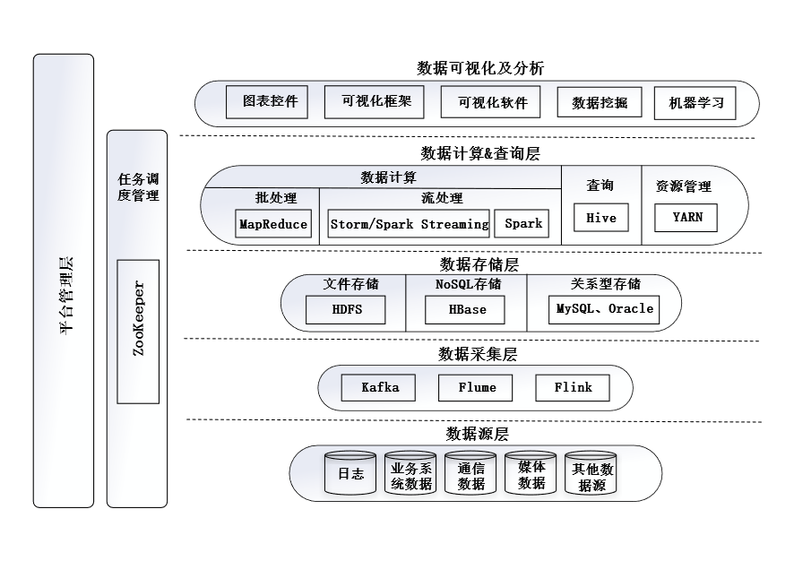

# 初识大数据

# 大数据是什么？

## 大数据的定义

通俗易懂的可以理解为海量数据，但事实上，并不仅仅是海量数据，更包含对于这些海量数据进行操作的集合。

可以定义为：**不仅是巨量数据，更是对巨量数据进行收集、存储、分析、处理、管理和可视化等操作的集合**

## 大数据的特点

目前比较普遍的特点是**5V**，即：海量化（volumes）、快速化（velocity）、多样化（variety）、真实性（veracity）以及变化性（variability）。其中海量化是最基本，最核心的特征。具体而言：

（1）海量化：数据体量大，发展到GB，TB，PB，EB，ZB的级别。

（2）多样化：多源异构性，来源丰富，包含结构化，半结构化，非结构化数据。

（3）快速化：需要低延迟，高速的完成实时操作

（4）价值化：大数据是低价值密度的，随着时间的增加，价值减少，随着真实性提高，价值增高。

（5）真实性，真实性主要是指代数据的质量，可信性和保真度。

# 大数据的研究背景

## 为什么会出现大数据

### 数据产生方式的变革

按照时间顺序过度为：

1. 早期运营系统，如超市管理系统等
2. 用户原创内容阶段，互联网平台兴起，激发了用户原创兴趣。
3. 感知式系统阶段，大量传感器，物联网，用户个人数据等被捕获，进一步提高了数据产生效率。

### 数据存储和管理技术的变革

主要是从传统的数据库技术过渡到面向大数据的数据库管理技术。

传统数据库技术主要有：文件系统，关系数据库，数据仓库，并行数据库。

- 文件系统：对文件进行操作和分配管理的操作系统。
- 关系数据库：传统的组织数据形式，可以理解为二维表格
- 数据仓库：来自于分散的操作型数据并按照一定的主题域进行组织，一般来说，存储的是历史数据，对数据进行分析。
- 并行数据库：在无共享的体系结构中进行数据操作的数据库系统，通过多个节点并行执行数据库任务。

传统数据库技术无法满足大规模，多类型数据存储和管理的需求，因此，新型数据库应运而生。

新型大数据存储和管理技术主要包括：分布式文件系统，NewSQL，NoSQL，云数据库等。

- 分布式文件系统：可以在廉价服务器集群中进行大规模分布式文件存储。
- NewSQL：指针对传统关系型数据库进行性能和能力的扩展的数据库。
- NoSQL：指不采用传统关系型数据库的数据库，包含图数据库，键值数据库等。
- 云数据库：部署和虚拟化在云计算环境中的数据库。

### 运行和计算速度的提升

从手工计算过渡到电子计算机，再过渡到超级计算机。

# 大数据平台系统

## 大数据平台

大数据平台是指以处理海量数据存储、计算及不间断流数据实时计算等场景为主的一套基础设施，它能够满足企业对于数据的各种要求。

典型的大数据平台包括Hadoop系列、Spark、Storm、Flink以及Flume/Kafka等集群。其中以Hadoop平台最为突出。如HDFS提供了一种分布式的方式来存储大数据和各种异构数据：MapReduce将处理移至数据，采用从属节点并行处理数据→主节点合并处理结果→将响应发送回客户端的处理流程加快数据访问与计算速度。

## 大数据技术

之前说过，大数据不仅仅是海量数据，更是对这些数据进行管理的集合，而大数据技术就是涵盖其中的技术。

按照处理过程可以分为：数据采集与预处理、数据存储及管理、数据处理及分析、数据隐私和安全。

### 数据采集与预处理

数据采集对多种数据，利用多种方式进行采集。数据采集的方法包括：系统日志采集、分布式消息订阅分发、网络数据采集以及使用ETL工具采集数据。

- 系统日志采集：一般大数据系统都具有日志采集的功能
- 分布式消息订阅分发：Kafka平台采用此种方式
- 网络数据采集：一般利用分布式爬虫的方法
- 使用ETL工具：ETL（Extract-Transform-Load）是一种数据仓库技术，表示将业务系统的数据从来源端经过抽取（extract）、转换（transform）、加载（load）至目的端的过程。

数据预处理按照流程可以包括数据清洗、数据集成、数据转换、数据规约和数据脱敏。

- 数据清洗：对缺失值，重复值，异常值等进行处理
- 数据集成：将来自多个数据源的数据，结合在一起形成一个统一的数据集合
- 数据转换：将数据转换成合适的格式，或者需要的区间
- 数据归约：在不影响挖掘结果的前提下，通过数值聚集、删除冗余特性的办法压缩数据。
- 数据脱敏：去除敏感数据。

### 数据存储和管理

目前，大数据环境下最适用的技术是分布式文件系统、分布式数据库以及访问接口和查询语言

### 数据处理及分析

大数据的处理和分析主要包括以下几个内容：大数据的计算、大数据挖掘和大数据的可视化分析。

大数据计算是指基于大数据的分布式计算技术，通过将数据划分为多个部分并分配到多个计算节点进行并行计算，以实现大规模数据的处理和分析。

大数据挖掘是指挖掘大数据中的隐含模式、规律和知识，并提供预测性和描述性信息的过程。

大数据的可视化分析是指通过图表、图形、地图等方式将大数据的分析结果可视化展示，以便用户更快速、直观地理解数据信息。

### 数据隐私和安全

大数据隐私与安全保护关键技术主要包括：数据发布匿名保护技术、社交网络匿名保护技术、数据水印技术、数据溯源技术、身份认证技术等。

## 大数据架构

大数据架构一般需要包含如下模块：数据源、数据采集、数据存储、资源管理、数据计算和查询和平台管理。

