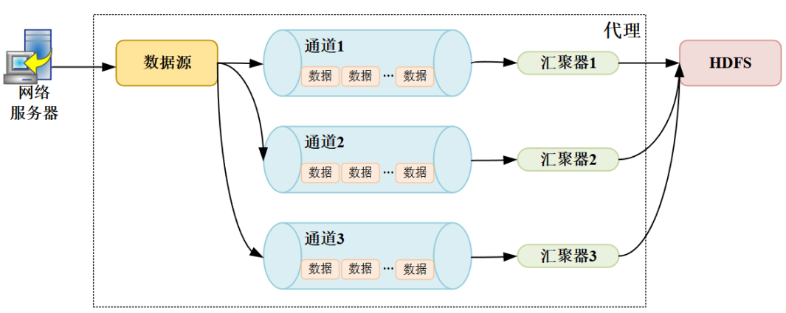
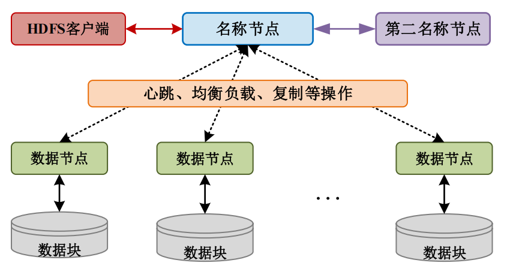
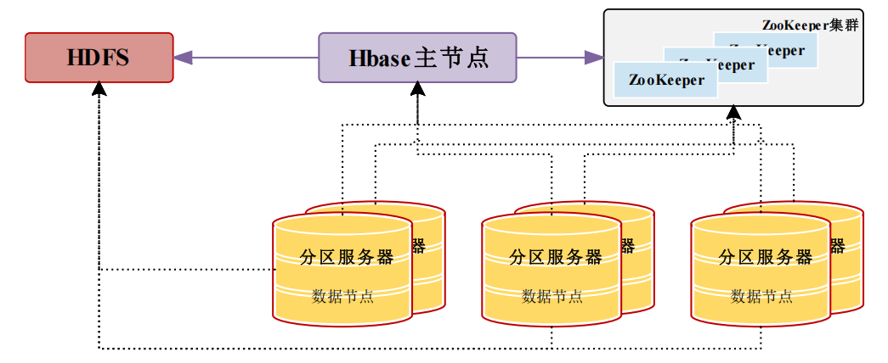
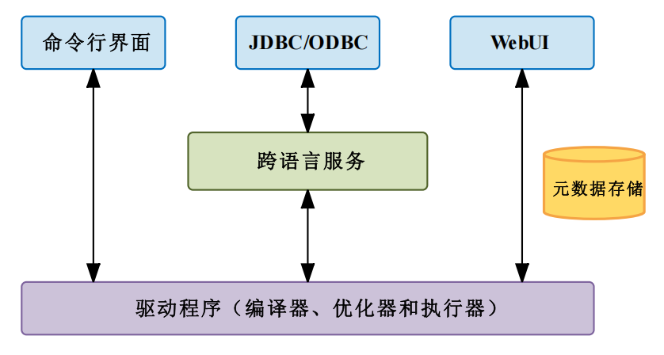

### 从“数据荒原”到“智能绿洲”——Hadoop生态如何搭建企业级数据流水线？

#### 场景化架构设计

假设你运营一个电商平台，每天产生10TB用户日志（点击、加购、支付），如何从中挖掘价值？传统方案如同用Excel处理天文数字——卡顿、丢失、无从下手。Hadoop生态系统提供了一套完整流水线：

1. **数据采集：Flume的“智能管道”**
	
	- 用户行为日志通过Flume从Web服务器实时抽取，经**Memory Channel**缓冲（避免洪峰冲垮系统），最终存入HDFS。这就像在城市地下铺设多根排水管，暴雨时引导雨水到水库，而非淹没街道。
	- 高级玩法：Kafka作为缓冲层，解耦数据生产与消费，即使HDFS维护，数据仍可暂存于Kafka（如同快递暂存柜）。
	
	> ##### 日志收集工具：Flume
	>
	> Apache Flume是分布式数据收集系统，由Cloudera在2010年开发，2011年进入Apache孵化器，2012年重构并成为顶级项目。采用流式数据流模型，通过配置数据源、通道和汇聚器构建数据流水线，用于收集和传输大规模数据。配置灵活、可用性高、容错性强，但管理工具有限，大规模部署和维护有挑战。适用于大规模日志和事件数据收集传输，如eBay和Twitter的应用。
	>
	> - **架构和主要组件**：代理是Flume中数据流的核心组成部分，是数据源、通道和汇聚器的集合。数据源用于收集不同类型的数据，通道在源和汇之间缓冲数据的组件，汇聚器将数据传输到最终目的地的组件。
	>
	> 	
	>
	>  - 使用`flume - ng`命令结合Python脚本实现数据收集和简单处理。例如，配置Flume从文件收集数据，通过Python脚本对数据进行简单过滤后传输到HDFS。首先编写Flume配置文件，指定数据源、通道和汇聚器，然后编写Python脚本处理数据：
	>
	> ```python
	> import sys
	> for line in sys.stdin:
	>     if 'error' not in line:
	>         print(line.strip())
	> ```
	>
	> 在运行过程中，遇到Flume与Python脚本数据传输编码不一致问题
	
2. **数据存储：HDFS与HBase的“黄金组合”**
	
	- **冷热数据分离**：历史日志用HDFS归档（高压缩、低成本），实时订单表用HBase支持随机查询。类比仓库管理：HDFS是郊区大仓，存放滞销品；HBase是市中心前置仓，高频补货热销商品。
	- **HBase的LSM树设计**：写入时先记录日志（WAL），再写入内存MemStore，定期合并到磁盘——如同快递员先记下收件清单，晚上统一装车，避免频繁开关车门（磁盘IO）。
	
	> ##### 分布式文件系统：HDFS
	>
	> HDFS是Hadoop生态系统的核心组件之一，主要用于存储大规模数据集，能提供高吞吐量访问能力，适用于在廉价机器上搭建存储环境，其他Hadoop组件大多依赖HDFS运行。
	>
	> - **诞生和发展**：2006年，受GFS启发，Doug Cutting等人在Apache Lucene项目中首次发布HDFS，当时只是初步原型。到2008年，HDFS正式被纳入Apache Hadoop项目，之后不断增加新特性，性能也持续优化。
	>
	> - **架构和主要组件**：采用Master/Slave主从架构，包含名称节点、数据节点、第二名称节点、客户端和数据块这些主要组件。名称节点管理文件系统命名空间和元数据，协调客户端操作；数据节点负责存储实际数据块，处理读写请求并向名称节点汇报信息；第二名称节点辅助合并和压缩名称节点编辑日志，帮助恢复文件系统状态；客户端用于用户与HDFS交互；数据块是基本存储单元，默认保存3份。
	>
	> 	
	>
	> - **优势**：具备高吞吐量访问、高可靠性、可扩展性和灵活性的特点，支持水平扩展，能通过添加节点轻松增加存储和处理能力，适合处理大规模数据集。
	>
	> - **局限性**：不适合实时响应的应用场景，在小文件存储方面表现欠佳，而且名称节点存在单点故障风险。
	>
	> - **行业应用**：在互联网、社交媒体等行业应用广泛。比如阿里巴巴利用HDFS实现个性化推荐系统；百度用HDFS存储和分析搜索请求产生的用户行为日志数据，优化搜索算法并为广告系统提供精准用户画像数据。
	>
	> - **实践**：
	>
	> 	- **搭建HDFS集群**：先在多台服务器安装Linux系统（如CentOS），接着安装Hadoop软件包并配置环境变量。配置HDFS相关文件（如`core - site.xml`、`hdfs - site.xml`）时，要准确设置名称节点和数据节点地址、数据块大小及副本数。启动集群后，用`hadoop fs -ls`命令查看文件系统。曾因数据块副本数设置过高，导致存储资源紧张，调整后解决。
	> 	- **深入研究HDFS的纠删码技术**：通过Hadoop官网文档了解原理和配置方法，在测试集群上启用纠删码功能，对比启用前后存储空间和数据恢复时间。发现启用后存储空间节省约30%，但数据恢复时间增加约20%。
	> 	- **使用`hdfs`库操作HDFS**：安装`hdfs`库（`pip install hdfs`）后，编写代码实现文件上传和下载。
	>
	> ```python
	> from hdfs import InsecureClient
	> client = InsecureClient('http://namenode:50070', user='your_username')
	> # 上传文件
	> with open('local_file.txt', 'rb') as f:
	>     client.write('/hdfs_path/local_file.txt', data=f)
	> # 下载文件
	> with client.read('/hdfs_path/local_file.txt') as reader:
	>     with open('downloaded_file.txt', 'wb') as f:
	>         f.write(reader.read())
	> ```
	>
	> 实操中遇到连接超时问题，检查发现是名称节点地址配置错误，修改后成功运行。
	>
	>  - **经验总结**：学习HDFS要注重配置参数理解，遇到问题多查阅官方文档和技术论坛。Python实操时，仔细检查代码中的地址和权限配置。
	>
	> ##### 分布式列数据库：HBase
	>
	> Hadoop HBase是开源的分布式面向列的NoSQL数据库系统，设计用于大规模数据存储和处理场景，具有高可扩展性、高性能和高可靠性。
	>
	> - **诞生和发展**：最初是Google Bigtable的开源实现，2007年Doug Cutting和Mike Cafarela在Apache Hadoop项目基础上开始开发，2008年成为Apache顶级项目，此后不断发展，功能和性能持续优化，支持更多复杂场景。
	>
	> - **架构和主要组件**：采用分布式、冗余备份架构，主要组件包括HBase主节点和分区服务器。HBase主节点管理集群，处理客户端元数据操作和集群管理任务；分区服务器存储数据，每个分区服务器管理多个区域，区域负责存储表的片段并处理读写请求，区域由主区域和副本组成，提供数据高可用性。
	>
	> 	
	>
	> - **优势**：数据一致性和高可用性强，支持数据多版本和时间戳索引，便于数据版本控制和历史数据查询；适用于快速访问和处理大规模结构化和半结构化数据场景，提供丰富API和客户端库，方便开发者集成使用。
	>
	> - **局限性**：与传统关系型数据库相比，配置、部署和维护更复杂，涉及Hadoop集群管理、数据模型设计和系统参数调优等；在处理随机写入（如频繁更新同一行的不同列）时，性能可能受影响。
	>
	> - **行业应用**：适用于快速读写非结构化和半结构化数据的场景，如Facebook用HBase存储用户个人信息和聊天记录；中国移动存储通话记录数据并满足实时业务需求；摩根大通银行管理交易流水并结合Hadoop进行数据分析，检测异常交易行为。
	>
	>  - **实操**：使用`happybase`库操作HBase。安装`happybase`库（`pip install happybase`）后，编写代码操作表数据：
	>
	> ```python
	> import happybase
	> connection = happybase.Connection('localhost', port=9090)
	> table = connection.table('test_table')
	> table.put(b'row1', {b'cf1:col1': b'value1'})
	> result = table.row(b'row1')
	> print(result[b'cf1:col1'])
	> connection.close()
	> ```
	>
	
3. **数据分析：Hive与YARN的“SQL化转型”**
	
	- 运营人员用HiveQL查询“618大促期间上海女性的购物偏好”，Hive自动翻译为MapReduce任务，YARN分配资源执行。这相当于把SQL工程师变成“数据分析指挥官”，无需关心底层如何调兵遣将。
	- **性能优化暗坑**：Hive默认MapReduce引擎速度慢，换成Tez或Spark引擎后，如同给汽车更换涡轮增压——同样的查询从小时级降到分钟级。
	
	>##### 资源管理器：YARN
	>
	>Hadoop YARN是Hadoop生态系统中的资源管理器，主要负责管理和调度集群中的计算资源，以运行大规模分布式应用程序。
	>
	>- **诞生和发展**：2012年在Hadoop 0.23版本中首次引入，取代了之前的MapReduce作业调度器。之后社区持续对其改进优化，增强了资源分配效率、作业调度精度，增加了对多种作业类型的支持，并引入了对Docker等容器技术的支持。
	>- **架构和主要组件**：采用分布式架构，主要组件有资源管理器、节点管理器、应用程序主控器和容器。资源管理器负责整个集群的资源管理和分配，包含调度器和应用程序管理器两个子组件；节点管理器运行在集群每个节点上，管理对应节点资源；应用程序主控器为每个提交的应用程序请求资源并管理任务；容器是资源抽象，包含CPU、内存等资源。
	>- **优势**：提供灵活的资源调度策略，可根据任务需求和集群资源进行动态分配；支持容器化任务执行，实现资源隔离和管理；提供统一接口和机制，便于不同框架在集群上共享和管理资源。
	>- **局限性**：部署和配置要求理解架构、组件及调优参数等知识，对初学者或无大数据经验团队不友好；使用不当的调度策略或作业提交方式时，无法充分利用节点资源；容错性有一定限度，节点故障或网络问题时需额外机制保证作业可靠性。
	>- **行业应用**：适用于大规模数据处理作业，如摩根大通银行用YARN管理和执行数据分析与风险建模作业；Amazon用YARN和Hadoop处理用户行为数据；阿里巴巴在阿里云的E-MapReduce服务中使用YARN支持日志处理和机器学习任务。
	>
	>##### 数据仓库：Hive
	>
	>Hadoop Hive是基于Hadoop的数据仓库工具，提供类SQL查询语言HiveQL，用于对存储在HDFS中的数据进行查询和分析。
	>
	>- **诞生和发展**：由Facebook开发并开源，2007年开源后，2008年成为ASF孵化项目，之后不断迭代并与其他工具集成。
	>
	>- **架构和主要组件**：通过用户接口接收指令，驱动程序处理查询，元数据存储管理数据，支持多种数据格式。用户接口包括命令行界面（CLI） 、JDBC/ODBC和WebUI等；驱动程序包含编译器、优化器和执行器；元数据存储初始在自带的Derby数据库，通常迁移到MySQL等更适合多用户操作的数据库。
	>
	>	
	>
	>- **优势**：类SQL语言HiveQL使熟悉SQL的开发人员易上手，底层基于MapReduce，能处理海量数据，通过Metastore管理元数据，方便数据查询、探索和管理。
	>
	>- **局限性**：主要用于批处理，处理实时数据延迟高，不适合对实时性要求高的场景；处理复杂查询和小规模数据集时查询性能较低，数据模型简单，不支持复杂数据关系和事务操作。
	>
	>- **行业应用**：适用于数据批处理场景，如Yahoo用Hive处理广告数据，分析广告效果；Netflix利用Hive分析用户观看历史，提供个性化推荐。
	>
	> - **实操**：使用`pyhive`库操作Hive。安装`pyhive`库（`pip install pyhive`）及依赖库后，编写代码查询数据：
	>
	>```python
	>from pyhive import hive
	>conn = hive.Connection(host='localhost', port=10000, database='default', auth='NOSASL')
	>cursor = conn.cursor()
	>cursor.execute('SELECT * FROM test_table')
	>for result in cursor:
	>    print(result)
	>conn.close()
	>```
	>
	
4. **协调与容灾：ZooKeeper的“隐形守护”**
	- 当RegionServer宕机时，ZooKeeper瞬间检测并通知HMaster迁移数据，用户无感知。这如同电网的自动切换装置：某变电站故障，备用线路毫秒级启用，客厅灯光甚至不会闪烁。
	
	> ##### 分布式协作服务：ZooKeeper
	>
	> Hadoop Zookeeper是开源的分布式协调服务，为分布式系统提供简单高效的协调解决方案，帮助开发人员构建可靠高性能的分布式系统。
	>
	> - **诞生和发展**：由Yahoo在2006年开发并开源，2008年成为Apache顶级项目。2010年发布的3.3x版本引入重要功能，增强了稳定性和性能，此后不断扩展功能，成为分布式系统领域广泛应用的技术。例如，Apache Kafka依赖ZooKeeper维护集群元数据和管理节点状态；Apache Flink使用ZooKeeper管理分布式应用程序配置、服务注册和发现机制。
	>
	> - **架构和主要组件**：架构是一组协同工作的节点集合，称为“ZooKeeper Ensemble”，主要组件包括领导者节点、跟随者节点和观察者节点。通过多数节点投票机制选举领导者节点，使用Zab协议通信协调。领导者节点处理客户端写操作，确保数据一致性；跟随者节点复制领导者节点状态，响应只读请求；观察者节点用于实现事件驱动通知，客户端可注册观察者监视ZNode节点状态变化。
	>
	> 	
	>
	> - **优势**：采用领导者 - 跟随者机制和多数节点投票机制，可靠性高，部分节点故障时系统仍能提供服务；架构可扩展性良好；能保证数据一致性，只有多数节点成功写入才判定写入成功。
	>
	> - **局限性**：领导者节点存在单点故障风险，所有写操作都需经过领导者节点处理和复制，系统性能受其限制。
	>
	> - **行业应用**：广泛应用于分布式系统的各个领域，如分布式配置管理、服务发现、分布式锁、Leader选举等。在Kafka中，ZooKeeper管理和协调Kafka集群中的Brokers，维护集群元数据，处理Leader选举；在HBase中，ZooKeeper管理集群中HMastr和RegionServer的状态，实现分布式锁，维护元数据并协助Region分配。
	>
	>  - **实操**：使用`kazoo`库操作ZooKeeper。安装`kazoo`库（`pip install kazoo`）后，编写代码创建和读取节点数据：
	>
	> ```python
	> from kazoo.client import KazooClient
	> zk = KazooClient(hosts='127.0.0.1:2181')
	> zk.start()
	> zk.create('/test_znode', b'test_data')
	> data, stat = zk.get('/test_znode')
	> print(data.decode())
	> zk.stop()
	> ```
	>

#### 技术演进启示录

- **从Lambda到Kappa架构**：早期Hadoop批处理（T+1报表）无法满足实时需求，后来引入Kafka+Storm实现流处理。但维护两套系统成本高，如今Flink统一批流，Hadoop生态逐渐转向云原生。
- **资源管理的进化论**：YARN从静态资源分配（如集体宿舍固定床位）发展到Kubernetes动态调度（如共享办公灵活工位），混合部署成为新趋势。

#### 未来挑战

- **云原生的冲击**：对象存储（如S3）逐渐替代HDFS，存算分离架构崛起，Hadoop如何适应？
- **AI与Hadoop的融合**：TensorFlow on YARN能否实现分布式训练？模型数据如何与Hive特征库打通？——这些问题正在改写生态边界。