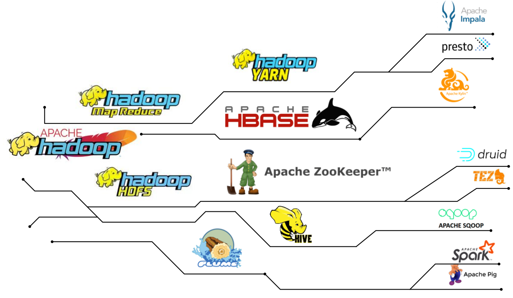
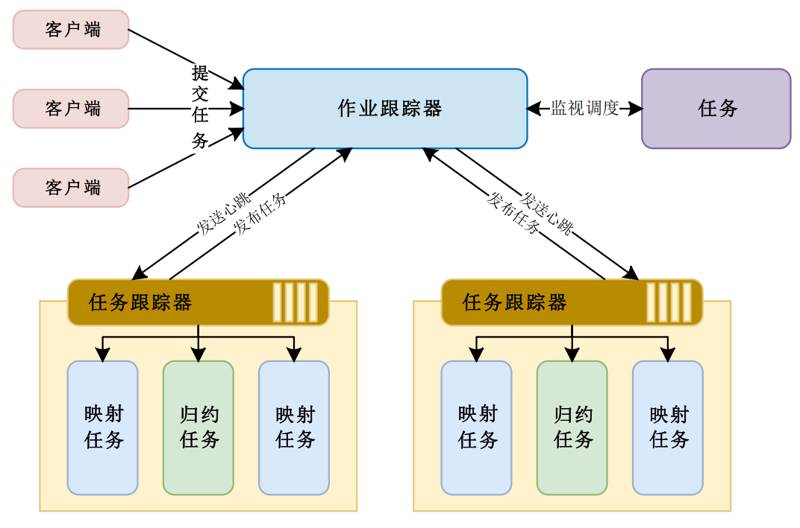
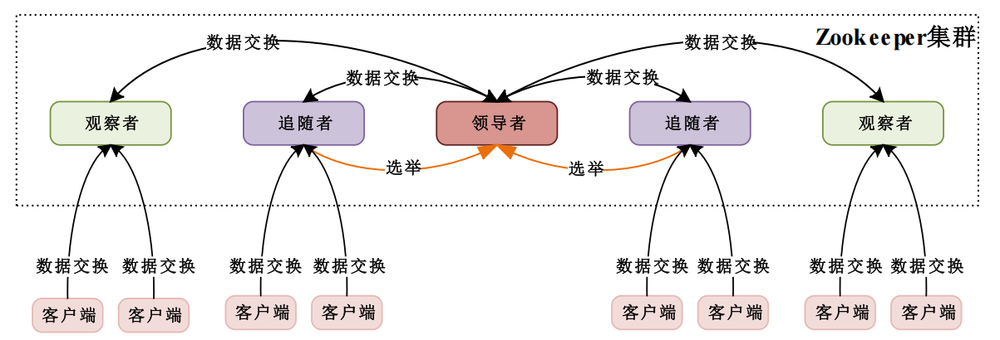

### Hadoop如何用“分布式思维”重塑大数据处理逻辑？

#### 问题起源

当传统数据库面对TB级数据时，就像用一辆小货车运输整个城市的快递——硬件成本飙升、处理速度断崖式下跌。为什么？传统架构的“完全共享”和“共享磁盘”设计存在致命瓶颈：存储集中化导致I/O拥堵，硬件故障可能引发雪崩式崩溃，且无法处理非结构化数据（如图片、日志）。这时，**Hadoop的无共享架构**给出了答案：将数据“打碎”分布到廉价机器集群，让计算贴近存储，像蚂蚁搬家一样并行处理。

> **Hadoop是一个分布式计算平台（数据库管理平台），包括**
>
> - HDFS分布式文件系统：提供了针对海量数据的存储服务
> - MapReduce分布式计算框架：提供了针对海量数据的计算框架
> - ZooKeeper分布式协作服务
> - HBase分布式列数据库
> - Hive分布式数据仓库
> - YARN分布式资源管理器
> - Flume分布式日志收集工具
>
> 

#### 核心技术拆解

1. **HDFS：数据的“分布式图书馆”**

  - **分块与冗余**：把100GB文件切成128MB的“书页”（Block），每个书页复制3份存放在不同机架的“书架”（DataNode）。即使一个书架倒塌（节点故障），其他副本仍可调用，如同图书馆备份珍贵古籍。
  - **主从架构的智慧**：NameNode是图书管理员，记录每本书的位置（元数据），但管理员一旦病倒（单点故障），整个图书馆将瘫痪——这是HDFS的软肋，后来通过HA（高可用）方案引入“副管理员”解决。


  - **优势**：具备高吞吐量访问、高可靠性、可扩展性和灵活性的特点，支持水平扩展，能通过添加节点轻松增加存储和处理能力，适合处理大规模数据集。
  - **局限性**：不适合实时响应的应用场景，在小文件存储方面表现欠佳，而且名称节点存在单点故障风险。
  - **行业应用**：在互联网、社交媒体等行业应用广泛。比如阿里巴巴利用HDFS实现个性化推荐系统；百度用HDFS存储和分析搜索请求产生的用户行为日志数据，优化搜索算法并为广告系统提供精准用户画像数据。
  - **实践**：
  	- **搭建HDFS集群**：先在多台服务器安装Linux系统（如CentOS），接着安装Hadoop软件包并配置环境变量。配置HDFS相关文件（如`core - site.xml`、`hdfs - site.xml`）时，要准确设置名称节点和数据节点地址、数据块大小及副本数。启动集群后，用`hadoop fs -ls`命令查看文件系统。曾因数据块副本数设置过高，导致存储资源紧张，调整后解决。
  	- **深入研究HDFS的纠删码技术**：通过Hadoop官网文档了解原理和配置方法，在测试集群上启用纠删码功能，对比启用前后存储空间和数据恢复时间。发现启用后存储空间节省约30%，但数据恢复时间增加约20%。
  	- **使用`hdfs`库操作HDFS**：安装`hdfs`库（`pip install hdfs`）后，编写代码实现文件上传和下载。

  ```python
  from hdfs import InsecureClient
  client = InsecureClient('http://namenode:50070', user='your_username')
  # 上传文件
  with open('local_file.txt', 'rb') as f:
      client.write('/hdfs_path/local_file.txt', data=f)
  # 下载文件
  with client.read('/hdfs_path/local_file.txt') as reader:
      with open('downloaded_file.txt', 'wb') as f:
          f.write(reader.read())
  ```

  实操中遇到连接超时问题，检查发现是名称节点地址配置错误，修改后成功运行。

   - **经验总结**：学习HDFS要注重配置参数理解，遇到问题多查阅官方文档和技术论坛。Python实操时，仔细检查代码中的地址和权限配置。


2. **MapReduce：流水线上的分拣工与统计员**

	- **Map阶段**：想象快递分拣中心，每个工人（Map Task）只处理自己区域的包裹（数据分片），快速贴上“目的地标签”（生成键值对）。
	- **Reduce阶段**：统计员（Reduce Task）将所有发往北京的包裹计数汇总。但问题来了——中间数据频繁写磁盘导致速度慢，如同分拣员每处理一个包裹就要跑回办公室登记，后来Spark用内存计算解决了这一痛点。

	

	- **优势**：可在大规模集群上运行，能高效处理PB级别及更大规模数据集，任务并行化和数据分片特性使其扩展性强，框架容错性高，编程模型简单，开发者无需关心底层分布式计算细节。
	- **局限性**：基于批处理模型，处理延迟较高，无法满足实时数据处理需求，运行过程中磁盘I/O开销大，在涉及大量中间数据的场景下，磁盘I/O可能成为性能瓶颈。随着大数据技术发展，新的数据处理框架如Apache Spark、Apache Flink等逐渐涌现，在一定程度上取代了传统的MapReduce。
	- **行业应用**：适用于处理大规模数据集的场景，如Google利用MapReduce处理和分析大规模数据集，生成和更新搜索引擎索引，提高搜索结果相关性和准确性；Facebook借助MapReduce分析海量用户生成内容，优先展示用户感兴趣的内容，提高用户粘性和活跃度。
	 - **实践**：
		- **以单词计数为例编写MapReduce程序**：在Map阶段拆分文本单词并输出，Reduce阶段累加相同单词次数。打包成JAR文件后，用`hadoop jar`命令提交到集群运行。曾因输入数据格式错误导致作业失败，检查数据格式后成功运行。
		- **使用`mrjob`库在Python中实现MapReduce**：安装`mrjob`库（`pip install mrjob`）后，编写单词计数代码：

	```python
	from mrjob.job import MRJob
	class MRWordCount(MRJob):
	    def mapper(self, _, line):
	        for word in line.split():
	            yield word, 1
	    def reducer(self, word, counts):
	        yield word, sum(counts)
	if __name__ == '__main__':
	    MRWordCount.run()
	```

	运行时遇到依赖包缺失问题，按提示安装后程序成功运行。

	 - **经验总结**：编写MapReduce程序要注意数据处理逻辑和格式。对比框架性能有助于深入理解不同框架特点。Python实操时，及时解决依赖包问题。


3. **ZooKeeper：分布式系统的“神经中枢”**

	在分布式系统中，最棘手的不是算力，而是协调。试想一个万人合唱团如何保持节奏一致？ZooKeeper通过Znode树状结构和Watcher机制，让各节点像合唱团员紧盯指挥手势：当配置信息变更时，所有相关节点实时同步状态。它的领导者选举机制更堪称精妙——半数以上节点存活即可维持服务，就像合唱团即使半数成员缺席，只要指挥在场仍能继续演出。但这也暴露出单领导者节点的风险，正如指挥突然失声会导致混乱，后来者如Etcd开始尝试去中心化方案。

	- 当Kafka需要选举新的分区Leader时，ZooKeeper像会议主持人一样协调投票，确保集群不陷入混乱。其**观察者机制**类似微信群通知：一旦配置文件修改（ZNode变化），所有订阅者立即收到提醒，无需反复刷新。
	
	
	
	- **优势**：采用领导者 - 跟随者机制和多数节点投票机制，可靠性高，部分节点故障时系统仍能提供服务；架构可扩展性良好；能保证数据一致性，只有多数节点成功写入才判定写入成功。
	- **局限性**：领导者节点存在单点故障风险，所有写操作都需经过领导者节点处理和复制，系统性能受其限制。
	- **行业应用**：广泛应用于分布式系统的各个领域，如分布式配置管理、服务发现、分布式锁、Leader选举等。在Kafka中，ZooKeeper管理和协调Kafka集群中的Brokers，维护集群元数据，处理Leader选举；在HBase中，ZooKeeper管理集群中HMastr和RegionServer的状态，实现分布式锁，维护元数据并协助Region分配。
	 - **实操**：使用`kazoo`库操作ZooKeeper。安装`kazoo`库（`pip install kazoo`）后，编写代码创建和读取节点数据：
	
	```python
	from kazoo.client import KazooClient
	zk = KazooClient(hosts='127.0.0.1:2181')
	zk.start()
	zk.create('/test_znode', b'test_data')
	data, stat = zk.get('/test_znode')
	print(data.decode())
	zk.stop()
	```
	

#### 行业实践启示

- **反欺诈系统的秒级响应**：汇丰银行用Flume实时采集交易数据，HBase快速读写可疑记录，YARN动态调配资源——如同交通指挥中心，摄像头（Flume）捕捉画面，数据库（HBase）秒级匹配黑名单，调度系统（YARN）灵活增派警力。
- **基因研究的“数据马拉松”**：人类基因组计划的PB级数据若用传统数据库分析，可能需要数年；Hadoop的MapReduce将任务拆解成数万个小作业，如同让数万人同时解读基因片段，最终拼合成完整图谱。

#### 局限性反思

- **实时性缺陷**：Hadoop适合“事后分析”，但抖音的实时推荐需要毫秒级响应，需结合Flink等流处理框架。
- **小文件困境**：存储百万张图片时，HDFS的元数据管理压力剧增，如同图书馆用一本书记录一支铅笔的位置——后来HBase的列式存储和Hive的分区表优化了此场景。