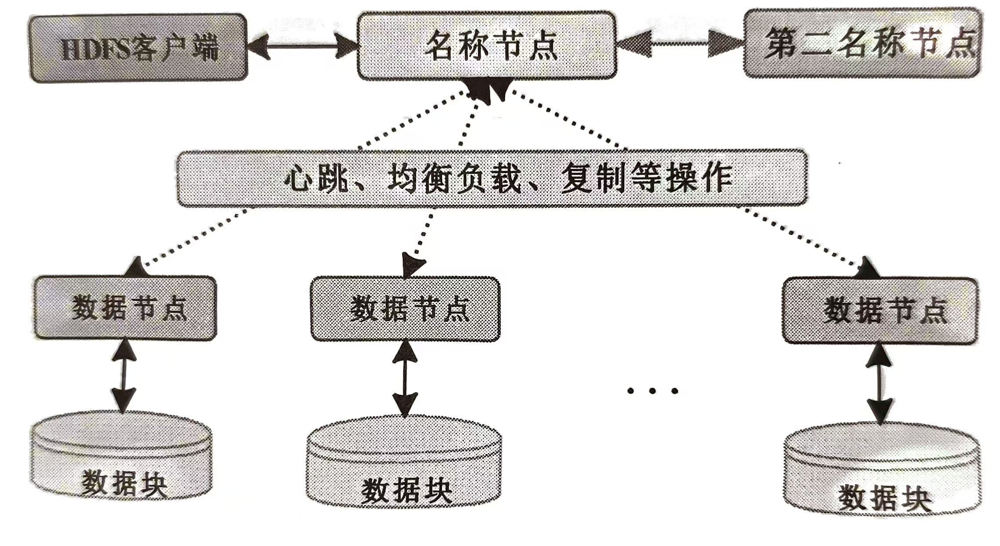
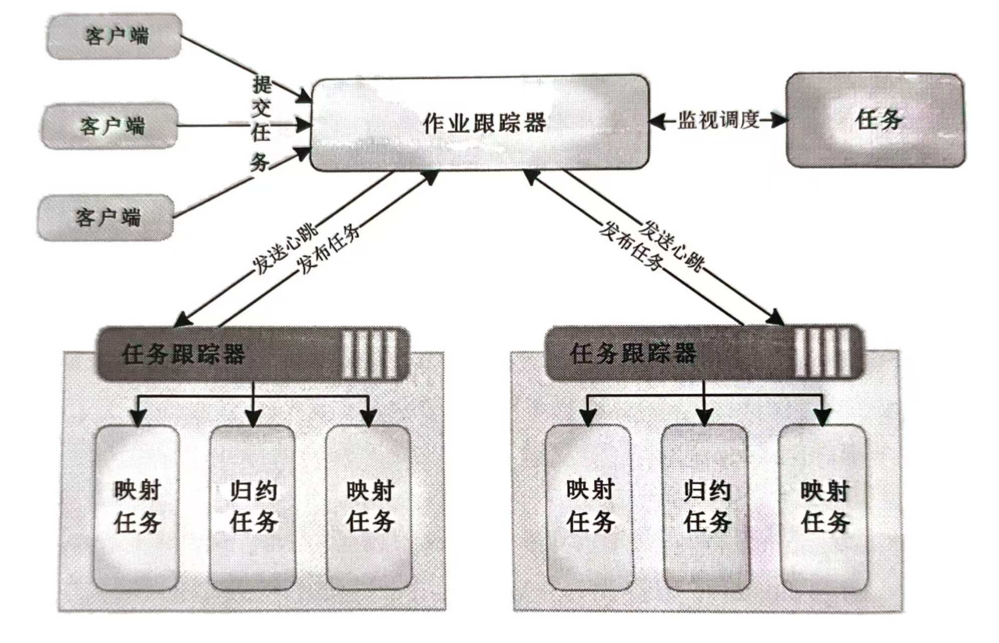
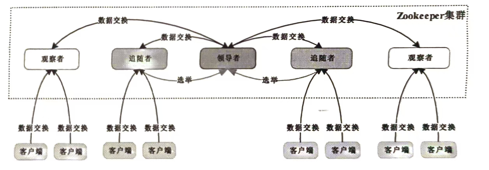
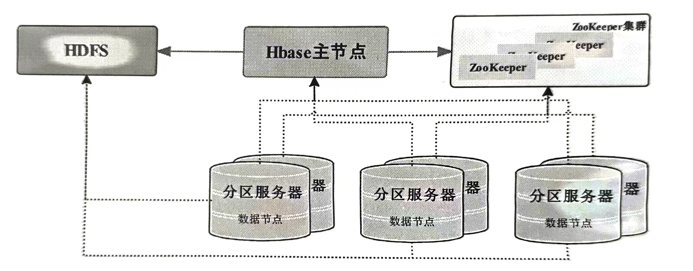
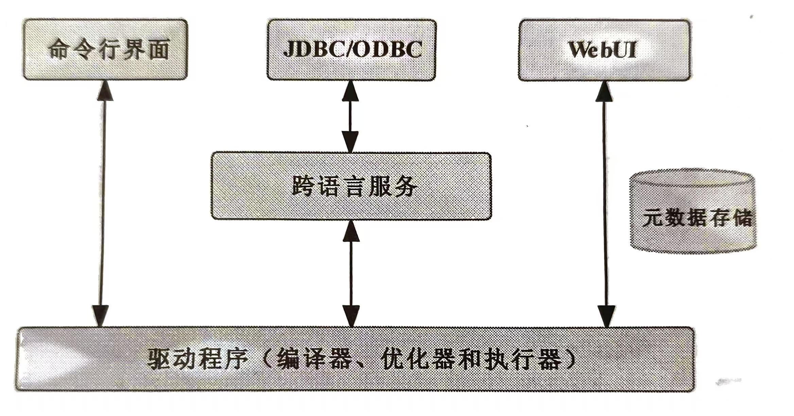
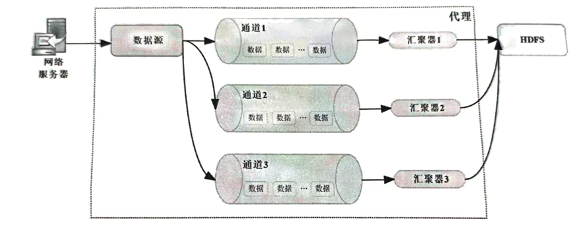

# 第三章 大数据处理架构Hadoop

## 1 数据库相关概述

### 数据库的架构设计种类

- 完全共享：数据库处于单个主机的环境中，占有完全透明共享的CPU、内存和硬盘
- 共享磁盘：数据存储在共享的磁盘上，但计算发生在各个节点的本地内存和处理器上，通常通过网络或共享总线连接磁盘存储设备，具有较低的单点故障风险
- 无共享：节点之间不共享任何资源，数据分布在各个节点上，主节点对所有从节点进行管理，通过网络进行协调和通信，每个节点负责一部分数据的存储和处理

### 传统的数据库管理

传统的数据库管理平台通常是建立在**完全共享**或**共享磁盘**的架构之上

**局限性：**

- 硬件故障问题
- 传输速率问题：硬盘寻址是导致操作延时的主要因素
- 非结构化数据处理问题

### 新兴的数据管理要求

- 支持高性能计算
- 具备扩展性和容错性
- 适应运行环境的异构性

### 基于无共享架构的数据库管理平台

- Vertica

- Teradata

- Exadata

- Madison

- Apache Hadoop：一套可靠的、可扩展的分布式计算框架，可用于处理和存储大规模数据集

	> **Hadoop是一个分布式计算平台（数据库管理平台），包括**
	>
	> - HDFS分布式文件系统：提供了针对海量数据的存储服务
	> - MapReduce分布式计算框架：提供了针对海量数据的计算框架
	> - ZooKeeper分布式协作服务
	> - HBase分布式列数据库
	> - Hive分布式数据仓库
	> - YARN分布式资源管理器
	> - Flume分布式日志收集工具

---


## 2 分布式文件系统：HDFS

适合运行于廉价机器上的分布式文件系统，Hadoop中的**其他组件**都需要**基于HDFS运行**

### 主要组件

- 名称节点`NameNode`
- 数据节点`DataNode`
- 第二名称节点`Secondary NameNode`：第二名称节点并**不是名称节点的备份**，而是一个辅助工具，用于定期合并和压缩名称节点的编辑日志`edit logs`以及内存中的文件系统状态`fsimage`，它的主要作用是帮助名称节点恢复故障后的文件系统状态，以缩短故障恢复时间
- HDFS客户端`HDFS Client`：客户端向名称节点发送读取、写入、修改等文件系统操作请求，并与数据节点**直接通信**以进行数据的读取和写入
- 数据块`Data`：数据块是HDFS的基本存储单元，通常为128MB或256MB，默认保存3份，客户端读取和写入文件时以数据块为单位进行操作

### 架构

HDFS采用了主从架构,其中由一个主节点`Master`负责管理文件系统的元数据和命名空间，而多个从节点`Slaves`负责存储实际的数据块

> **主从架构：**
>
> - 主节点：负责处理写入操作
> - 从节点：负责复制主节点的数据副本，并处理读取操作



**通过心跳、均衡负载和复制机制，HDFS能够有效管理和存储大规模数据，并在数据节点故障时保持数据的高可用性和可靠性**

> **心跳机制：**
>
> 心跳机制是指在分布式系统，各个节点（如作业跟踪器和任务跟踪器）之间定期发送信号（心跳信号），以确定彼此的存货状态，并交换必要的状态信息
>
> **均衡负载`Load Balancing`：**
>
> 均衡负载是为了保证数据在各个数据节点之间的均匀分布，以优化资源利用和提高系统性能，HDFS提供了以下均衡机制
>
> - 名称节点的初始均衡
> - Balancer工具
>
> **复制机制：**
>
> HDFS采用数据库`block`级别的复制机制，以提高数据的可靠性和可用性。默认情况下，每个数据块会被复制3份，存储在不同的DataNode上

### 局限性

HDFS不适用于需要实时响应的应用场景

在小文件存储方面的支持度比较差

如果名称节点出现故障，可能会导致整个文件系统不可用

### 应用

HDFS不依赖高性能的服务器集群即可满足超大型的文件处理需求，被互联网、社交媒体等行业广泛应用于处理用户行为日志、用户生成内容等数据

---


## 3 分布式计算框架：MapReduce

是一种编程模型和处理大规模数据的并行计算框架

### 主要组件

- 作业跟踪器`JobTracker`（主节点）
- 任务跟踪器`TaskTracker`（从节点）
- 映射任务`Map Task`
- 归约任务`Reduce Task`

### 架构

主从架构



### 局限性

处理延迟较高，无法满足实时数据处理的需求

需要频繁地从磁盘读取和写入数据，会导致大量的磁盘I/O开销，降低了处理性能

### 应用

MapReduce适用于需要处理大规模数据集的应用场景

---


## 4 分布式协作服务：ZooKeeper

客户端可以连接到ZooKeeper集群，并对节点树进行读取、写入、监听等操作

### 主要组件

- 领导者`Leader`节点：处理客户端写操作，确保它们按照顺序被复制到其他节点
- 跟随者`Followers`节点：复制领导者节点的状态，并响应客户端的只读请求。领导者发生故障时，从跟随者节点中重新选举
- 观察者`Observer`节点：允许客户端在特定节点上注册，以便在ZNode节点状态发生变化时得到通知

### 架构

ZooKeeper通过管理和操作ZNode（ZooKeeper节点）实现对分布式系统的协调和管理功能。每个ZNode都能存储少量数据，并通过路径进行唯一标识。用户可以对ZNode进行操作，监听ZNode的变化，并根据这些变化实现分布式系统中的协调和同步。

> **ZNode及其路径：**
>
> ZNode是ZooKeeper的数据节点，类似于文件系统中的目录或文件。每个ZNdoe都有一个路径，用来唯一标识这个节点的位置和层级关系
>
> 例如：`“/app1/config”`
>
> `”/app1“`是一个ZNode，表示一个应用程序或一个目录
>
> `”/app1/config“`是另一个ZNode，是`”/app1“`的子节点，可能存储应用程序的配置数据



### 局限性

领导者节仍然存在单点故障的风险

### 应用

ZooKeeper被广泛应用于分布式系统的各个领域，如分布式配置管理、服务发现、分布式锁、Leader选举等

---


## 5 分布式列数据库：HBase

一个分布式的、面对列的NoSQL数据库系统

HBase的数据存储依赖于HDFS

HBase的数据模型类似于一个多维的映射，由行健`Row key`、列族`Column family`、列限定符`Column qualifier`和时间戳`Timestamp`组成

支持自动的数据分片`Region splitting`和负载均衡

集成了于Hadoop生态系统的其他组件（如MapReduce、Hive、Pig等）的连接，使得大数据处理任务中能够方便的使用

### HBase与HDFS

```python
if 不需要实时响应的应用场景:
    return HDFS
else:
    return HBase
```

### 主要组件

- HBase主节点`HMaster`
- 分区服务器`Region server`

### 架构

主从架构



### 局限性

在处理随机写入（如频繁更同一行的不同列）时，HBase的性能可能会受到一定影响

### 应用

HBase适用于需要快速读写操作非结构化和半结构化数据的应用场景

---


## 6 数据仓库：Hive

一个建立在Hadoop之上的数据仓库工具，提供了类似于SQL的查询语言，称谓HiveQL，用于对存储在HDFS中的数据进行查询和分析

采用读时模式

> **读时模式：**
>
> 数据存储时不需要严格定义数据模式，数据读取时才解析和应用数据的结构和模式
>
> 适合处理数据多样化和快速变化的场景
>
> **写时模式：**
>
> 在数据写入时定义数据模式和结构
>
> 适合需要保证数据准确性和一致性的场景

可扩展性：用户可以编写自定义UDF（用户定义函数）、UDAF（用户定义聚合函数）和UDTF（用户定义表生成函数）来扩展HiveQL的

功能

### 主要组件

- 用户接口
	- 命令行界面`CLI`：命令行基本交互界面
	- JDBC/ODBC：Hive的Java实现
	- WebUI：用户友好的Web界面
- 跨语言服务`Thrift server`：通过Thrift server接口，可以用多种编程语言编写的客户端与Hive进行通信，执行查询和管理任务
- 驱动程序`Driver`
	- 编译器`Compiler`
	- 优化器`Optimizer`
	- 执行器`Executor`
- 元数据存储`Metastore`：元数据包含了关于表、列、分区等信息，以及表数据存储位置的信息

### 架构



### 局限性

在处理实时数据时的延迟较高

在处理复杂查询和小规模数据集时的查询性能可能较低

不支持复杂的数据关系和事务操作

### 应用

Hive被广泛用于需要进行数据批处理的应用场景

---


## 7 资源管理器：YARN

是Apache Hadoop生态系统中的一个资源管理器

主要作用是管理和调度集群中的计算资源，以便于运行大规模的分布式应用程序

### 主要组件

- 资源管理器`ResourceManager`
	- 调度器`Scheduler`：负责整个集群的资源管理和分配
	- 应用程序管理器`ApplicationMaster`：每个提交带YARN上的应用程序（如MapReduce作业、Spark作业）都会有一个对应的应用程序管理器，负责每个具体应用程序的资源申请和任务执行
- 节点管理器`NodeManager`：负责管理集群对应节点上的资源
- 容器`Container`：表示一组节点资源，包括CPU、内存和其他资源

### 架构

在YARN中，集群资源被分为多个容器`Containers`，每个容器都具有一定数量的CPU核心、内存等资源

应用程序可以向YARN请求容器，并将自己的任务分配到这些容器中执行

YARN负责跟踪集群中的资源使用情况，并根据应用程序的需求进行资源调度和分配

这种分离的资源管理模型使得不同类型的应用程序可以共享同一个Hadoop集群，从而更高效地利用资源

### 局限性

对于初学者不友好

尽管YARN有一定程度的容错性，但在节点故障或者网络问题等情况下，仍可能会，需要额外的机制来处理这些故障情况并保证作业的可靠性

---


## 8 日志收集工具：Flume

用于从多个数据源收集大规模数据，并将其移动到Hadoop生态系统中的存储系统，如HDFS或HBase

是一个用于收集、聚合和传输大规模日志和事件数据的工具

### 主要组件

代理`Agent`是Flume中数据流的核心组成部分，是数据源、通道和汇聚器的集合

- 数据源`Source`：用于收集不同类型的数据
- 通道`Channel`：在源和汇之间缓冲数据的组件
- 汇聚器`Sink`：将数据传输到最终目的地的组件

### 架构



### 局限性

大规模部署和维护可能需要额外的管理工具和技术

对初学者不友好

### 应用

Flume被广泛用于大规模日志数据和事件数据的收集和传输
