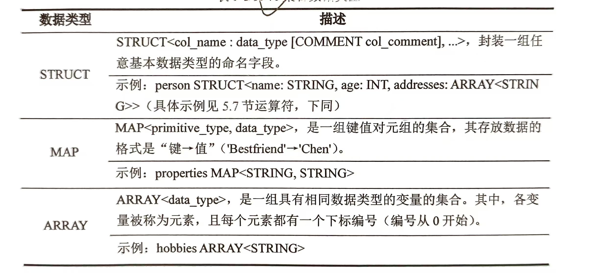
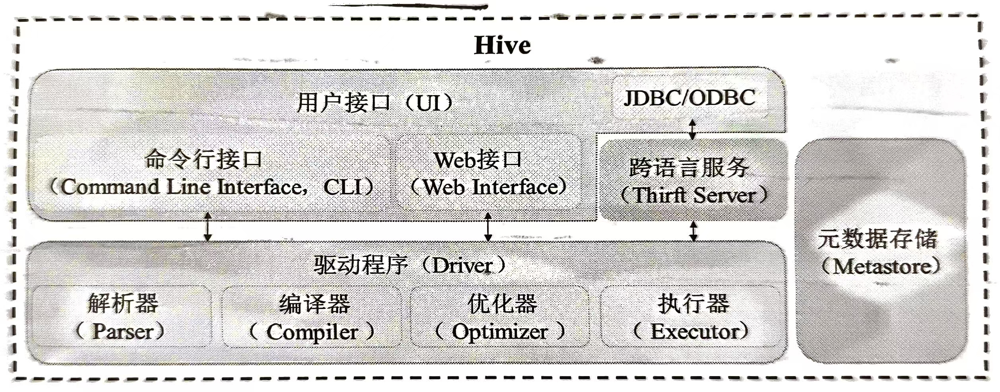
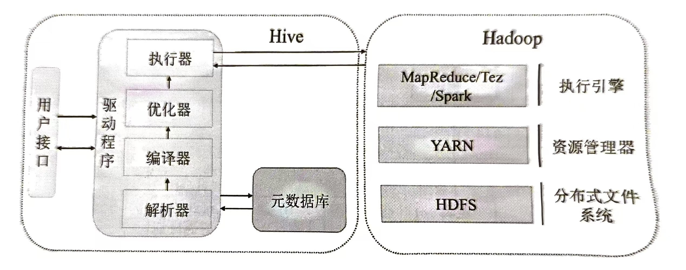
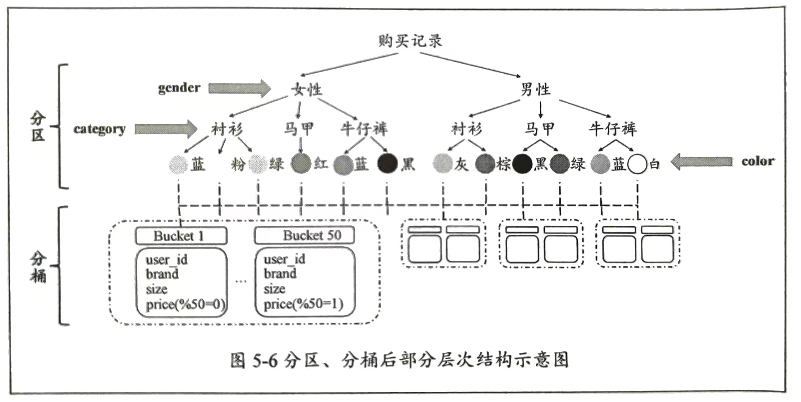
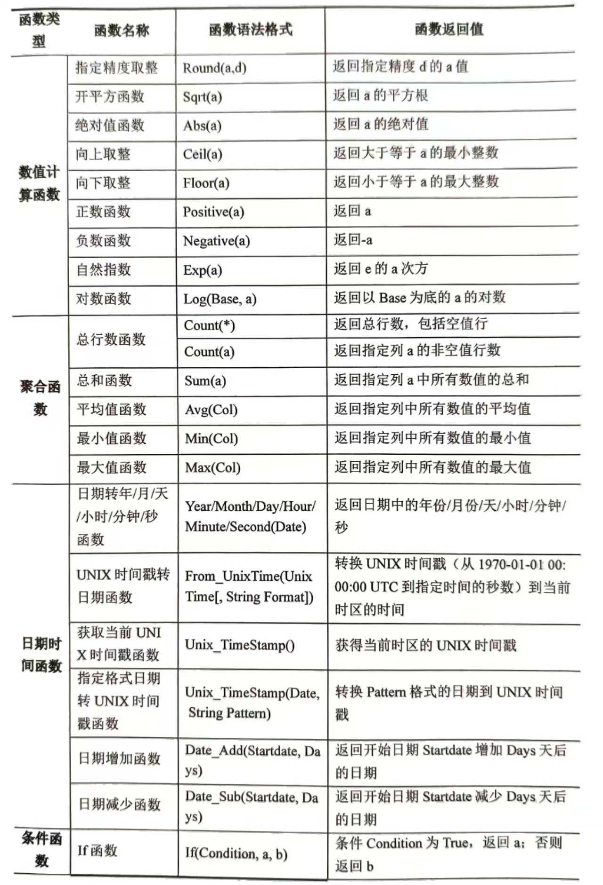
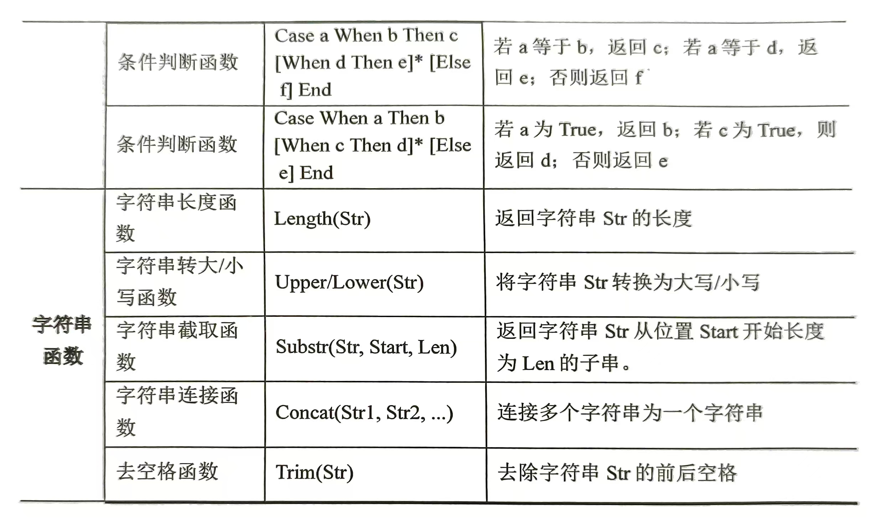

# 第五章 基于Hadoop的数据仓库工具Hive

## 1 Hive概述

### Hive简介

Hive是基于Hadoop建立的数据仓库工具，通过抽取`Extract`、转换`Transform`、加载`Load`（ETL）操作将多种数据源导入到Hadoop集群中，实现统一管理和分析。

提供了一种类似于SQL的结构化查询语言HQL，允许用户轻松地查询、分析和处理存储在HDFS中的数据

### Hive数据类型

- 基本数据类型

- 集合数据类型

	

### 应用场景

支持导入结构化和半结构化数据（如CSV文件、JSON文件等）

---

## 2 Hive架构及运行机制

### Hive架构

- 用户接口
	- 命令行界面`CLI`：适合用于执行简单的操作（创建表、增删改查数据等）和快速验证查询结果
	- JDBC/ODBC：接口使开发人员能够通过使用标准的SQL语句和编程语言（如Java、Python等）与Hive进行交互，更适合于开发复杂的应用程序和自动化任务
	- WebUI：提供更直观的Web操作控制台
- 跨语言服务`Thrift server`：通过Thrift server接口，可以用多种编程语言编写的客户端与Hive进行通信，执行查询和管理任务
- 驱动程序`Driver`：完成HQL查询语句的处理，包括对查询语句的词法分析、语法分析、编译、优化，以及生成最终查询计划
	- 解析器`Parser`
	- 编译器`Compiler`
	- 优化器`Optimizer`
	- 执行器`Executor`
- 元数据存储`Metastore`：元数据包括表名、表结构、字段名、字段类型等，用于描述数据的特征和属性

### Hive工作流程及与Hadoop生态系统的交互

---

## 3 Hive数据定义语言`DDL`

### 数据库管理

Hive支持创建、删除、重命名和切换数据库等操作

- 新建数据库

- 查询数据库

- 使用数据库

- 查看数据库信息

- 修改数据库

	在Hive中可以修改数据库的属性和所有者属性

	- 添加数据库描述
	- 修改数据库的所有者用户

- 删除数据库

### 表管理

在Hive中，表是数据组织和存储的基本单位，分为内部表和外部表

- 内部表`Managed table`：Hive默认创建的表类型，为表自动分配存储空间。当删除一个内部表时，Hive不仅会删除表的元数据，还将删除内部表绑定的所有数据文件
- 外部表`External table`：Hive只记录表的元数据，不负责实际的数据存储。外部表数据存储位置由建表语句中的`LOCATION`指定。删除外部表时，Hive只删除表的元数据，而不会影响实际的数据文件

**Hive中用于管理表结构的常用命令：**

- 创建表

- 修改表

- 删除表

	`DROP TABLE`语句用于删除表的元数据和数据。若指定`PURGE`，则表数据不会放入回收站，后续无法通过回收站恢复表数据。反之，表数据会放入回收站

### 视图管理

- 创建视图
- 重命名视图
- 查看视图
- 删除视图

### 索引管理

Hive中创建的索引是只读的，一旦创建了索引，则只能查询索引而不能修改索引

对表数据进行更新和删除操作时，索引会带来额外的开销

- 创建索引
- 查看表索引信息
- 删除索引

---

## 4 分区和分桶

### 分区

分区指将表中数据按照某一列或多列的值划分成若干个逻辑分区的过程。其中，用来划分数据并创建逻辑分区的一列或多列被称为分区键

一旦表被设置为分区表并指定了分区键，后续插入数据时会根据分区键的值将数据存储到相应的分区目录中

进行分区后，若要查询相关内容，只需要扫描满足对应条件的分区即可，而无需读取全部数据，极大提高了查询效率和数据检索速度

- 创建分区表：在创建表的语句后面添加`PARTITIONED BY`
- 增加分区
- 删除分区
- 查看分区表的所有分区

### 分桶

分桶是根据指定的某一列将数据文件划分为固定数量桶的技术。其中，桶不是文件夹或文件，而是数据在表中的逻辑分组。每个桶包含一部分数据，并存储在表的文件中。通过将数据文件划分到不同的桶中，可以改善数据访问的局部性，并进一步优化查询性能

创建分桶表：在创建表的语句后面添加`CLUSTERED BY`

### 分区和分桶辨析

分区提供一种划分数据和优化查询的方式。然后，并非所有的数据集都适合进行分区，因为部分分区后会出现数据倾斜问题，即分区之间数据量差异大。此时，可以考虑使用分桶来更加均匀地进行数据划分

分区和分桶的区别在于作用的范围不同。分区是针对数据的存储路径进行组织，通过在存储路径中加入分区信息来实现数据的划分。而分桶是针对数据文件进行组织，将数据文件按照某个规则分配到不同的桶中

---

## 5 Hive数据操作语言

### 加载文件

将本地磁盘或者HDFS文件中的结构化数据加载到指定的Hive数据表或分区中

### 查询插入

- 单表插入：将查询的单个结果集插入到一张表中
- 多表插入：将查询的多个结果集插入多张表中
- 本地插入：将查询的单个结果集插入本地文件系统或HDFS文件系统

### 数据迁移

- `IMPORT`命令用于将外部数据迁入Hive表
- `EXPORT`命令用于将表或分区的数据及其元数据迁出到指定的输出位置

两个命令常需要配合使用且遵循先导出，后导入的顺序，常见于在两个Hadoop集群之间进行Hive表的迁移

---

## 6 Hive数据检索

### Hive数据操作

- `WHERE`语句
- `GROUP BY`与`HAVING`语句
- `JOIN`语句
	- 内连接
	- 左连接、右连接和全连接
	- 左半连接：结果集只包含左表的列，不包含右表的列，用于筛选出左表中存在的符合连接条件的记录
	- 交叉连接（笛卡尔积）
- 排序语句
	- `ORDER BY`：全局排序，将结果集按照一个或多个字段进行升序或降序排序
	- `SORT BY`：内部排序，只在每个Reduce中对数据进行排序，保证局部有序，但不保证全局有序
	- `DISTRIBUTE BY`：分区排序，控制Map的输出按照指定的字段将数据划分到不同的Reduce输出文件中
	- `CLUSTER BY`：`DISTRIBUTE BY`+`SORT BY`，排序只能是升序排序，无法指定排序规则
- `LIMIT`语句

### Hive内置函数

