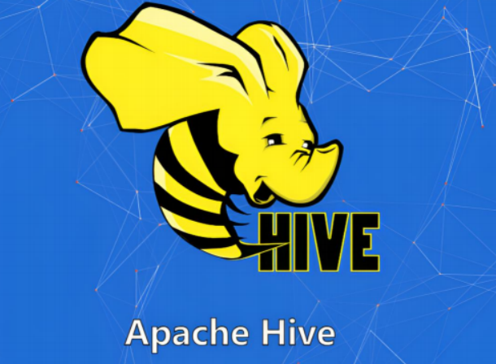
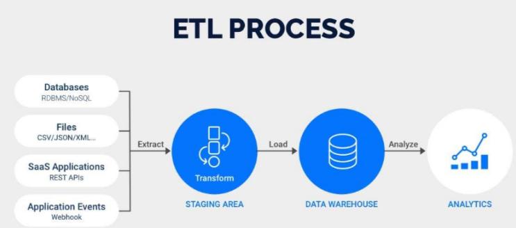
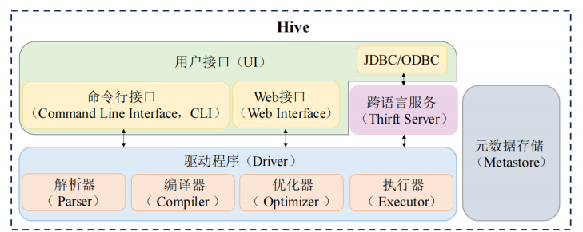
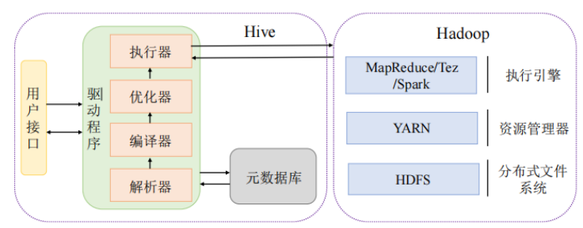
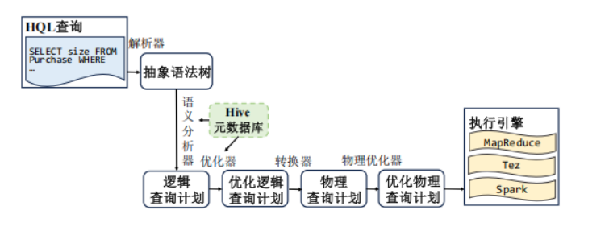

# 基于Hadoop的数据仓库工具 Hive


### 我们为什么选择 Apache Hive？

在面对汪洋大海般的大数据时，我们常常会问：有没有什么工具，既能驾驭这种规模的海量数据，又不需要我们下海去和复杂的分布式计算搏斗？答案就是——**Apache Hive**。

我们可以把 Hive 想象成是一个聪明的翻译官。它站在我们和 Hadoop 之间，一边听我们说类 SQL 的语言（也就是 HiveQL），一边迅速把这些“话”翻译成 Hadoop 能听懂的 MapReduce 任务。这就好比我们在用熟悉的语言发号施令，Hive 在幕后自动调度庞大的 Hadoop 集群帮我们干活，整个过程丝滑又高效。

## Hive基础及架构

#### Hive 是怎么帮我们管数据的？




Hive 的核心任务，其实就是三件事：**抽取（Extract）**、**转换（Transform）** 和 **加载（Load）**——也就是我们常说的 **ETL 操作**。它就像一个万能的接口，把来自不同渠道的数据源（比如日志、业务数据、CSV 文件等等）源源不断地导入 Hadoop 大家庭中，存储在 HDFS（Hadoop 分布式文件系统）里，统一管理、统一分析。

而且，Hive 很贴心地给这些原始的、结构化的数据“披上了表结构的外衣”，我们可以像操作数据库表一样去管理和查询它们——这一切，都离不开我们手中的利器：**HQL（Hive Query 、Language）**。

#### HQL：我们熟悉的“老朋友”

HQL 长得就像 SQL，说话的方式几乎一模一样，不区分大小写，写起来得心应手。我们以前用 `SELECT * FROM table WHERE ...`，在 Hive 里同样可以这么写。也就是说，**即便面对的是分布式的大数据系统，我们也不需要重新学习一套全新的编程语言**，继续用 SQL 思维去分析数据就够了——效率提升、学习成本降低，事半功倍！

更厉害的是，如果我们是技术高手，Hive 也留出了“高级通道”：我们可以自己写 MapReduce 程序，定制 Mapper 和 Reducer，来应对一些特别复杂的业务逻辑，比如数据合并、字段映射、数据清洗等，这就好比在自动驾驶的同时还保留了手动挡的操作选项，灵活又强大。

#### Hive 的执行引擎和运行架构

Hive 不是单打独斗，它运行在整个 Hadoop 分布式系统中，数据放在 HDFS 中，计算则可以交给 **MapReduce**、**Tez** 或者 **Spark** 来执行。可以理解为 Hive 是指挥家，调度不同的计算引擎演奏出最动听的数据交响曲。

#### Hive 的四大优势：

- 处理大数据，稳！

Hive 天生适合海量数据处理。我们可以把 TB、PB 甚至更大的数据集交给它，通过分布式计算，轻松实现批量数据迁移、过滤、清洗、挖掘等任务。别看它外表温和，其实它骨子里就是个“高性能批处理专家”。

- 数据模型，灵！

Hive 不挑食，不管是标准的结构化数据，还是带点“自由发挥”的半结构化数据（比如 JSON），它都能处理。支持数组、结构体、映射，甚至是嵌套数据结构，灵活得让人安心。

- 扩展能力，强！

我们可以为 Hive 自定义函数（UDF）、自定义聚合函数（UDAF），甚至自定义表函数（UDTF），根据不同业务逻辑进行个性化扩展，就像给它装插件一样，随用随调。

- 生态融合，好！

Hive 跟 Hadoop、Spark 等大数据生态成员关系紧密，可以无缝集成在一起。我们可以在 Hive 中处理数据，在 Spark 中建模分析，搭配使用、效率翻倍。

### Hive核心架构



**Hive核心组件**

Hive 架构包含以下四个核心组件：用户接口、跨语言服务、驱动程序（Driver）和元数据存储（Metastore）。

#### 用户接口（UI）

Hive 不仅是个强大的数据仓库，它还是个“非常好相处”的系统——不管我们是数据分析师、开发者，还是运维工程师，Hive 都为我们准备好了多种与它对话的方式。我们只需选择自己最熟悉的“通道”，就能轻松上手、畅快交流。

那么，Hive 都有哪些用户接口？

##### 命令行界面（CLI）:“撸代码”

如果我们喜欢用键盘“撸代码”，那么 Hive 的命令行界面（Command Line Interface，简称 CLI）就是我们的好伙伴。它就像数据库界的终端窗口，我们可以直接敲命令，像这样：

```sql
CREATE TABLE sales (...);
SELECT * FROM sales WHERE region = 'East';
```

CLI 适合执行一些常规操作，比如建表、查数据、删表等，非常适合快速验证想法、调试查询语句或写点临时脚本。

##### Web 接口：可视化控台，点一点也能玩转数据

不是每个人都喜欢在黑窗口里写命令，所以 Hive 贴心地提供了 Web 界面。通过浏览器就能登录进来，看到熟悉的图形化操作界面。

我们可以上传数据、执行查询、查看执行计划、查看任务运行情况

这一切都可视化展现，不仅对新手友好，也方便我们做一些简单管理和监控工作，轻松又直观！

##### JDBC 和 ODBC 接口：为开发者量身打造的“连接桥梁”

如果我们是 Java 或 Python 开发者，想让应用程序自动去 Hive 查询数据，那 JDBC（Java Database Connectivity） 和 ODBC（Open Database Connectivity） 就是必不可少的接口。

这些标准化的接口就像是我们应用程序和 Hive 之间的桥梁，让我们可以用熟悉的 SQL 语句，在代码中对 Hive 数据库进行各种操作，比如批量查询数据、自动化报表生成、后台数据预处理

无论是做大数据 ETL，还是写 BI 系统，JDBC/ODBC 都是不可或缺的武器！

##### 总结一下，我们怎么“叫醒” Hive？

| 接口类型  | 适用场景             | 特点                         |
| --------- | -------------------- | ---------------------------- |
| CLI       | 快速操作、调试命令   | 简洁、高效、适合开发者       |
| Web 界面  | 图形化操作、管理数据 | 直观、友好，适合非技术人员   |
| JDBC/ODBC | 程序开发、自动化处理 | 支持各种编程语言，灵活可拓展 |

不管我们是谁、用什么方式接触 Hive，它都能给我们提供合适的入口。正是这种灵活开放的接口体系，让 Hive 能无缝融入各种数据平台和工作流中，真正做到“你用你熟悉的方式，我做我专业的数据处理”。

#### 跨语言服务：我们如何用不同语言调用Hive？跨语言服务了解一下！

在 Hive 的世界里，我们可不光是人机对话的高手，它还非常擅长**“语言沟通”**。不管我们是用 Java、Python 还是 C++，Hive 都能听懂！这多亏了它背后的跨语言秘密武器——**Apache Thrift**。

##### 什么是 Apache Thrift？

我们可以把 Thrift 想象成是 Hive 的“翻译官”，它负责把 Hive 的指令和响应，翻译成各种编程语言能理解的形式。它有点像 API 自动生成工厂：只要我们用一种通用的语言（IDL）描述接口，Thrift 就能立刻给我们生成 Java、Python、C++ 等语言版本的客户端代码。

> 所以，不管我们团队用什么语言开发，只要调用 Thrift 提供的 API，就能和 Hive 建立通信，读取数据、发送查询，轻松集成进各种项目中！

#### Hive 驱动程序：幕后智囊团的四重奏

当我们发出一条 HQL 查询，Hive 并不是直接就去执行，而是经过一整套严谨的“内部流程”。这套流程的核心主角就是我们称为“驱动程序（Driver）”的模块，它由以下几个部分组成：

#####  1. 解析器（Parser）

负责把我们写的 HQL 语句拆解成语法树，进行词法和语法分析。就像 Hive 在“读懂”我们说的每一句话，理解语法结构是否正确。

#####  2. 编译器（Compiler）

把语法树翻译成逻辑执行计划，决定要查哪些表、过滤哪些数据，类似“把问题转化成操作方案”。

#####  3. 优化器（Optimizer）

逻辑计划有了？别急，优化器登场！它负责“精打细算”，比如合并扫描操作、避免重复计算、选择最佳执行顺序，以便用最少的资源完成任务。

#####  4. 执行器（Executor）

最终，把优化过的计划交给执行器，生成真正能跑在 Hadoop 上的 MapReduce、Tez 或 Spark 任务。任务一旦跑起来，数据就开始在集群里“飞驰”了！

#### 元数据存储：Hive 的“数据字典”

我们常说“术业有专攻”，数据虽然放在 HDFS 中，但 Hive 可不只是保存数据这么简单，它还得“知道”这些数据的**结构和属性**。这就涉及到了 Hive 的另一个核心：**元数据（Metadata）**。

元数据包括：表名、数据库名，字段名称、字段类型，分区信息、存储格式，文件路径、创建时间等

这些信息都被集中存储在一个叫 **Metastore** 的地方，就像是 Hive 的“数据字典”或“说明书”，每次我们查询，Hive 都要来这里“翻翻字典”。

###  Hive 在 Hadoop 中的“角色扮演”：我们是如何驾驭大数据引擎的？


在庞大的 Hadoop 集群里，我们可以把 Hive 想象成一个**“大数据驾驶舱”**。我们不需要亲自操控底层的 MapReduce 引擎，也无需关心任务怎么被调度、数据怎么在集群间传输——这些繁琐的细节，Hive 都帮我们搞定了。

它就像是一个“SQL 翻译官 + 调度大师”，让我们用熟悉的 SQL 写查询，它却能背后默默转译成可以跑在集群上的复杂分布式任务！

### 工作流程：我们的一条 HQL 查询，是怎么一步步跑起来的？



我们设想一下——我们在命令行或网页上输入了一条 HQL 查询，然后 Hive 是怎么把它执行出来的呢？

整体流程，其实可以看成是以下几个关键步骤：

1. **提交查询**
    使用 CLI/Web/JDBC 等接口，输入 HQL 查询，例如：

   ```sql
   SELECT * FROM sales WHERE region = 'East';
   ```

2. **驱动程序接收指令，准备“翻译”工作**
    Hive 的 Driver 收到我们的请求，开始内部的“翻译和调度”流程。
3. **任务生成并提交给 YARN**
    Driver 将我们的查询语句经过处理，转换为可以由 Hadoop 执行的 MapReduce、Tez 或 Spark 任务。
4. **Hadoop 集群开始并行执行**
    YARN 接到任务后，把它分发到集群中各个节点进行并行处理。
5. **查询结果返回**
3. **任务生成并提交给 YARN**
    Driver 将我们的查询语句经过处理，转换为可以由 Hadoop 执行的 MapReduce、Tez 或 Spark 任务。
4. **Hadoop 集群开始并行执行**
    YARN 接到任务后，把它分发到集群中各个节点进行并行处理。
5. **查询结果返回**
    执行完成后，结果从 HDFS 中读取出来，回传给 Hive，最终呈现在我们的界面上

