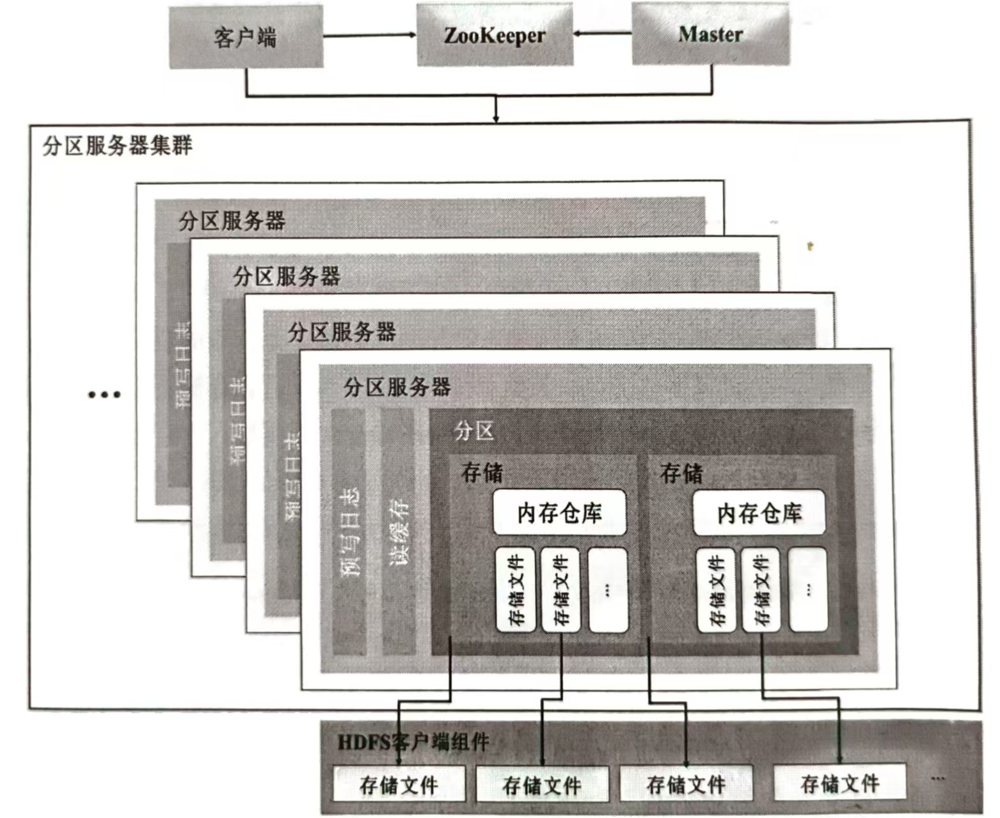
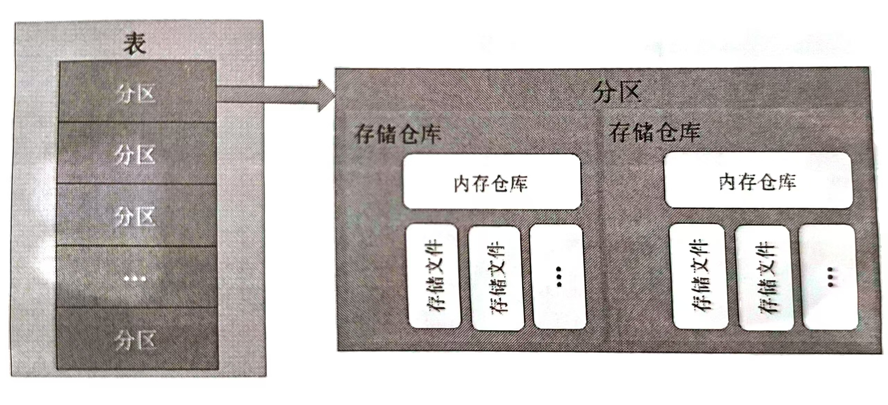

# 第六章 分布式数据库HBase

与MapReduce的离线批处理计算框架不同，HBase提供随机访问存储和数据检索功能，弥补了HDFS和Hive在实时性、随机访问和数据更新等方面的不足，使得HBase更加适合需要高性能、实时数据处理和频繁数据操作的应用场景

## 1 数据库系统概述

### 数据库系统组成

- 数据库`DB`
- 存储硬件
- 数据库应用软件
	- 操作系统
	- 数据库管理系统`DBMS`：数据定义，数据操纵，数据库建立和维护，数据库传输，数据库运行管理
	- 应用程序
- 人员
	- 数据库设计人员
	- 系统分析员
	- 数据库管理员`DBA`
	- 应用程序员

### ACID

DBMS的四个关键特征

- 原子性`Atomicity`
- 一致性`Consistency`
- 隔离性`Isolation`
- 持久性`Durability`

**ACID中的一致性约束：**

- 约束完整性
- 域完整性
- 引用完整性
- 事务完整性

### 数据模型的三要素

- 描述系统静态特征的**数据结构**：数据库的组成对象以及对象之间的联系
- 描述系统动态特征的**数据操作**：对数据库中对象所执行操作的集合，包括数据插入、数据删除、数据修改和数据检索等
- 系统中定义的数据**完整性约束**：用于防止不符合规范的数据进入数据库，包括主键约束、Check约束、Unique约束、默认约束以及外键约束

---

## 2 关系型数据库

### 常见数据依赖关系和约束

- 主键约束
- 唯一约束
- 外键约束
- 默认值约束
- 检查约束

### SQL常用命令

| 语言类型              | 动作           | SQL示例语句                                                  |
| :-------------------- | :------------- | :----------------------------------------------------------- |
| **数据定义语言`DDL`** | 创建数据库     | `CREATE DATABASE database_name;`                             |
|                       | 创建表         | `CREATE TABLE table_name (column1 datatype, column2 datatype, …);` |
|                       | 修改表结构     | `ALTER TABLE table_name ADD/DROP/RENAME column_name datatype;` |
| **数据操纵语言`DML`** | 插入数据       | `INSERT INTO table_name (column1, column2, …) VALUES (value1, value2, …);` |
|                       | 更新数据       | `UPDATE table_name SET column1=value1, column2=value2 WHERE condition;` |
|                       | 删除数据       | `DELETE FROM table_name WHERE condition;`                    |
|                       | 查询数据       | `SELECT (column1, column2, …) FROM table_name WHERE condition;` |
| **数据控制语言`DCL`** | 授予权限       | `GRANT privilege_type ON database_name TO user_name;`        |
|                       | 撤销权限       | `REVOKE privilege_type ON database_name FROM user_name;`     |
| **事务控制语言`TCL`** | 提交事务       | `COMMIT;`                                                    |
|                       | 回滚事务       | `ROLLBACK;`                                                  |
|                       | 设置事务保存点 | `SAVEPOINT savepoint_name;`                                  |
|                       | 设置事务属性   | `SET TRANSACTION transaction_characteristic;`                |

---

## 3 HBase

是一个分布式、面向列的NoSQL数据库，建立在HDFS之上，具备高可靠性、高性能和可扩展性，主要用于处理大规模的非结构化和半结构化数据集

### HBase表结构

- 行`Row`
- 列族`Column family`
- 列限定符`Column qualifier`
- 单元格`Cell`
- 时间戳`Timestamp`
- 分区`Region`
- 命名空间`Namespace`：党需要把多个表分到一个组去统一管理时，会用到表命名空间
- 数据定位

### HBase优缺点

**优点：**

- 容量巨大
- 可扩展性强
- 支持多版本
- 支持稀疏存储
- 支持处理过期数据
- 原生支持Hadoop

**缺点：**

- 不适用于复杂的聚合运算（如Join和GroupBy）
- 缺乏二级索引功能，无法进行二级索引查找
- 原生的HBase不支持全局跨行事务，仅支持单行事务模型

### HBase体系架构

采用主从结构模型的架构

- 一个管理集群的Master节点：主要负责HBase系统的各种管理工作
- 一个ZooKeeper节点：协助Master节点对集群进行管理
- 分区服务器：由一个（或多个）预写日记、读缓存（BlockCache）以及多个分区构成，主要负责用户数据写入、读取等基础操作
- HDFS客户端组件`DFS Client`：负责与底层的HDFS交互，用于读取和写入数据，具体包括管理与HDFS的连接、执行文件的读写操作以及处理数据块的位置信息和复制策略

### HBase数据模型

在HBase中，表的行键范围被划分为多个分区，每个分区负责存储一定范围内的行键数据。初始情况下，表通常有一个默认的分区。随着数据的增加，分区的大小会逐渐增大。为了避免单个分区变得过大影响性能，HBase会根据预设的阈值自动触发分裂操作。分裂将一个分区拆分为两个，每个新分区负责原分区的一半数据范围，以此类推。这种自动分裂机制使得HBase能够在数据不断增长的情况下进行水平扩展，从而保证系统的性能和可用性。通过合理设置分区大小和阈值，可以有效管理数据存储和访问效率。
分区是HBase由一个或多个存储仓库组成的（一个存储仓库对应一个列族的数据），每个存储仓库由一个内存仓库和多个存储文件组成。数据写入时，首先进入内存仓库并存储在内存中。内存仓库中的数据是有顺序的，当内存仓库的存储量累计到一定阈值时，就会创建一个新的内存仓库，并将旧的内存仓库添加到刷写队列，由单独的线程写入到磁盘上，成为一个存储文件。当一个存储仓库中的存储文件达到一定阈值后，就会进行一次合并操作——将对同一个行键的修改记录合并到一起，形成一个大的存储文件。当存储文件的大小达到一定阈值后，又会对存储文件进行切分操作，等分为两个存储文件。

### HBase读写程序

**HBase写入程序流程：**

1. 客户端首先根据连接配置的ZooKeeper地址，获取元数据表hbase:meta表所在的分区服务器地址。注意，hbase:meta有且仅有一个分区，获取到地址后客户端会缓存该地址
2. 客户端根据步骤1获取到的分区服务器地址，访问hbase:meta表数据并缓存，hbase:meta表数据列出了每个分区所在的分区服务器以及开始和结束行键，同时客户端会缓存这些信息
3. 客户端根据命名空间、表名和行键信息，找到写入数据对应的分区客户端向分区对应的分区服务器发起远程过程调用协议`RPC`请求
4. 分区服务器接收到写入请求之后将数据解析出来，首先写入预写日志文件，再写入目标分区的内存仓库
5. 随着数据的不断写入，内存仓库中存储的数据会越来越多。系统为了保持内存在一个合理的水平，会在内存仓库容量超过阈值时将其中的数据刷写到磁盘上，形成IDFS 中的存储文件。至此，数据真正地被持久化到硬盘上，就算服务器断电宕机，数据也不会丢失

**HBase读取操作流程：**

1. HBase客户端首先访问ZooKeeper，获取元数据表hbase:meta所在的分区服务器地址
2. 根据上一步获取的地址，客户端访问对应的分区服务器。进一步根据命名空间、表名和行键信息，对元数据表进行扫描，找到目标数据对应的目标分区信息
3. 客户端向目标分区的分区服务器发送读取请求
4. 当读取请求到达分区服务器后，首先检查读缓存。读缓存是内存中的缓存，用于存储最近读取的数据。如果请求的数据在读缓存中，直接从缓存中读取数据，可以显著提高读取速度
5. 如果目标数据不在读缓存中，分区服务器会在对应的存储文件中查找数据
6. 如果目标数据最近被写入但还未刷写到存储文件中，那么目标数据则可能存在于内存仓库中，此时分区服务器会在内存仓库中查找数据
7. 由于HBase的每个单元格存储多个版本的数据，分区服务器可能需要从多个存储文件和内存仓库中检索数据。这些数据会被合并，以提供具有最新时间戳标记的数据
8. 经过合并和排序后，目标数据会返回给HBase客户端

### HBase shell

HBase通过命令行交互工具HBase shell实现数据定义和数据操纵操作

**数据定义语言：**

- `CREATE`：用户可以在任何时候往任何列族中添加任何列，而无需在表创建时声明它们

- `LIST`：列出HBase实例中所有表名

- `DESCRIBE`：返回表的表名、列族名称及其配置属性

	> **配置属性：**
	>
	> - 版本数`VERSIONS`：显示表中保留了多少个数据版本
	> - 压缩类型`COMPRESSION`
	> - 生存时间`Time-To-Live, TTL`：超过TTL的数据会被自动清理
	> - 保留已被删除的数据`KEEPDELETED_CELLS`
	> - 可读取数据的最小单元`BLOCKSIZE`

**数据操纵语言：**

- `PUT`：插入一个单元格的数据

	> HBase没有特定的更行命令，可以通过新插入一条数据的方式覆盖以前的数据

- `GET`：通过指定时间戳来获取在该时刻的行数据

- `SCAN`：扫描表的数据然后全部输出

- `DELETE`：删除某列数据

- `DELETEALL`：删除整行数据

- `TRUNCATE`：清除表格中所有的数据

	> 清除表数据之前需要将表禁用：`DISABLE <表名>`

