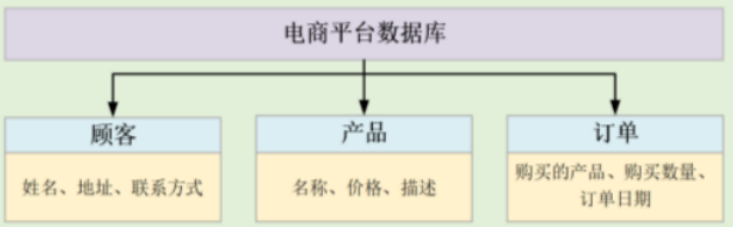
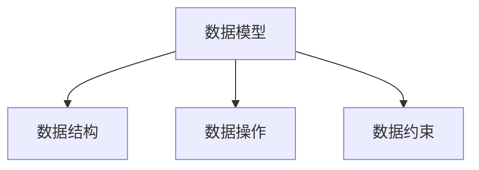
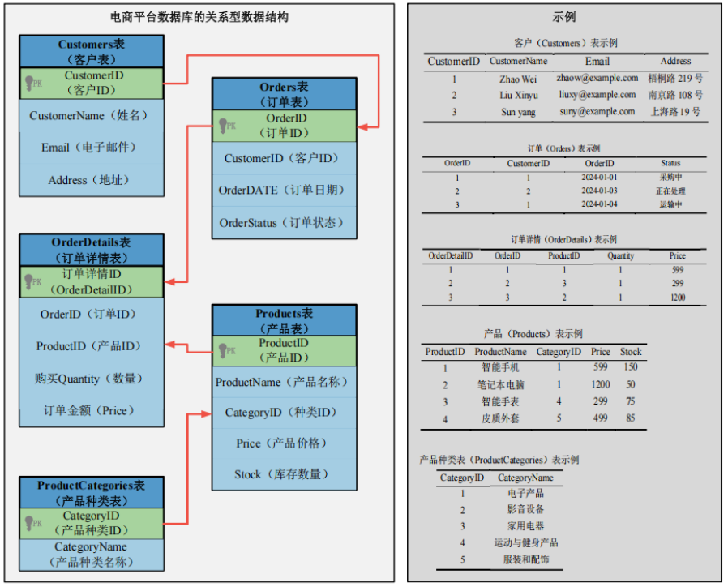

## 初识 HBase：打造高性能实时数据处理的利器


在我们面对海量数据挑战的今天，传统的关系型数据库往往难以应对高并发访问和实时读写的需求。这时候，HBase 就登场了。

HBase 是一个开源的、面向列的分布式 NoSQL 数据库，它支持高性能的实时读写操作，同时具备良好的水平扩展能力。换句话说，我们可以用一堆普通的 PC 服务器，搭建起一个能处理海量结构化数据的大型集群系统。

说到这里，可能会有人问：“HBase 和 Hadoop 的 MapReduce 有啥关系？”简单来说，MapReduce 更擅长做批处理任务，比如大数据的离线计算。而 HBase 则补上了 MapReduce 不擅长的一块——实时性。它支持随机读写操作，弥补了 Hadoop 的 HDFS 和 Hive 在实时查询、数据更新等方面的短板。

这也正是 HBase 的魅力所在：当我们的应用场景需要高性能的数据处理、实时查询，甚至是频繁的数据写入与更新时，HBase 就是我们手中的利器。

## 6.1 数据库系统概述：数据世界的基石

在这个数据爆炸的时代，几乎所有的系统背后都有一个强大的数据库系统在默默支撑。无论是我们使用的社交应用、电商平台，还是银行、医院、学校等机构的后台系统，数据库的存在都是不可或缺的。那么，什么是数据库系统？它到底由哪些部分组成？今天我们就一起来了解一下数据库系统的基本面貌。

#### 什么是数据库系统？

简单来说，**数据库系统**是一个用来**存储、管理、检索和处理大量数据**的系统。它不是单独的一个软件或设备，而是一个由多部分组成的“协作系统”，包括：

1. **数据库**（Database）：数据的“仓库”，是结构化、有组织、可共享的数据集合。
2. **存储硬件**：各种实际承载数据的物理设备，比如服务器、硬盘等。
3. **数据库应用软件**：最核心的是数据库管理系统（DBMS），它负责组织和维护数据。
4. **人员**：包括设计、开发、管理数据库的各类专业人员。

数据库系统无处不在，广泛应用于企业管理、金融、电商、医疗、教育等几乎所有我们能想到的领域。

其中的“核心”是 **数据库管理系统（DBMS）**。它的任务就是在操作系统的基础上，提供一个强大又可靠的数据管理工具。最关键的是，它要确保所有操作都遵守 **ACID 原则**，也就是我们常听到的：

- **原子性（Atomicity）**：事务中的操作要么全做，要么全不做；
- **一致性（Consistency）**：操作前后数据库保持合法状态；
- **隔离性（Isolation）**：多个事务同时执行时互不干扰；
- **持久性（Durability）**：事务一旦完成，结果永久保留。

这些规则保证了数据库的稳定、安全和可靠性。此外，一致性还包括一些更细致的机制，比如：

- **主键和外键约束**（保证数据正确关联）；
- **字段类型约束**（比如年龄字段必须是整数）；
- **引用完整性**（比如订单里的用户必须在用户表中存在）；
- **事务一致性**（确保整个事务过程不出错）。

### 6.1.1什么是数据模型？

我们可以把**数据模型（Data Model）**看作是现实世界和数据库系统之间的一座桥梁。它就像是一种“语言”或“框架”，帮助我们用抽象的方式去描述数据的结构、行为以及规则。




举个简单的例子：现实中有“顾客”“商品”“订单”，在数据库中我们就需要通过数据模型，把它们“翻译”成一个个表格、字段和关系。

#### 数据模型的三种类型

数据模型按用途可以分为三类：**概念模型、逻辑模型和物理模型**。它们之间是一个从抽象到具体、从业务到实现的过程。

##### 1. 概念模型：从业务出发，建立蓝图

概念模型是我们建库的第一步。它关注的是**“业务上存在哪些数据”以及“它们之间的关系是什么”**。这个阶段完全不关心数据库技术细节，比如用不用 MySQL、存在哪个磁盘上这些都不重要。

我们可以把概念模型比作建筑设计图，是用来沟通业务需求和总体结构的工具。常用的表现形式是 **ER 图（实体-关系图）**。

>##### 什么是“实体”和“联系”？
>
>- **实体**：可以被识别的对象，比如顾客、商品、订单。
>- **实体集**：同类实体组成的集合，比如所有的商品。
>- **联系**：实体之间的关联，比如“顾客购买商品”“员工属于公司”。
>  - 一对一：如品牌公司与董事长
>  - 一对多：如品牌公司与员工
>  - 多对多：如顾客与品牌公司

##### 2. 逻辑模型：从图纸到结构

概念模型不能直接被数据库识别，我们还需要把它转化为能由数据库管理系统理解的格式，这就是**逻辑模型**。

逻辑模型专注于描述数据的**逻辑结构**，比如表、字段、数据类型和主外键关系。它不受具体数据库产品的限制，适用于不同系统之间的迁移或设计抽象。

常见的逻辑模型包括：

- **关系模型**（我们最常用，如 MySQL 的表结构）
- **维度模型**（常用于数据仓库）

##### 3. 物理模型：落地执行的技术细节

最后一步，是把逻辑模型转换成真正能在数据库中运行的形式，这就是**物理模型**。

物理模型关注的是：

- 数据的**存储方式**
- **索引**设计
- **存储路径**与**设备**
- 与操作系统、数据库软件之间的配合

它需要考虑实际性能、硬件资源和数据库管理系统（DBMS）的能力。

> ##### 一个例子理解三类模型的关系
>
> 我们可以将数据库设计过程类比为建造一栋房子：
>
> | 阶段     | 对应模型 | 类比说明                                       |
> | -------- | -------- | ---------------------------------------------- |
> | 设计阶段 | 概念模型 | 草图：说明“这里是客厅、这里是厨房”，不涉及施工 |
> | 准备阶段 | 逻辑模型 | 设计图纸：给出每一面墙、门的位置和尺寸         |
> | 实施阶段 | 物理模型 | 工程图：设计水电管线、建材规格、施工工艺等     |

#### 数据模型的三要素

一个完整的数据模型，不只是结构那么简单。它还包括了数据的操作方式和规则约束。我们一起来看看组成数据模型的三个核心部分：



##### 1. 数据结构：定义“有哪些数据”

数据结构描述的是数据库中的**对象（实体）及其之间的关系**。

##### 举个例子：电商平台的数据结构

- 顾客实体：包含姓名、地址、联系方式等；
- 产品实体：名称、价格、描述等；
- 订单实体：包含产品信息、顾客信息、订单时间等；
   通过这些实体间的关系，我们可以追踪“谁买了什么产品，什么时候买的”。

##### 2. 数据操作：我们能对数据做什么？

数据库系统必须支持基本的增删改查操作（即 CRUD）：

- 插入：新增顾客、产品或订单
- 删除：删除不活跃用户或已取消订单
- 修改：更新顾客联系方式或商品价格
- 查询：查顾客的购买记录、某个时间段的订单

这些操作都有一套固定的规则和语法，通常用 SQL 实现。

##### 3. 数据完整性约束：确保“数据不能乱来”

完整性约束就像数据库的“法律”，它确保数据不会出现逻辑错误或不合规范的内容。比如：

- **主键约束**：每个产品 ID 必须唯一
- **外键约束**：订单中引用的产品必须存在
- **Check 约束**：价格不能为负数
- **默认值**：新顾客的“状态”字段默认为“激活”

这套机制可以有效防止“脏数据”进入数据库系统。

### 6.1.2关系型数据库：让数据像表格一样清晰

在我们日常接触的数据系统中，最常见、最成熟的一种数据库类型就是**关系型数据库（Relational Database）**。不论是我们用的电商平台、银行系统，还是学校教务系统，背后基本都有它的身影。那么关系型数据库到底长啥样？它又是怎么组织和管理数据的呢？

#### 什么是关系型数据库结构？

顾名思义，**关系型数据库**是用“关系”（也就是我们熟悉的表格）来组织和存储数据的。每一张表由“行”和“列”组成，这种结构让数据的查询、更新都变得非常方便。

按照标准定义，关系型数据库的结构由三部分构成：

- 数据结构（数据长什么样）
- 数据操作（我们怎么用它）
- 数据约束（怎样保证数据的正确性）

下面，我们先从**数据结构**说起

##### 基本术语秒懂：看懂数据库表的每一个部分

我们用一个电商平台的例子来说明这些概念，看下面这张简化版的客户表（Customers）：

| CustomerID | CustomerName | Email                                         | Address       |
| ---------- | ------------ | --------------------------------------------- | ------------- |
| 1          | Zhao Wei     | [zhaow@example.com](mailto:zhaow@example.com) | 梧桐路 219 号 |
| 2          | Liu Xinyu    | [liuxy@example.com](mailto:liuxy@example.com) | 南京路 108 号 |
| 3          | Sun Yang     | [suny@example.com](mailto:suny@example.com)   | 上海路 19 号  |

来看几个重要的术语：

1. **关系（Relation）**：就是上面这张“表”，它是关系型数据库的基本单位。
2. **元组（Tuple）**：表中的一行，比如上面第一行信息，就是一个“元组”，也就是一条记录。
3. **属性（Attribute）**：表中的一列，比如“CustomerName”就是一个属性。
4. **域（Domain）**：某个属性可取的值的范围，比如“Email”这个属性的值必须是邮箱格式。
5. **主键（Primary Key）**：唯一标识每条记录的字段，比如“CustomerID”。
6. **候选码（Candidate Key）**：可能作为主键的字段，比如 Email 也是唯一的，也可以当主键。
7. **外键（Foreign Key）**：表中的某个字段指向其他表的主键，比如订单表中的“CustomerID”就是从客户表来的。
8. **全键（All Key）**：所有能唯一标识一条记录的字段组合，比如“CustomerID + Email”也可以。
9. **分量（Component）**：某条记录中某个字段的具体值，比如“1”是第一条记录的“CustomerID”。

#### 多张表怎么协作？看看电商数据库结构示意图


一个电商平台数据库可能包含下面这些表：

- **Customers**（客户信息）
- **Orders**（订单信息）
- **OrderDetails**（订单中每个商品的详情）
- **Products**（商品信息）
- **ProductCategories**（商品类别）

它们的关系大概是这样的：

- 一个客户可以有多个订单；
- 一个订单包含多个商品（通过 OrderDetails 表记录）；
- 每个商品属于某一个类别。

通过这些关系，我们不仅能实现数据的“拆分与复用”，还能高效组织、查找和更新数据。

#### 关系模式：从结构上定义每张表

关系型数据库不仅仅是“表格”，我们还要为这些表定义清晰的结构，这就是所谓的**关系模式（Relation Schema）**。

举个例子，客户表的模式可以写成：$$ R(Customers, U, D, DOM, F)$$

**R**：关系名，也就是表名，比如 Customers

**U**：属性集合，比如 {CustomerID, Name, Email, Address}

**D**：数据类型集合，比如都是 string

**DOM**：属性与数据类型的映射，比如 DOM(CustomerID) = string

**F**：约束集合，包括下面这些：

> 常见的约束有哪些？
>
> | 约束类型 |       说明       | 示例                                                    |
> | -------- | :--------------: | ------------------------------------------------------- |
> | 主键约束 |   保证唯一标识   | `Primary Key(CustomerID)`                               |
> | 唯一约束 |    防止重复值    | `Unique(Email)`                                         |
> | 外键约束 |   建立表间联系   | `Foreign Key(Orders.CustomerID → Customers.CustomerID)` |
> | 默认值   | 没填内容时的默认 | `Default(Address, "")`                                  |
> | 检查约束 |  强制值格式合法  | `Check(CustomerID like "c00x")`                         |

### 关系型数据库怎么玩？搞懂关系操作和完整性约束就够了！

前面我们聊了关系型数据库的结构，现在是时候回答另一个问题了：**我们怎么用这些表来处理和查询数据？**

答案就在这一节的主角——**关系操作**里。除此之外，我们还会聊聊另一个同样重要但常被忽略的部分：**数据完整性约束**。它们就像是数据库世界中的“交通规则”，保障数据井然有序地流动。

#### 什么是关系操作？

通俗点说，**关系操作**就是我们能在数据库中对表做的事情。比如：

- 查数据（查询）
- 加数据（插入）
- 删数据（删除）
- 改数据（更新）

这四大操作是数据库应用最核心的部分。在不同的数据库系统（像 MySQL、PostgreSQL、Oracle）中，我们可以用类似的语言来实现这些操作，比如 SQL。

不过，关系操作并不止这些！在理论上，它还包括很多我们常用的“集合类”操作，比如并、差、交、连接等，下面带你逐个盘一盘。

#### 核心关系查询操作一览

我们来看看几种经典的查询操作，配合电商平台的例子就更容易理解啦。

##### 选择（Select）

从表里筛选符合某个条件的“行”。
 **例子**：找出订单金额大于 1000 的记录。

```sql
SELECT * FROM OrderDetails WHERE Price > 1000;
```

##### 投影（Project）

只要你关心的“列”。
 **例子**：只看订单 ID 和金额，不看其他字段。

```sql
SELECT OrderID, Price FROM OrderDetails;
```

##### 连接（Join）

把两张表“拼起来”，从而获取更完整的信息。
 **例子**：订单表 + 客户表，通过 CustomerID 把客户名也查出来。

```sql
SELECT Orders.OrderID, Customers.CustomerName 
FROM Orders 
JOIN Customers ON Orders.CustomerID = Customers.CustomerID;
```

##### 并（Union）

两个结构相同的表，合并成一个大表（不能重复）。
 **例子**：合并“今年订单”和“去年订单”。

```sql
SELECT * FROM Orders2023
UNION
SELECT * FROM Orders2024;
```

##### 差（Except）

A 表有但 B 表没有的记录。
 **例子**：今年下单但去年没下单的客户。

```sql
SELECT CustomerID FROM Orders2024
EXCEPT
SELECT CustomerID FROM Orders2023;
```

##### 交（Intersection）

两个表都包含的记录。
 **例子**：今年和去年都购物的客户。

```sql
SELECT CustomerID FROM Orders2024
INTERSECT
SELECT CustomerID FROM Orders2023;
```

##### 笛卡尔积（Cartesian Product）

两个表的每个记录互相组合，生成最大可能的组合集。
 通常不用直接查询它，但它是 JOIN 操作的基础。

#### SQL 是如何支持关系操作的？

在实际开发中，我们通常使用**SQL**（结构化查询语言）来实现上述操作。SQL 是最主流的关系型数据语言，它不仅能做数据查询，还支持：

- **DDL（定义语言）**：建表、删表
- **DML（操纵语言）**：增删改查
- **DCL（控制语言）**：管理权限
- **TCL（事务控制语言）**：处理事务、回滚等

其他像 Oracle 的 PL/SQL、PostgreSQL 的 PL/pgSQL 也是围绕这些核心功能扩展而来的。

#### 数据完整性约束：数据世界的“交通规则”

数据库不是“你想存什么就存什么”的地方。我们需要设定一些规则，确保数据是合法、准确、可依赖的。于是就有了**关系型数据完整性约束**。

它包含三个大类：

##### 1.实体完整性

每一条记录都必须是唯一的，不能重复，不能空。
 → **主键（Primary Key）** 就是实现这个规则的关键。
 **例子**：每个客户的 ID 不能重复也不能缺失。

##### 2.参照完整性

不同表之间的“链接”要真实有效。
 → **外键（Foreign Key）** 帮我们实现这种关联。
 **例子**：订单表中的 CustomerID 必须在客户表中真实存在。

系统在我们插入或更新数据时，会自动帮我们检查这些外键是不是“靠谱的”。

##### 3.用户定义完整性

我们自己定的业务规则，比如：

- 默认值（Default）
- 范围限制（Check）

**例子**：

```sql
CREATE TABLE Orders (
  OrderID INT PRIMARY KEY,
  Status VARCHAR(20) DEFAULT 'Pending',
  Quantity INT CHECK (Quantity > 0)
);
# 2.参照完整性

不同表之间的“链接”要真实有效。
 → **外键（Foreign Key）** 帮我们实现这种关联。
 **例子**：订单表中的 CustomerID 必须在客户表中真实存在。

系统在我们插入或更新数据时，会自动帮我们检查这些外键是不是“靠谱的”。

##### 3.用户定义完整性

我们自己定的业务规则，比如：

- 默认值（Default）
- 范围限制（Check）

**例子**：

```sql
CREATE TABLE Orders (
  OrderID INT PRIMARY KEY,
  Status VARCHAR(20) DEFAULT 'Pending',
  Quantity INT CHECK (Quantity > 0)
);
```
