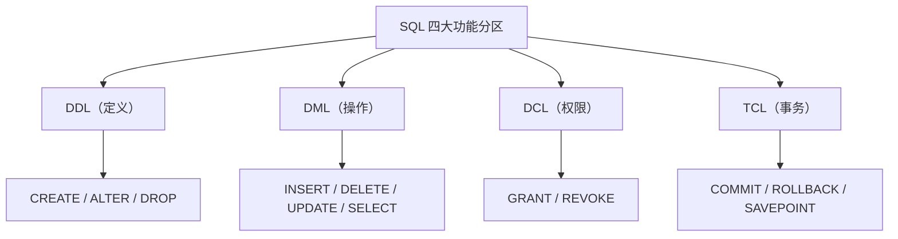
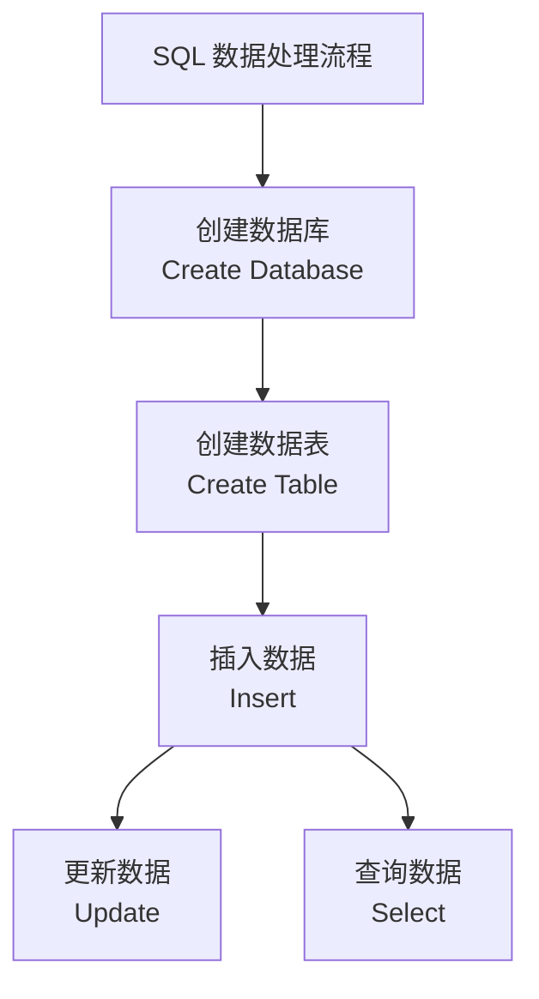
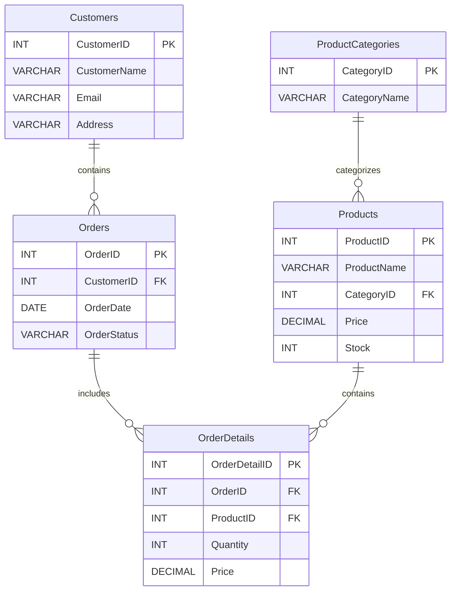

## 从入门到熟练：用 SQL 玩转关系型数据库

说到操作数据库，我们最常听到的词就是 **SQL**。这三个字母背后可不是“随便聊聊”，而是“Structured Query Language”，也就是**结构化查询语言**。

它是所有主流关系型数据库（比如 MySQL、PostgreSQL、Oracle）都支持的标准语言。不论我们是要创建数据库，插入数据，还是查询订单、分析报表，SQL 都是一把通用钥匙。

本篇，让我们一步步走进 SQL 的世界。

### 一、SQL 的基本构成

一条 SQL 语句就像一句简短的英文句子，包含 **关键字、表名、列名、条件等元素**。比如这句：

```sql
SELECT CustomerName FROM Customers WHERE CustomerID = 1;
```

你可以理解为：“从 Customers 这个表里，找出 CustomerID 为 1 的客户姓名。”

- `SELECT` 是关键字，表示查询。
- `CustomerName` 是列名。
- `Customers` 是表名。
- `WHERE` 是条件关键字，用来筛选记录。

#### 小贴士：SQL 语法小规则

1. 每条语句以英文 **分号（;）** 结尾；
2. **大小写不敏感**，`select` 和 `SELECT` 没区别；
3. **字符串要加引号**，如 `'2024-01-26'`；
4. **空格不能省**，否则系统会报错；
5. 表名、列名必须用 **英文字母开头**，不能用中文、特殊符号等。

### 二、SQL 的四大功能分区

SQL 根据用途可以分为四大类，我们一起来认识它们：



#### 数据定义语言（DDL）：我们先建个“家”

##### 创建表

```sql
CREATE TABLE Customers (
  CustomerID INT PRIMARY KEY,
  CustomerName VARCHAR(50) NOT NULL,
  Email VARCHAR(100) UNIQUE,
  Address VARCHAR(100)
);
```

我们用 `CREATE TABLE` 新建了一个“客户表”，包括主键、非空字段和唯一约束。

##### 修改表结构

```sql
ALTER TABLE Customers ADD BirthDate DATE;
ALTER TABLE Customers DROP COLUMN Address;
```

- 添加一列：`ADD`
- 删除一列：`DROP COLUMN`

#### 数据操纵语言（DML）：插入、更新、删除、查询数据

##### 插入数据

```sql
INSERT INTO Customers (CustomerID, CustomerName, Email)
VALUES (1, 'Zhao Wei', 'zhaow@example.com');
```

一次插入多条数据：

```sql
INSERT INTO Customers (CustomerID, CustomerName, Email)
VALUES 
(2, 'Liu Xinyu', 'liuxy@example.com'),
(3, 'Sun Yang', 'suny@example.com');
```

##### 删除数据

```sql
DELETE FROM Customers WHERE CustomerID = 3;
```

##### 更新数据

```sql
UPDATE Customers SET Email = 'new@example.com' WHERE CustomerID = 2;
```

##### 查询数据

```sql
SELECT * FROM Customers;
SELECT CustomerName FROM Customers WHERE Email LIKE '%@example.com';
```

#### 大礼包：进阶查询技巧，把数据查得又快又准

##### 条件查询

```sql
SELECT * FROM Orders WHERE OrderStatus = '运输中' AND OrderDate > '2024-01-01';
```

##### 投影查询（只看几个字段）

```sql
SELECT CustomerName, Email FROM Customers;
```

##### 排序查询

```sql
SELECT * FROM Products ORDER BY Price DESC;
```

##### 分页查询（只显示部分记录）

```sql
SELECT * FROM Orders LIMIT 5 OFFSET 10;
```

表示跳过前 10 条记录，显示第 11~15 条。

##### 聚合查询（统计分析）

```sql
SELECT COUNT(*) AS TotalCustomers FROM Customers;
SELECT AVG(Price) FROM Products;
SELECT CategoryID, COUNT(*) FROM Products GROUP BY CategoryID;
```

#### 常见约束：守护数据安全的“六大法宝”

| 约束类型            | 说明           | 示例                                                        |
| ------------------- | -------------- | ----------------------------------------------------------- |
| 主键（PRIMARY KEY） | 唯一且非空     | `CustomerID INT PRIMARY KEY`                                |
| 外键（FOREIGN KEY） | 建立表之间关系 | `FOREIGN KEY (CustomerID) REFERENCES Customers(CustomerID)` |
| 唯一（UNIQUE）      | 值不能重复     | `Email VARCHAR(100) UNIQUE`                                 |
| 非空（NOT NULL）    | 不能插入空值   | `CustomerName VARCHAR(50) NOT NULL`                         |
| 检查（CHECK）       | 取值范围限制   | `CHECK (Age >= 18)`                                         |
| 默认值（DEFAULT）   | 默认填入的值   | `OrderStatus VARCHAR(20) DEFAULT 'Pending'`                 |

### 6.1.3 全流程演练：用 SQL 打造一个电商平台数据库

掌握了 SQL 的基本语法之后，是时候来一场真正的实战了！

在这篇文章中，我们将通过一个 **电商平台的案例**，一步步演示如何用 SQL 完成从建库建表，到插入、更新、查询数据的全过程。无论你是初学者，还是想要系统梳理 SQL 技能的开发者，这篇实操指南都能帮你打下坚实基础。



#### 创建数据库：从零开始构建电商系统

首先，我们为整个电商平台准备一个数据库，命名为 `ECommerceDB`：

```sql
CREATE DATABASE ECommerceDB;
```

之后，别忘了进入该数据库环境：

```sql
USE ECommerceDB;
```

#### 创建数据表：构建五张核心业务表

电商系统主要包括五类数据：客户、产品、订单、订单详情和产品种类。我们为每类数据创建对应的表：



##### 客户表 `Customers`

存储客户的基础信息，用 `CustomerID` 作为主键：

```sql
CREATE TABLE Customers (
  CustomerID INT PRIMARY KEY,
  CustomerName VARCHAR(255),
  Email VARCHAR(255),
  Address VARCHAR(255)
);
```

##### 产品种类表 `ProductCategories`

记录商品的种类信息：

```sql
CREATE TABLE ProductCategories (
  CategoryID INT PRIMARY KEY,
  CategoryName VARCHAR(255)
);
```

##### 产品表 `Products`

与产品种类表通过 `CategoryID` 建立外键关联：

```sql
CREATE TABLE Products (
  ProductID INT PRIMARY KEY,
  ProductName VARCHAR(255),
  CategoryID INT,
  Price DECIMAL(10, 2),
  Stock INT,
  FOREIGN KEY (CategoryID) REFERENCES ProductCategories(CategoryID)
);
```

#####  订单表 `Orders`

记录每个客户的订单，`CustomerID` 为外键：

```sql
CREATE TABLE Orders (
  OrderID INT PRIMARY KEY,
  CustomerID INT,
  OrderDate DATE,
  OrderStatus VARCHAR(255),
  FOREIGN KEY (CustomerID) REFERENCES Customers(CustomerID)
);
```

##### 订单详情表 `OrderDetails`

用于记录每个订单中购买了哪些产品：

```sql
CREATE TABLE OrderDetails (
  OrderDetailID INT PRIMARY KEY,
  OrderID INT,
  ProductID INT,
  Quantity INT,
  Price DECIMAL(10, 2),
  FOREIGN KEY (OrderID) REFERENCES Orders(OrderID),
  FOREIGN KEY (ProductID) REFERENCES Products(ProductID)
);
```

#### 插入数据：为表“填充生命力”

我们来填一些测试数据，方便后续操作。

##### 插入客户：

```sql
INSERT INTO Customers (CustomerID, CustomerName, Email, Address)
VALUES
(1, 'Zhao Wei', 'zhaow@example.com', '梧桐路 219 号'),
(2, 'Liu Xinyu', 'liuxy@example.com', '南京路 108 号'),
(3, 'Sun Yang', 'suny@example.com', '上海路 19 号');
```

##### 插入产品种类：

```sql
INSERT INTO ProductCategories (CategoryID, CategoryName)
VALUES
(1, '电子产品'),
(2, '影音设备'),
(3, '家用电器'),
(4, '运动与健身产品'),
(5, '服装和配饰');
```

##### 插入产品：

```sql
INSERT INTO Products (ProductID, ProductName, CategoryID, Price, Stock)
VALUES
(1, '智能手机', 1, 599, 150),
(2, '笔记本电脑', 1, 1200, 50),
(3, '智能手表', 4, 299, 75);
```

##### 插入订单：

```sql
INSERT INTO Orders (OrderID, CustomerID, OrderDate, OrderStatus)
VALUES
(1, 1, '2024-01-01', '采购中'),
(2, 2, '2024-01-03', '正在处理'),
(3, 1, '2024-01-04', '运输中');
```

##### 插入订单详情：

```sql
INSERT INTO OrderDetails (OrderDetailID, OrderID, ProductID, Quantity, Price)
VALUES
(1, 1, 1, 1, 599),
(2, 2, 2, 1, 1200),
(3, 3, 3, 1, 299);
```

------

#### 更新数据：修改客户邮箱

将 ID 为 1 的客户邮箱更新为新地址：

```sql
UPDATE Customers
SET Email = 'newzhaow@example.com'
WHERE CustomerID = 1;
```

#### 查询数据：业务场景下的常见查询

##### 📦 查询库存不足的商品及其类别

```sql
SELECT Products.ProductName, Products.Stock, ProductCategories.CategoryName
FROM Products
JOIN ProductCategories ON Products.CategoryID = ProductCategories.CategoryID
WHERE Products.Stock < 100;
```

##### 📊 查询每位客户的订单总数

```sql
SELECT Customers.CustomerID, Customers.CustomerName, COUNT(Orders.OrderID) AS NumberOfOrders
FROM Customers
JOIN Orders ON Customers.CustomerID = Orders.CustomerID
GROUP BY Customers.CustomerID, Customers.CustomerName;
```

##### 💰 查询每个产品类别的平均价格

```sql
SELECT ProductCategories.CategoryName, AVG(Products.Price) AS AveragePrice
FROM Products
JOIN ProductCategories ON Products.CategoryID = ProductCategories.CategoryID
GROUP BY ProductCategories.CategoryName;
```

> 扩展小知识：你真的了解 JOIN 吗？
>
> 常见 JOIN 类型快速回顾：
>
> | JOIN 类型      | 说明                                                |
> | -------------- | --------------------------------------------------- |
> | **INNER JOIN** | 返回两个表中都匹配的记录                            |
> | **LEFT JOIN**  | 保留左表所有记录，右表匹配不到补 NULL               |
> | **RIGHT JOIN** | 保留右表所有记录，左表匹配不到补 NULL               |
> | **FULL JOIN**  | 返回左右表所有记录，缺失补 NULL（部分数据库不支持） |
> | **CROSS JOIN** | 返回两个表的笛卡尔积                                |
> | **SELF JOIN**  | 表和自己连接，比如员工和经理在同一张表              |

### 拥抱大数据时代：数据库技术的进化

在信息化社会的浪潮中，数据正以前所未有的速度爆发式增长。我们不仅要存储更多的数据，还要更快地处理、分析、响应这些数据的变化。这对传统数据库系统提出了前所未有的挑战。

现在，我们就来聊聊：**在大数据时代，数据库面临了哪些新需求？NoSQL 技术又是如何应运而生、一步步改变游戏规则的？**

#### 一、为什么传统数据库开始“跟不上节奏”？

我们熟悉的关系型数据库（如 MySQL、Oracle）基于严格的表格结构和 ACID 原则，在早期数据规模相对较小时确实非常稳定可靠。但随着数据越来越“大”、种类越来越“杂”，它们逐渐暴露出了一些明显短板：

#####  无法应对多样化数据

现实世界的数据早已不再是清一色的表格数字：

- 文本、图片、视频、语音、HTML 页面……
- 结构化、半结构化、非结构化数据混合共存

而传统关系型数据库强调字段、表结构、固定类型，这种“死板”显然不适合处理海量异构数据。

#####  水平扩展能力差

大数据意味着什么？意味着我们可能需要将数据拆分放到 **成百上千台机器上** 并发处理。传统数据库主要依赖垂直扩展（加内存、换更强的 CPU），这种做法：

- 成本高
- 可扩展性差
- 容易成为系统瓶颈

#####  缺乏并行处理能力

传统数据库通常是“单机处理为主”，而在大数据场景下，我们需要的却是 **多节点、多线程的并行处理能力（MPP）**，能够在成百上千个节点上同时计算和分析数据。

#### 二、NoSQL 是如何“接过接力棒”的？

为了解决这些问题，**NoSQL 技术（Not Only SQL）**诞生了。它不追求“万能”，而是根据大数据需求场景，选择适合的模型和机制，做到了灵活、快速、强扩展。

##### NoSQL 的五大特性，让数据库更适应大数据时代：

##### ① 横向扩展能力强

NoSQL 系统天生支持水平扩展（比如加更多节点来分散存储和计算压力），比传统数据库更适合大规模部署和集群环境。

##### ② 弱一致性，最终一致就好

相比传统 ACID 模型的强一致性，NoSQL 采用的是 **BASE 原则**：

- **Basically Available**（基本可用）
- **Soft State**（状态可变）
- **Eventually Consistent**（最终一致）

这种机制可以牺牲短时间一致性换取系统的更高吞吐量和更低延迟。

##### ③ 内建高可用机制

为了保障数据的可靠性，NoSQL 系统通常会将数据 **分区复制三份**，即使某个节点宕机，数据依然不受影响，保证服务不断。

##### ④ 摆脱关系模型限制

NoSQL 支持 **键值对（Key-Value）**、**列族（Column Family）**、**文档型（Document）**、**图数据库（Graph）**等灵活的数据模型，适用于不同应用场景，突破了“表格式”结构的限制。

##### ⑤ 与云计算深度融合

NoSQL 天然适合在云环境中运行，支持弹性伸缩、按需分配资源，能很好地对接现代化云基础设施。

#### 三、NoSQL 是数据库的未来吗？

这可能还不是一个非黑即白的问题。关系型数据库依然在事务性强、结构清晰的系统中扮演重要角色。但在 **社交、物联网、电商、推荐系统** 等对数据规模和速度要求极高的领域，NoSQL 正迅速占据核心地位。

#### 四、HBase：NoSQL 阵营中的“高性能扛把子”

在众多 NoSQL 数据库中，**HBase** 是专门为大规模数据量、实时读写需求而设计的“重型选手”：

- 它基于 Hadoop 构建，支持处理 **PB 级别**的数据；
- 采用列族存储结构，适合稀疏数据、高频读写；
- 支持快速查询、插入和更新，特别适用于 **日志分析、用户画像、实时推荐系统** 等场景。

> 本章后续将重点介绍 HBase 的结构、原理和使用方式。我们会讲解 HBase 的数据模型、表结构、存储机制以及常用的 Shell 命令，帮助你真正上手构建一个大数据级别的分布式数据库系统。
