## 从零了解 HBase：大数据时代的分布式数据库利器

在上一篇文章中，我们聊到了 NoSQL 技术如何打破传统数据库的桎梏，为大数据时代带来了灵活、高效的新选择。而今天，我们要把目光聚焦到一个 NoSQL 世界里的“重量级选手”——**HBase**。

HBase 是什么？它长什么样？为什么它在处理海量数据时表现得如此强劲？这篇文章将带你一探究竟。

#### 什么是 HBase？

简单来说，**HBase 是一个基于 Hadoop 构建的、支持实时读写的分布式、面向列的 NoSQL 数据库系统**。它的底层依赖 HDFS（Hadoop 分布式文件系统），天然具备高可靠性、强扩展性和高性能。

HBase 的灵感来源于 Google 的 BigTable，是其在 Java 开源社区的实现版本。它继承了 BigTable 的核心思想，并解决了开源兼容性、跨平台支持、低成本部署等问题。我们可以在一群普通 PC 服务器上，轻松搭建一个可存储上亿行、百万列的超大数据表格！

#### HBase 的“表结构”长什么样？

虽然名字里带“Base”，但它和传统数据库的“表格结构”有点不一样。我们来逐一看看它的核心组成部分。
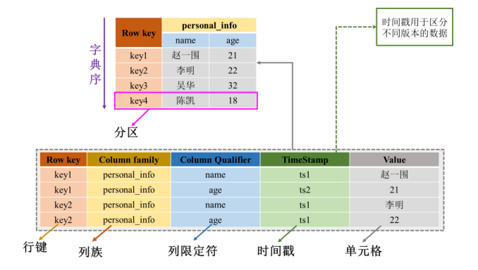


#####  行（Row）和行键（Row Key）

- 每行数据都用一个唯一的**行键**来标识，类似关系型数据库中的主键。
- 行键是字符串，可以自定义，一般长度为 10~100 字节。
- **数据是按照行键的“字典序”存储和访问的**，这对于范围查询非常高效。

##### 列族（Column Family）

- 列族是 HBase 的基本存储单元，它是“一组相关列”的集合。
- 所有数据都必须归属于某个列族，**在创建表时必须提前定义**。
- 同一列族的数据会尽量存储在一起，方便压缩、管理和高效访问。

比如我们要建一个大学生信息库，可能就有两个列族：

- `personal_info`：包含 name、age 等
- `contact_info`：包含 email、phone 等

##### 列限定符（Column Qualifier）

- 它是列族中的具体“列名”，与列族一起构成完整的列名，如：`personal_info:name`。
- 与关系型数据库不同，**列限定符是动态的**，可以灵活添加、删除，不需要修改表结构。

#####  单元格（Cell）

- 在 HBase 中，一个单元格是由 `[行键, 列族, 列限定符, 时间戳]` 这四个维度定位的。
- 数据被当作字节数组存储，**可以为每个单元格保留多个版本**。

##### 时间戳（Timestamp）

- 用来区分同一单元格的多个历史版本，支持查看历史数据或者回滚。
- 可以自动生成，也可以手动设置。

##### 分区（Region）

- 为了实现分布式存储，HBase 会将一个表按“行键范围”划分成多个 Region。
- 每个 Region 可以动态扩容，自动分布到不同服务器上，实现负载均衡。

##### 命名空间（Namespace）

- 类似于数据库系统中的“数据库”概念，用来组织、分组不同表，方便管理和权限控制。

#### HBase 有哪些优势？

为什么我们需要用 HBase？答案很简单，它为我们提供了传统数据库无法实现的一些能力：

##### 支持超大数据量

在 MySQL 或 Oracle 中，当一张表数据量达到亿级时，性能就会急剧下降。而 HBase **可以轻松处理数百亿行、百万列的表**，真正实现了 TB 甚至 PB 级别的数据存储。

##### 天生支持扩展

无论是增加存储容量还是计算能力，我们都可以通过**增加节点**来动态扩容，**不需要更换机器或者修改原有架构**。

##### 多版本支持

每次写入的数据都有一个时间戳，允许我们保留多个历史版本，这在数据分析或审计场景下特别实用。

##### 高效处理稀疏数据

HBase 的表可以没有固定列，即使不同行拥有不同的列结构也完全没问题，这非常适合存储日志、传感器数据等“不规则”的内容。

#####  TTL（自动过期）

可以为数据设置“生存时间”，一旦过期，系统自动清理。我们再也不用担心过期数据“堆积如山”啦。

##### 原生整合 Hadoop

作为 Hadoop 生态的亲兄弟，HBase 和 HDFS、MapReduce、Hive 等组件可以无缝协作，打造强大的大数据处理平台。

------

#### 那 HBase 有缺点吗？

当然也有。

 不适合复杂的聚合操作（如多表 Join、GroupBy）

 不支持二级索引（只能通过 Row Key 查）

原生只支持“单行事务”而非跨行操作

所以在设计系统时，我们要根据业务特点选对工具。HBase 不是万能钥匙，但在应对“高并发、大数据量、实时性强”的场景时，它是当之无愧的主力军。

### HBase 架构揭秘：分布式数据库背后的协同魔法

在前文中，我们一起了解了 HBase 的数据模型和基本结构。但光有结构还不够，我们可能更好奇一个问题：**HBase 是怎么在大规模集群中高效运行的？**

今天，我们就来揭开 HBase 架构的“幕后魔法”，看看它是如何通过精妙的系统设计，实现海量数据的高性能读写与高可用性的。

#### HBase 架构总览：主从协同 + ZooKeeper 协调

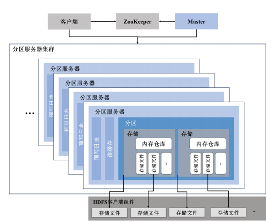


HBase 采用的是典型的 **Master/Slave（主从）架构**。整体看下来，它由以下几个核心组件组成：

- **Master 节点**：统筹全局，负责管理和调度；
- **RegionServer（分区服务器）**：负责实际的数据读写；
- **ZooKeeper**：集群协调“大总管”；
- **HDFS 客户端（DFSClient）**：负责和底层的 HDFS 交互；
- **客户端（Client）**：用户操作的入口，提供多种接口。

#### Master：HBase 的“控制中枢”

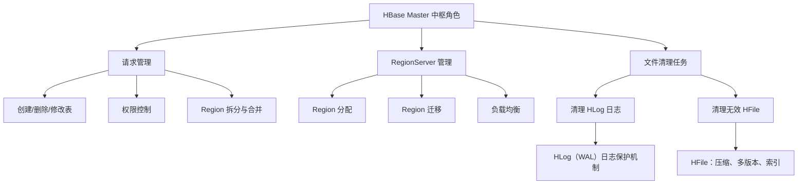

Master 是整个 HBase 集群的“调度员”，主要负责以下几项工作：

1. **管理请求处理**：像新建/修改/删除表、权限控制、合并或拆分分区等，都由 Master 统一协调。
2. **RegionServer 管理**：Master 会将表的分区（Region）分配给各个 RegionServer，并负责后续的分区迁移与负载均衡。
3. **文件清理任务**：定期清理过期日志（HLog）和无效的 HFile，保持系统轻盈高效。

##### 扩展知识：

- **HLog** 是预写日志（WAL），确保数据写入前先记录日志，哪怕系统异常也能恢复；
- **HFile** 是 HBase 的核心数据文件格式，支持索引、压缩、版本管理等功能。

#### RegionServer：HBase 的“搬运工”

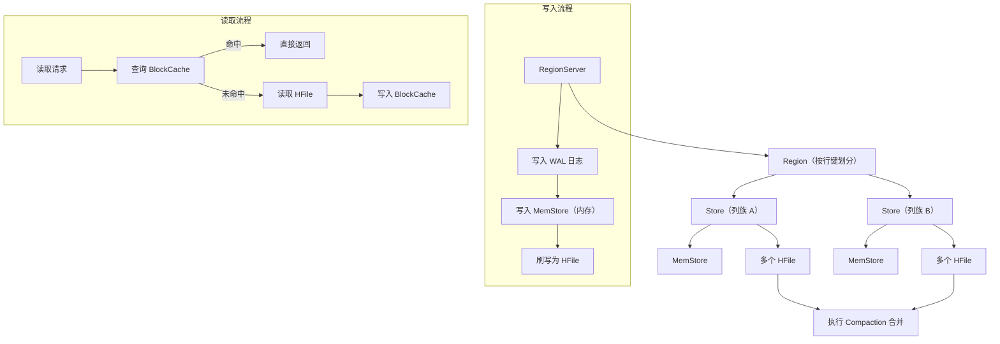

RegionServer 是我们读写数据的“第一线”战士，它们的核心职责包括：

##### 数据写入流程

当我们往 HBase 写入数据时，RegionServer 会：

1. 把数据写入 **WAL 日志**，确保可靠性；
2. 再将数据写入内存中的 **MemStore**；
3. 等数据积累到一定程度后，再统一刷写成磁盘文件（HFile）保存。

这种设计既保障了写入速度，又不牺牲数据安全。

##### 数据读取流程

读取操作会优先查询 RegionServer 的 **读缓存（BlockCache）**。如果命中，就直接返回；没命中则读取 HFile 并把结果放入缓存，提升后续访问效率。

##### Region 与 Store 的配合

- 一个 Region 是表的一个分区，由行键范围决定；
- 每个 Region 对应多个 **Store**，每个 Store 代表一个列族；
- 每个 Store 包含一个 MemStore 和多个 HFile；
- 数据多了之后，多个 HFile 会通过合并（Compaction）优化成更少更大的文件。

#### ZooKeeper：让集群协作起来的幕后英雄

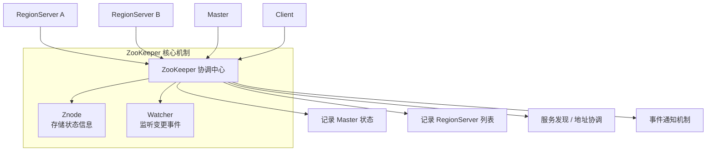

别看 ZooKeeper 平时不“吭声”，它可是在后台干着非常重要的事情：

- **记录集群状态**：比如哪些 RegionServer 活着、Master 是谁；
- **协调各节点通信**：帮助客户端或组件发现服务地址；
- **事件监听**：如果 RegionServer 挂了，ZooKeeper 能第一时间通知 Master 接管资源。

它通过一种叫 **Znode** 的机制来存储配置信息，各个 HBase 组件也都可以注册 **Watcher** 来订阅感兴趣的事件。

#### HBase 客户端：多接口支持，谁都能用

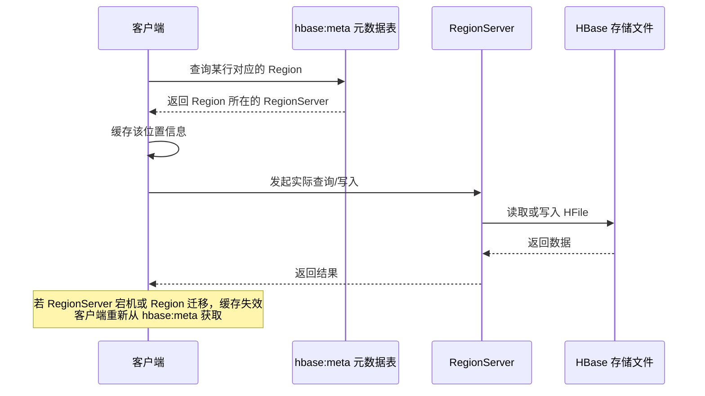

我们和 HBase 打交道最常见的方式当然是客户端，它提供了丰富的接口：

- **Shell 命令行**：快速测试与管理；
- **Java 原生 API**：适合系统集成；
- **Thrift/REST API**：方便跨语言调用；
- **MapReduce 接口**：支持大批量数据处理。

客户端在发起查询前，通常会先去元数据表 `hbase:meta` 获取分区位置信息，这张表本身也是存在于 HBase 里的。

为了效率，客户端会**缓存这部分元数据**，避免每次都从头查。只是在 RegionServer 宕机或分区迁移后，缓存才会失效并重新获取。

#### HDFS：HBase 的数据底座

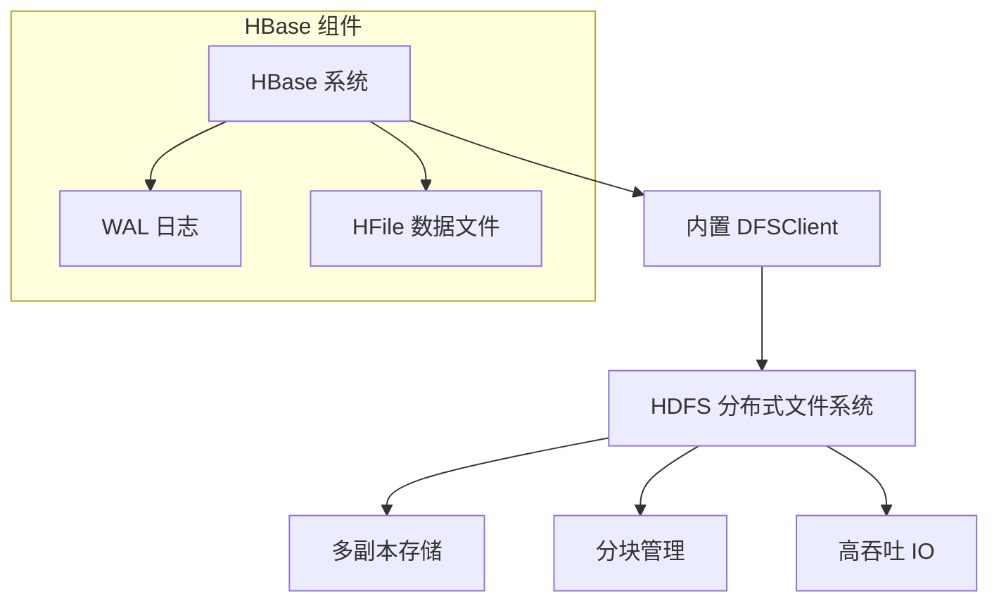

HBase 本质上并不直接存储数据，它是**构建在 HDFS（Hadoop Distributed File System）之上的**。它通过内置的 DFSClient 与 HDFS 交互，完成数据的读写、复制、分块管理等操作。

HDFS 让 HBase 具备了：

- 多副本备份机制；
- 高吞吐顺序读写；
- 与 Hadoop 生态的深度融合。

这也是为什么 HBase 在处理海量数据时如此稳健可靠。

## 6.4HBase 的数据模型：用四维坐标玩转大数据存储

在构建一个高效的分布式数据库系统时，底层的数据模型设计至关重要。下面，我们一起来探究 HBase 是如何通过独特的“列式 + 四维索引”数据模型，在面对大数据挑战时仍能稳如老狗的。

### 一、HBase 表结构，和我们熟悉的不太一样！

和传统的关系型数据库不一样，HBase 的表**并不追求整整齐齐的二维表格**，它更像是一个**“稀疏、多维、无限扩展”的超级字典（Map）**。

在 HBase 中，每一个数据单元都通过一个 **四维坐标 [行键、列族、列限定符、时间戳]** 来唯一定位。这种设计非常灵活，特别适合结构化、半结构化甚至非结构化数据的存储。

举个例子：

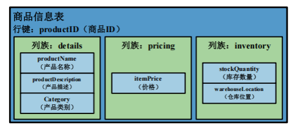

 我们以一个电商平台的商品信息表为例。每一件商品对应一个行键（比如商品ID），然后分为三个**列族（Column Family）**：

- `details`：产品名称、描述、分类
- `pricing`：价格
- `inventory`：库存数量和仓库位置

像这样的一行数据，可能长得像这样：

```
["P1001", "details", "name", ts1] = "LED 电视"
["P1001", "pricing", "price", ts1] = 999
["P1001", "inventory", "stockQuantity", ts1] = 150
```

每条记录都有时间戳，表示数据的历史版本。也就是说，HBase **天然支持多版本数据**！

### 二、概念模型 vs 物理模型：理解数据是怎么落地的

上面我们讲的是“概念模型”，那这些数据到底是怎么存储在磁盘上的呢？

####  HBase 是“列式数据库”！

HBase 是按照 **列族进行物理存储** 的，也就是说，属于同一个列族的数据会被打包放在一起，而不同列族的数据则分开存储。

##### 为什么这样做？

- 更利于压缩，提高存储效率；
- 支持只读取需要的列族，减少磁盘 IO。

比如我们的商品信息表会被拆成三个物理区域：

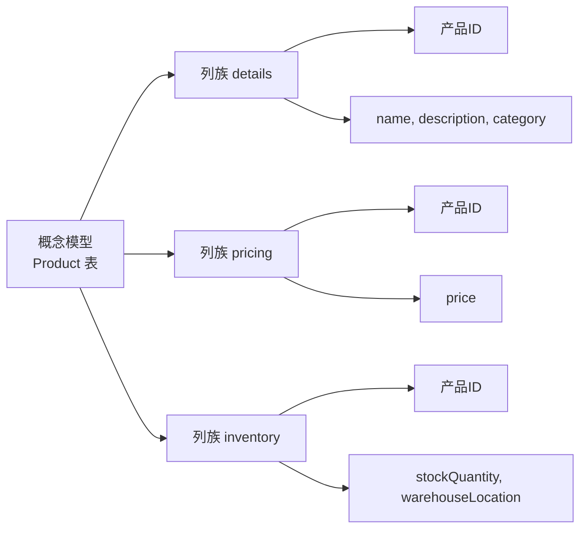

##### 列族 `details`

| 产品 ID | 时间戳 | name     | description | category |
| ------- | ------ | -------- | ----------- | -------- |
| P1001   | ts1    | LED 电视 | 55 英寸     | 电子产品 |
| P1002   | ts2    | 蓝牙耳机 | 降噪入耳式  | 电子产品 |

##### 列族 `pricing`

| 产品 ID | 时间戳 | price |
| ------- | ------ | ----- |
| P1001   | ts1    | 999   |
| P1002   | ts2    | 199   |

#####  列族 `inventory`

| 产品 ID | 时间戳 | stockQuantity | warehouseLocation |
| ------- | ------ | ------------- | ----------------- |
| P1001   | ts1    | 150           | 5号仓库           |

### 三、分区 + 刷写 + 合并：高效的数据存储机制

HBase 的强大还体现在其灵活的物理存储机制。我们来看看背后发生了什么魔法

#### 分区机制

一张表初始时只有一个分区（Region），随着数据增多，HBase 会自动进行 **分裂**，将一个大分区一分为二。这样就可以：

- 充分利用多个 RegionServer 提供服务；
- 支持水平扩展，数据越多越不怕！

#### 内存 + 磁盘协同

每个 Region 由多个 **Store（存储仓库）** 构成，每个 Store 对应一个列族。数据的写入流程是这样的：

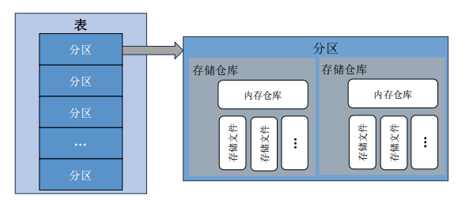

1. 写入 WAL（预写日志）；

1. 写入 MemStore（内存仓库）；
2. MemStore 满了之后触发 Flush，写入磁盘变成 HFile；
3. HFile 太多？没问题，我们触发 **Compaction（合并）** 来优化存储结构；
4. 文件太大？继续切分，永不爆炸！

这套机制确保了数据：

- 写得快（先写内存）；
- 不怕丢（先写日志）；
- 读得快（有缓存 + 索引）；
- 易扩展（动态分区 + 分布式架构）。

## 6.5一次写入和一次读取到底发生了什么？

HBase 是一个强大且高性能的分布式数据库，很多朋友知道它读写快，但却不清楚它“到底是怎么做到的”。这篇文章，我们就从**写入**和**读取**两个流程出发，一步步揭开 HBase 工作机制的神秘面纱。

### 一、HBase 的写入操作到底干了什么？

我们先来看最常用的场景：写入数据。HBase 写数据不是简单地“直接落盘”，而是一个经过**精心设计的多步骤流程**，既保证了性能，也保证了数据的可靠性。下面我们一起来走一遍完整流程

#### 写入流程详解

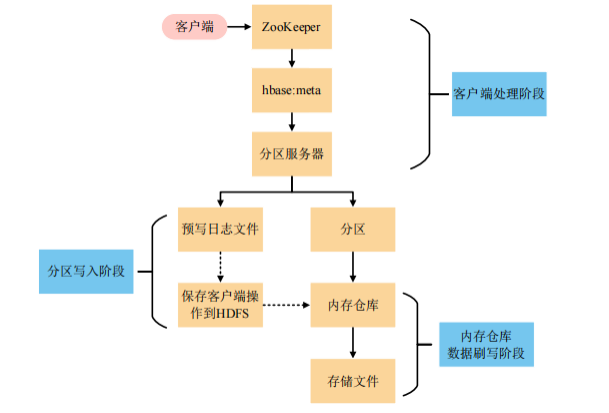


   1.**客户端访问 ZooKeeper：**
 客户端首先通过 ZooKeeper 找到元数据表 `hbase:meta` 所在的分区服务器地址。这个表很关键，它记录了所有用户数据的分布情况。

2. **定位目标分区：**
    根据目标表名、行键等信息，客户端访问 `hbase:meta` 表，找到这个数据应该写入到哪个分区（Region）上。这个定位信息随后会被**缓存在客户端本地**，提高后续访问速度。

3. **发起 RPC 请求：**
    定位完成后，客户端向目标分区所在的 RegionServer 发起 RPC（远程调用）请求，把数据发送过去。
4.  **RegionServer 接收写入请求：**
    RegionServer 做了两件关键的事：

- 写入预写日志（WAL），确保即使服务器宕机，数据也能恢复；
- 写入 MemStore（内存仓库），暂存数据。

5. **刷写到磁盘（Flush）：**
    当内存仓库中的数据量达到设定阈值，比如 128MB，系统会自动将这部分数据刷写（flush）到磁盘中，生成 HFile 文件，最终存储在 HDFS 上。这样数据才算“真正落盘”。

### 二、HBase 的读取流程又是怎么回事？

相比写入，HBase 的读取流程**更复杂一些**，因为它不仅要查缓存，还可能查磁盘、查内存，并且还要处理“多版本”数据的问题。


#### 读取流程详解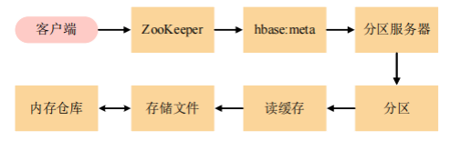


1. **客户端访问 ZooKeeper：**
    和写入一样，客户端第一步是找 ZooKeeper，获取 `hbase:meta` 的地址。

   2.**定位数据在哪个分区：**
	 通过 `hbase:meta` 表的信息，客户端定位目标数据所在的 Region。

  3.**发起读取请求：**
	 接着，客户端向这个 Region 所在的 RegionServer 发送读取请求。

   4.**检查读缓存（BlockCache）：**
 	RegionServer 首先查读缓存，命中的话直接返回，速度极快（不读磁盘！）。

5. **缓存没命中？查磁盘！**
    没在读缓存里？那就只能“下盘”查找 HFile 存储文件了。

6. **也可能在 MemStore 里：**
    有时候数据虽然写了，但还没 flush 到磁盘，这时它可能还“躺”在 MemStore（内存仓库）里，RegionServer 会去那儿找一找。

7. **数据合并处理：**
    HBase 支持多个版本（通过时间戳），所以即使找到多个“版本”，系统也会帮我们**合并+排序**，找出我们要的那个“最新值”。

​    8.**最终响应：**
 	最终，结果返回给客户端，读取流程结束！

## 6.6玩转 HBase Shell：从建表到查删，掌握核心命令

在掌握了 HBase 的数据模型和读写流程之后，我们终于可以上手实践了！下面，我们就来一起熟悉一下 HBase 的“操控面板”——**HBase Shell**。只要掌握这些命令，我们就能轻松完成表的创建、数据的插入、查询、删除等一系列操作。

####  一、表结构怎么建？数据定义语言了解一下

在 HBase 中，表的结构是围绕“列族”来定义的，而“列”本身是动态添加的，不需要提前声明。我们可以通过三条常用命令完成表结构的基本操作：

##### 1.CREATE：创建表

比如我们要建一个商品信息表 `Products`，包含 `details`、`pricing` 和 `inventory` 三个列族，那只需要一条命令：

```bash
CREATE 'Products', 'details', 'pricing', 'inventory'
```

##### 2. LIST：查看当前有哪些表

看看当前 HBase 实例里都有哪些表，可以用：

```bash
LIST
```

输出结果会列出所有表名及执行时间。

##### 3. DESCRIBE：查看表结构

想了解某张表的列族及属性？用：

```bash
DESCRIBE 'Products'
```

这个命令会告诉我们每个列族的版本控制（VERSIONS）、压缩方式（COMPRESSION）、生存时间（TTL）等配置。

##### 小科普：常见的压缩类型

- **Gzip**：压缩比高，速度慢
- **Snappy**：速度快，适合大数据流处理
- **LZO**：压缩快、解压快，适合中大型集群

####  二、数据操作怎么搞？数据操纵语言请收好

接下来，我们来看看如何用 Shell 对数据进行插入、读取、删除等操作。就以商品 ID 为 `P1001` 的商品为例，一步步演示：

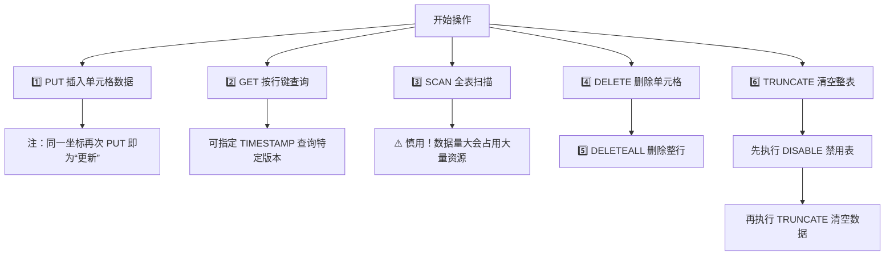

#####  PUT：插入数据

HBase 的 PUT 是“单元格级”的，每次插入一条数据。插入一整行数据需要多条命令配合：

```bash
PUT 'Products', 'P1001', 'details:name', 'Smart LED TV'
PUT 'Products', 'P1001', 'details:description', '55 英寸'
PUT 'Products', 'P1001', 'details:category', '电子产品'
PUT 'Products', 'P1001', 'pricing:price', '999'
PUT 'Products', 'P1001', 'inventory:stockQuantity', '150'
PUT 'Products', 'P1001', 'inventory:warehouseLocation', '5 号仓库'
```

 注意：**HBase 没有 UPDATE 命令**，再次插入同一个坐标就是“更新”。

------

#####  GET：按行键读取数据

想读取某条商品信息，只需：

```bash
GET 'Products', 'P1001'
```

HBase 支持版本控制，如果你只想查某个时间戳版本的数据：

```bash
GET 'Products', 'P1001', {TIMESTAMP => 'ts1'}
```

------

##### SCAN：全表扫描（慎用！）

```bash
SCAN 'Products'
```

 注意：数据量大时慎用 SCAN，容易导致资源占用过高。

------

#####  DELETE：删除某个单元格数据

```bash
DELETE 'Products', 'P1001', 'inventory:stockQuantity'
```

------

##### DELETEALL：删除整行

```bash
DELETEALL 'Products', 'P1001'
```

适用于整条记录都不需要的情况。

------

#####  TRUNCATE：清空整张表的数据

**慎用操作！**

```bash
DISABLE 'Products'
TRUNCATE 'Products'
```

------

#####  GET：按行键读取数据

想读取某条商品信息，只需：

```bash
GET 'Products', 'P1001'
```

HBase 支持版本控制，如果你只想查某个时间戳版本的数据：

```bash
GET 'Products', 'P1001', {TIMESTAMP => 'ts1'}
```

------

##### SCAN：全表扫描（慎用！）

```bash
SCAN 'Products'
```

 注意：数据量大时慎用 SCAN，容易导致资源占用过高。

------

#####  DELETE：删除某个单元格数据

```bash
DELETE 'Products', 'P1001', 'inventory:stockQuantity'
```

------

##### DELETEALL：删除整行

```bash
DELETEALL 'Products', 'P1001'
```

适用于整条记录都不需要的情况。

------

#####  TRUNCATE：清空整张表的数据

**慎用操作！**

```bash
DISABLE 'Products'
TRUNCATE 'Products'
```

清空数据前必须先禁用表。

