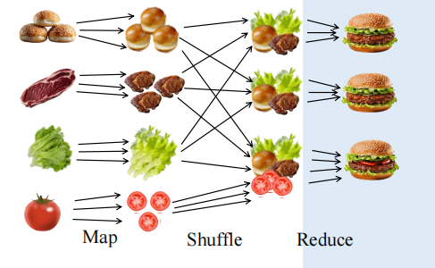
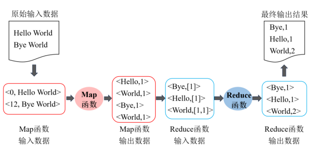
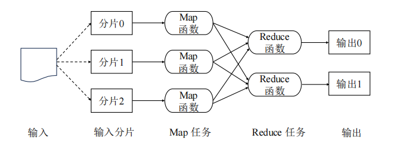
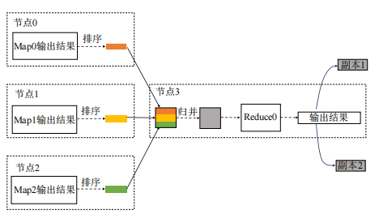
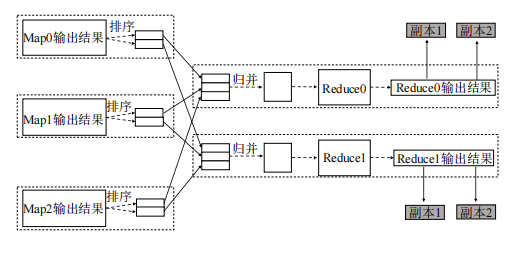
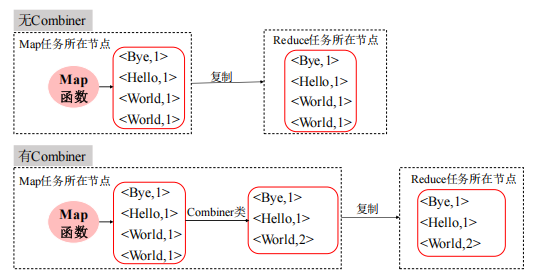

## 初识 MapReduce：用并行的力量处理大数据！

在大数据时代，我们面临着一个现实挑战：**数据实在太多了！**传统的单机处理方式早就力不从心，我们必须换个思路，用更多机器一起“并肩作战”来处理这些海量信息。

这正是 MapReduce 发挥威力的地方。




###  7.1什么是 MapReduce？

MapReduce 是由 Google 在 2004 年提出的一种 **分布式并行编程模型**，后来被 Apache Hadoop 项目实现并开源。我们可以把它看作是一种“工厂流水线”，专门用于处理大规模数据集。

这个模型主要分成两个阶段：

- **Map（映射）阶段**：先把任务拆解成多个“小任务”，每个节点负责一部分，输出键值对（Key, Value）。
- **Reduce（归约）阶段**：把具有相同 Key 的所有值归并处理，得出最终结果。

这么设计的好处就是：**可以横向扩展！**我们可以在很多台机器上同时跑 Map 和 Reduce，大大提升处理效率。

#### Map 和 Reduce 到底怎么用？

在 MapReduce 编程模型中，我们只需要写两个函数：

##### Map 函数

**定义**：接收一个 `<K1, V1>` 的键值对，输出一组中间键值对 `<K2, V2>`。

比如，我们有个文本文件，Map 函数就会逐行读取，把每个单词提取出来，输出 `<单词, 1>`，表示该单词出现一次。

**伪代码长这样：**

```java
public class Mapper {
  public void map(Long key, String value) {
    String[] words = value.split(" ");
    for (String word : words) {
      emit(word, 1);  // 输出 <单词, 1>
    }
  }
}
```

Reduce 函数

**定义**：接收 Map 阶段输出的 `<K2, List<V2>>`，进行聚合操作，最终输出 `<K3, V3>`。

继续上面的例子，Reduce 就会把所有相同单词的值加起来，得出每个单词的总次数。

**伪代码长这样：**

```java
public class Reducer {
  public void reduce(String key, Iterable<Integer> values) {
    int count = 0;
    for (Integer value : values) {
      count += value;
    }
    write(key, count);  // 输出 <单词, 总次数>
  }
}
```

#### 举个例子：单词计数




假设我们有一个文本文件 `file01.txt`，内容是：

```
Hello World
Bye World
```

##### Map 阶段

文件被转成如下键值对，K 是行偏移量，V 是行内容：

```
<0, "Hello World">
<12, "Bye World">
```

Map 函数处理后输出：

```
<Hello, 1>
<World, 1>
<Bye, 1>
<World, 1>
```

#####  Shuffle 阶段（自动完成）

MapReduce 系统自动把相同的 key 分组，形成：

```
<Hello, [1]>
<World, [1, 1]>
<Bye, [1]>
```

##### Reduce 阶段

Reduce 对这些值求和，最终输出：

```
<Hello, 1>
<World, 2>
<Bye, 1>
```

就这么简单！我们就实现了一个并行计算的“单词计数器”！

### 7.2 搞懂 MapReduce 的工作流程：数据是怎么一步步被处理的？

简单来说，MapReduce 的执行流程就像是一条流水线，从数据输入到结果输出，每一步都在大数据集群中有条不紊地进行着。

####  从整体看：MapReduce 的执行大致分几步？



1. **数据输入阶段**：从分布式文件系统（比如 HDFS）中读取数据，并切成多个小分片。
2. **Map 阶段**：每个数据分片会交给一个 Map 任务处理，输出中间的键值对。
3. **Shuffle 阶段**：对这些中间结果进行归类、排序、分发，为 Reduce 做准备。
4. **Reduce 阶段**：汇总每一类数据，生成最终结果。
5. **输出阶段**：将最终结果写入分布式文件系统中。

我们可以把整个流程看作是“多工并行 + 分工协作”，既有自动调度，也能保证处理效率

#### Map 任务的四个小秘密：并行处理的关键

在 MapReduce 的工作流程中，Map 阶段是我们处理数据的“第一道工序”，也是整个并行计算的起点。那么，Map 任务到底有什么特别之处呢？我们总结出了 **四个关键点**，带你快速掌握 Map 阶段的核心机制！

#####  1. Map 任务数量影响效率，但不是越多越好

首先，Map 任务的数量是由输入数据被切成了多少个“分片”（Input Split）决定的。假设我们把一个超大的文件切成了 10 片，那就会启动 10 个 Map 任务并行处理。

**并行任务多，效率就高吗？** 这在大数据处理时通常是对的，但也有例外。

>  如果数据量太小，还硬要分成几十片，反而会因为创建任务和管理资源的开销太大，导致“用力过猛，反而变慢”。

所以，我们要根据数据规模灵活设置 Map 数量，找到处理效率和资源利用的平衡点。

#####  2. Map 有“就地加工”能力：数据本地化

MapReduce 有个非常聪明的设计：**数据在哪，就在哪处理**！

我们称之为“数据本地化”。比如，数据A存在机器A上，那就优先在这台机器上启动 Map 任务处理它，这样可以大大减少网络传输的时间和成本。

当然啦，如果那台机器太忙，系统也会退而求其次，找一台“离得近的”机器来处理，只不过这时候就得走一段“数据搬家”的流程，效率会打点折扣。

#####  3. Map 的输出是啥？中间的“半成品”

Map 阶段处理完一个分片的数据，会生成一堆 `<Key, Value>` 键值对——这就是我们说的“中间结果”。

这些结果会临时保存在本地磁盘，等待接下来的 Reduce 阶段进一步归并、统计或处理。你可以把它理解成是“工厂流水线上的中转产品”。

#####  4. Map 任务出错也不怕：自动重启机制

真实的大数据集群里，不可避免会有某些节点偶尔“罢工”。如果某个 Map 任务执行失败，**Hadoop 会自动在其他空闲节点上重启它**，保证整个任务能顺利跑完。

这也是 MapReduce 天生具备“容错性”的体现之一，让我们在处理海量数据时更加放心。

#### 深入了解 Reduce 任务：MapReduce 的“压轴好戏”

在上一节我们聊了 Map 任务的处理逻辑，相信你已经对数据的“分片并行处理”有了基本了解。现在轮到 MapReduce 的“下半场主角”登场了——**Reduce 任务**。这个阶段可以说是前面所有努力的“收官总结”。

今天，我们就来一起揭开 Reduce 的四大特点，看它是如何把海量数据归整成我们最终需要的结果的！

##### （1）Reduce 没有“数据本地化”优势

还记得我们说 Map 任务有“数据本地化”优势吗？也就是说，它可以“就地处理”，不需要在节点之间搬来搬去。

可惜的是，**Reduce 并不享有这种特权**。为什么呢？

因为 Map 阶段的输出结果要被发送给不同的 Reduce 任务，而这些任务大概率不在原来的 Map 节点上。所以，Reduce 阶段就不可避免地要走一段“跨节点搬运工”的流程，通过网络把数据拉过来再处理。

这也意味着，在 Reduce 阶段，网络带宽成了影响性能的一个关键因素。

##### （2）单个 Reduce 任务的处理流程：全场数据，一口吃掉！




如果我们只配置了 **1 个 Reduce 任务**，那会发生什么呢？

很简单，所有 Map 输出的数据都集中到这一个 Reduce 任务处理，相当于“全场唯一出品人”。虽然实现简单，但这种方式容易成为瓶颈，尤其是当数据量很大的时候。

数据从多个 Map 节点通过网络传输到一个 Reduce 节点，然后执行排序、归并、处理逻辑，**最后输出一个结果文件**。

适合小数据量处理，或你确实只需要一个最终结果的情况，比如统计总销售额之类的任务。

##### （3）多个 Reduce 任务：并行归并更高效



在实际应用中，我们往往会设置多个 Reduce 任务，进行“并行归并”，效率自然更高。

那系统是怎么知道哪个 `<Key, Value>` 应该送到哪个 Reduce 呢？这就靠 **分区函数** 来决定。

>  默认的分区函数是“哈希分区”，它会根据键的哈希值对 Reduce 任务总数取模（也就是 `hash(key) % R`），结果一样的就归到同一个 Reduce。

这样做的好处是：**相同 Key 的数据一定在同一个 Reduce 任务中处理**，不会漏，不会重，不会乱！

每个 Reduce 都独立处理自己的键值对，**各产一个输出文件**，相当于我们“多人分工合作”，最后集合所有人的成果。

##### （4）Reduce 输出结果：不止保存，还自动备份！

Reduce 任务处理完数据后，输出的结果会先保存在本地磁盘上，但这不是“完事大吉”。

为了提高数据的可靠性和防止节点故障导致数据丢失，系统还会自动将结果文件**复制一份到其他节点上**，形成冗余备份。

这就像把重要文件不仅保存本地，还上传云盘一份，确保“稳如老狗”。

#### 什么是 Combiner？MapReduce 的“节流阀”来了！




Combiner 是一个**介于 Map 和 Reduce 之间的“中间处理器”**。

它出现在每一个 Map 任务之后，在数据发送到 Reduce 节点之前，先做一轮**本地的初步归约**处理。

换句话说，它就像一个“迷你版的 Reduce 函数”，帮我们提前做了一部分聚合工作，从而大大减少后续要发送给 Reduce 节点的数据量。

### 理解 MapReduce 执行流程：一步步读懂大数据的幕后魔法

MapReduce 这条“数据流水线”到底是怎么运作的？下面，我们一起来拆解 MapReduce 的整个执行流程，看看它从读取数据到输出结果，背后都做了哪些事。

#### 一图了解 MapReduce 的运行逻辑

简单来说，MapReduce 的执行过程可以分为五大阶段：


1. **输入阶段**：准备数据
2. **Map 阶段**：并行处理数据，产出中间结果
3. **Shuffle 阶段**：对中间结果分类打包
4. **Reduce 阶段**：聚合计算
5. **输出阶段**：写入结果

#####  第一步：输入阶段

一切从数据开始。MapReduce 首先通过 InputFormat（输入格式）来定位并读取我们要处理的数据：

- **Step 1：** 定位数据的存储路径（比如 HDFS 路径）；
- **Step 2：** 遍历路径下的每个文件；
- **Step 3：** 把文件逻辑上划分为多个“分片”（Input Split），默认每个分片大小是 HDFS 的一个块大小（比如 128MB）。注意这里只是划分“元数据”，不会真的把文件切开。

这些分片，正是后面 Map 任务的“作业单”。

##### 🛠️ 第二步：Map 阶段

到了 Map 阶段，就开始动真格了。

- **Step 4：** 系统根据分片数，向 YARN 申请资源并启动等数量的 Map 任务；
- **Step 5：** 每个 Map 任务处理对应的分片内容（通常按行读取），执行我们自定义的 Map 函数，生成 `<Key, Value>` 形式的中间结果。

如果设置了 Combiner，这时候还可以对结果做一次“本地聚合”，减少后续网络传输量（我们上一篇有详细讲解）。

#####  第三步：Shuffle 阶段（重头戏！）

Shuffle 是连接 Map 和 Reduce 的桥梁，也是整个流程中最复杂、最关键的部分。它负责：

- **Step 6：** Map 输出的键值对先写入环形缓冲区（默认大小 100MB），按键排序，并根据 Reduce 数量进行“分区”；
- **Step 7：** 缓冲区数据到达阈值（默认 80%）后，写入本地磁盘，生成多个“溢写文件”；
- **Step 8：** 最终，这些溢写文件会被合并成一个大文件，每个分区的数据已经排好序，准备好传给相应的 Reduce 任务。

###### 📦 Map 端的 Shuffle 工作，就像在打包快递：

- 每个包裹（键值对）按收件人（Reduce）分类；
- 包装好、贴好地址标签，等快递员（Reduce）来取件。

##### 第四步：Reduce 阶段

到了 Reduce 阶段，就是“汇总和出报告”的时候了。

- **Step 9：** 每个 Reduce 任务会从各个 Map 节点“拉取”自己的分区数据；
- **Step 10：** 拉取的数据会先在本地排序、聚合，然后执行我们自定义的 Reduce 函数，比如求和、平均值、最大最小等。

在这个阶段，所有同一个 Key 的 Value 列表都会被聚在一起统一处理，最终得出结果。

#####  第五步：输出阶段

最后的成果也不能随便扔，需要通过 OutputFormat 进行验证和格式化：

- **Step 11：** Reduce 的输出结果会被写入到 HDFS 或其他分布式存储系统中，也会做备份来保证可靠性。

至此，一整个 MapReduce 任务就宣告完成啦！👏

### 7.3MapReduce 数据类型与输入输出格式解析：从源码到实际应用

在我们使用 MapReduce 处理大数据的过程中，数据的输入、传输和输出都围绕着一套特定的“键值对”格式在运作。那么这些键值对到底是什么类型？它们是怎么从文件变成我们程序中能处理的格式的？又是如何被最终写入结果文件或数据库的？

现在就带大家一探 MapReduce 的“数据之路”，从数据类型的选用到输入/输出格式的转换，帮你打通大数据处理流程的“任督二脉”。

####  一切皆键值：MapReduce 的核心数据结构

MapReduce 的数据传递离不开 `<Key, Value>` 键值对这一形式。

- **Map 函数输入输出：** `<K1, V1> → List(<K2, V2>)`
- **Reduce 函数输入输出：** `<K2, List(V2)> → <K3, V3>`

这意味着从读取数据开始，到最终写出结果，中间的每一个阶段都在处理键值对，只不过类型可能不同。

####  数据类型是怎么决定的？

Hadoop 为我们定义了一整套可序列化的数据类型，它们和 Java 的基础类型一一对应，例如：

| Hadoop 类型                 | Java 类型   | 用途说明                    |
| --------------------------- | ----------- | --------------------------- |
| IntWritable                 | int         | 整数值                      |
| LongWritable                | long        | 长整型（偏移量等）          |
| Text                        | String      | 文本行内容                  |
| NullWritable                | null        | 空值（不需要 key 或 value） |
| MapWritable / ArrayWritable | Map / Array | 复杂数据结构存储            |

####  输入格式 InputFormat：文件如何变成键值对

在 MapReduce 中，我们不能直接把文本文件交给 Map 函数处理。得先把文件“翻译”成 `<Key, Value>` 的结构。这正是 `InputFormat` 的工作。

##### `InputFormat` 做了两件事：

1. **分片（Split）数据：** 把输入文件逻辑上划分为若干分片，每个分片对应一个 Map 任务。
2. **生成键值对：** 把每个分片进一步切成一条条记录，每条记录对应一个 `<Key, Value>`

| 类名                      | 说明                       |
| ------------------------- | -------------------------- |
| `TextInputFormat`         | 默认格式，每行作为一条记录 |
| `KeyValueTextInputFormat` | 用“\t”切分键和值           |
| `SequenceFileInputFormat` | 读取二进制键值文件         |
| `DBInputFormat`           | 从数据库中读取记录         |

####  输出格式 OutputFormat：如何保存最终结果

处理完数据后，结果去哪儿了？这就交给 `OutputFormat` 来决定。

| OutputFormat 实现类        | 输出形式                 |
| -------------------------- | ------------------------ |
| `TextOutputFormat`         | 默认，以文本形式输出     |
| `SequenceFileOutputFormat` | 输出为 Hadoop 二进制文件 |
| `DBOutputFormat`           | 直接输出到数据库表中     |

####  番外：分片大小是怎么定的？

默认情况下，一个分片的大小等于 HDFS 的 blockSize（128MB）。但 MapReduce 会做一些聪明的判断来避免出现太多“碎片”：

- 如果最后一个分片太小（比如 < blockSize × 0.1），MapReduce 可能会不再切分；
------------------- | ------------------------ |
| `TextOutputFormat`         | 默认，以文本形式输出     |
| `SequenceFileOutputFormat` | 输出为 Hadoop 二进制文件 |
| `DBOutputFormat`           | 直接输出到数据库表中     |

####  番外：分片大小是怎么定的？

默认情况下，一个分片的大小等于 HDFS 的 blockSize（128MB）。但 MapReduce 会做一些聪明的判断来避免出现太多“碎片”：

- 如果最后一个分片太小（比如 < blockSize × 0.1），MapReduce 可能会不再切分；
- 系统使用了一个叫 `SPLIT_SLOP` 的比例（默认 1.1）来判断分片是否合理，避免浪费计算资源。
