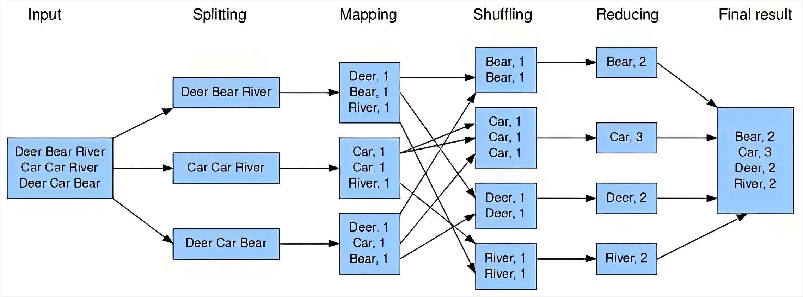
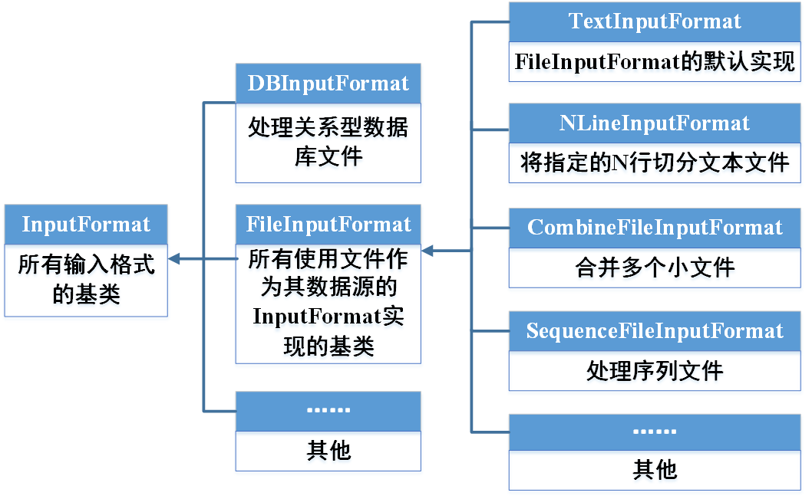
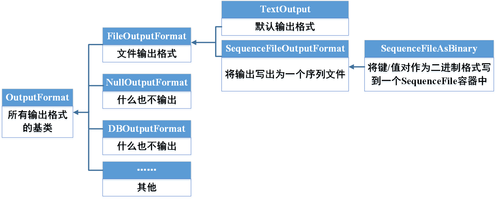
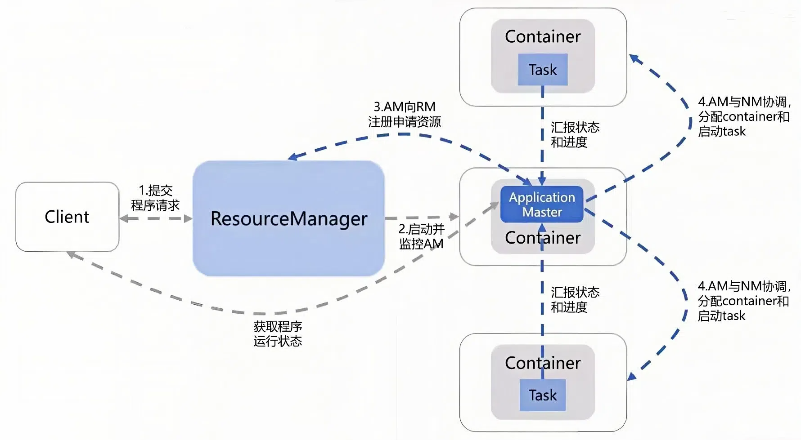
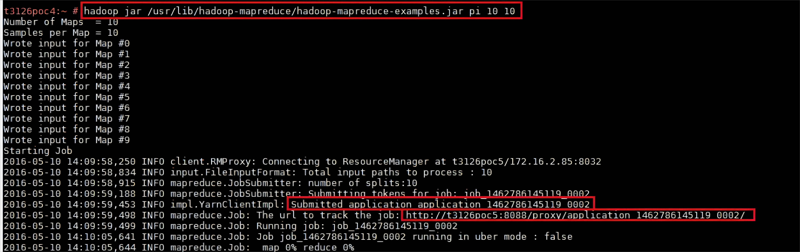
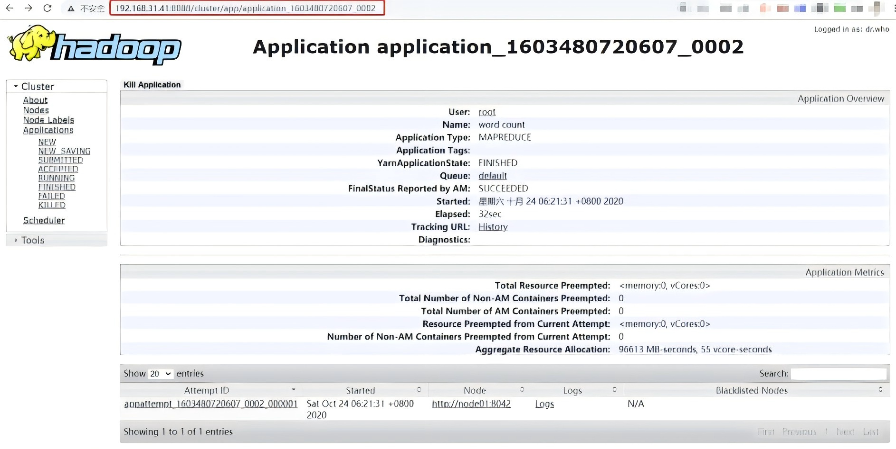

[TOC]

# MapReduce框架

## 1.基本概念和原理

### 1.1MapReduce是什么

简要说明它是一种分布式计算框架，用于处理大规模数据，核心是将任务拆分（Map）和汇总（Reduce）。可以将MapReduce比作一个流水线，Map是加工工序，Reduce是装配工序。

>起源：2004年10月Google发表了MapReduce论文；设计初衷是解决搜索引擎中大规模<u>网页数据</u>的并行处理；Hadoop MapReduce是Google MapReduce的开源实现；MapReduce是Apache Hadoop的核心子项目概念概念：面向批处理的分布式计算框架；一种编程模型:MapReduce程序被分为Map（映射）阶段和Reduce（化简）阶段
>
>核心思想：分而治之，并行计算；移动**计算**，而非移动数据
>
>特点：计算跟着数据走；良好的扩展性，计算能力随着节点数增加，近似线性递增；高容错；状态监控；适合海量数据的**离线批处理**；降低了分布式编程的门槛

**核心思路：**

* **Map阶段**：将数据分成小块并并行处理。
* **Reduce阶段**：将处理结果合并生成最终结果。

### 1.2工作流程

#### 1.2.1 MapReduce运行流程

* MapReduce运行步骤拆解：

  * 输入数据：批量存储数据

  * **Split（切片）阶段**：在Hadoop中如果数据存储在HDFS，则HDFS会帮助输入数据进行自动切片，如果未存储在HDFS，则MapReduce会自己调用Split占用128M的空间给数据进行切片，切片得到的是数据块（Block）。由Inputformat组件完成。

  * **Map（映射）阶段**：每个切片得到的数据块启动一个Map任务， 对每个数据块进行处理，并输出键值对，键值对形式为[key, value]，处理数据块得到的部分为key，value计数为1。

  * **Shuffle（洗牌）阶段**：对Map输出的结果按照相同key值进行分组、排序，并分发到同一个Reduce节点（Reduce节点总数人为规定），这是最关键的一步。如何决定分发到哪个Reduce节点？经常采用Hash（哈希）取模来决定，模数为Reduce节点个数 ，将切片的数据取哈希值转换为数字，取模后相同余数的数据为一个节点。

    > 在 Hadoop MapReduce 中，默认使用 `HashPartitioner` 进行哈希取模分区，**Key 的分布较均匀**时，默认 `HashPartitioner` 可较好地平衡负载：
    >
    > `ReducerID = (hash(key) mod numReducers)`
    >
    > 其中：
    >
    > - `hash(key)`：计算 Key 的哈希值。
    > - `numReducers`：Reduce 任务的总数量（自行规定）。
    > - `ReducerID`：计算出的目标 Reduce 任务编号。
    >
    > ```java
    > public class HashPartitioner<K, V> extends Partitioner<K, V> {
    >     public int getPartition(K key, V value, int numReduceTasks) {
    >         return (key.hashCode() & Integer.MAX_VALUE) % numReduceTasks;
    >         //key.hashCode() 计算 Key 的哈希值。
    >         // & Integer.MAX_VALUE 保证哈希值非负（避免负数索引）。
    >         //numReduceTasks 代表 Reduce 任务的数量，取模后得到 Reducer ID。
    >     }
    > }
    > ```

  * **Reduce（化简）阶段**：对相同键的值集合进行合并加总处理，每一个Reduce节点对应一个结果文件，所有结果文件形成最终结果。

    > 注：如果按照**任务（Task）**划分MapReduce工作流程，则**Map Task**从输出数据、Split阶段开始，到Shuffle阶段中间截止；**Reduce Task**从Shuffle阶段中间开始到Reduce阶段截止。
    >
  
* 实际案例：词频统计

  

  示例：统计文本中单词出现次数。

  - Input输入：`["Deer", "Bear", "River", "Car", "Car", "River", "Deer", "Car", "Bear"]`
  - Splitting输出：`["Deer", "Bear", "River"],["Car", "Car", "River"],["Deer", "Car", "Bear"]`
  - Mapping输出：`[("Deer",1),("Bear",1),("River",1)],[("Car",1),("Car",1),("River",1)],[("Deer",1),("Car",1),("Bear",1)]`
  - Shuffling输出：`("Bear",[1,1]),("Car",[1,1,1]),("Deer",[1,1]),("River",[1,1])` 
  - Reducing输出：`("Bear",2),("Car",3),("Deer",2),("River",2)`
  - Final Result：`("Bear",2),("Car",3),("Deer",2),("River",2)`

#### 1.2.2 Shuffle阶段详解

**Shuffle阶段**是Map、Reduce阶段的中间环节，负责执行Partition（分区）、Sort（排序）、Spill（溢写）、Merge（合并）、Fetch（抓取）等工作，是MapReduce框架中**最重要**的阶段。以下为MapReduce框架各阶段的流程示意图，重点关注Shuffle阶段。


* 步骤运行流程：

  * **Partition（分区）**：在完成切片后，对每一个map处理得到的结果，也就是形如`(Bear,1)`的数据进行分区，key值相同的在同一分区，同一分区的数据最终会在同一个Reduce任务内处理。

    > 如何决定分区？Partition编号=Reduce任务编号=key hashcode % reduce task number（哈希取模，余数为编号）

  * **Sort（排序）**：在每个分区内，按照key值对数据进行排序

  * **Fetch（抓取）**：将不同map分区排序后的结果数据中同一分区的数据进行抓取，即对应同一Reduce任务

  * **Merge（合并）**：将抓取的数据进行合并，得到Reduce任务的源数据

* 后端运行流程：
  * **Map端**：Map任务将中间结果写入专用**内存缓冲区Buffer(默认100M)**，同时进行**Partition**和**Sort**(先按“keyhashcode % reduce task number”对数据进行分区，分区内再按key排序）。当Buffer的数据量达到阈值（默认80%）时，将数据**溢写(Spill)**到磁盘的一个临时文件中，也就是进行落盘，由此磁盘内将不断产生一个个小文件，文件内数据先分区后排序（Partition，Sort）。  
    Map任务结束前，将多个临时小文件**合并(Merge)**为一个Map输出文件，文件内数据先分区后排序(Partition,Sort)，进行落盘。
  * **Reduce端**：Reduce任务从多个Map输出文件中主动**抓取(Fetch)**属于自己的分区数据，先写入**内存缓冲区Buffer**，数据量达到阈值后，**溢写(Spill)**到磁盘的一个临时文件中，类比Map端，也是生成多个临时小文件。
    数据抓取完成后，将多个临时文件**合并(Merge)**为一个Reduce输入文件，文件内数据按key排序(Sort)，再进行落盘。
* Map端内存缓冲区Buffer默认是100M，Reduce端所占内存根据处理任务数量而定，一般所占内存在几百M内，由此来看，Shuffle阶段运行所占内存较低，但这会导致磁盘占用较多，即Shuffle阶段在数据溢写、合并临时小文件时需要进行多次落盘，存在**与磁盘的大量交互**。并且，在完成Shuffle阶段后需要将文件传输给Reduce节点，是通过**网络传输**的，造成效率较低。以上两点导致**MapReduce运行较慢**。

#### 1.2.3 核心组件

MapReduce的核心是Map函数和Reduce函数，Map函数与Reduce 函数的输入输出都是`<Key,Value>`形式的键值对，如下表所示。

| 函数   | 输入          | 输出           |
| ------ | ------------- | -------------- |
| Map    | <K1, V1>      | List(<K2, V2>) |
| Reduce | <K2.List(V2)> | <K3, V3>       |

在上表所示四种`<Key, Value>`形式的键值对中，键和值的类型可以是Hadoop中预定义的任意数据类型，如上表所示。但它们之间具有一定的约束关系:Map函数输出的键值类型(K2和V2)和Reduce函数输入的键值类型(K2和V2)必须相同，其它键值类型可以不同。

* **InputFormat**：输入格式，切分数据。

>在运行 MapReduce 程序时，输入数据格式主要为文本文件、二进制格式文件、数据库表等。而 Map 函数的输入要求是`<Key,Value>`键值对，因此输入数据并不能直接交给 Map函数处理，在此之前需要先使用InputFormat 类把输入数据转换为 Map函数可以处理的格式。
>
>* InputFormat类在MapReduce中主要负责两个**核心功能**：首先，它根据设定的分片大小(splitSize)和文件的切分规则，逻辑上对输入数据进行**分片**，并确定分片数量，其中每个输入分片对应一个由单个Map任务处理的数据块，这是Map阶段的基础。其次，InputFormat类负责将每个输入分片进一步**分解为若干个`<Key,Value>`键值对**，这些键值对是送入Map函数中进行处理的记录。
>
> 
>
>* InputFormat类及其实现类结构如上图所示，包括用于处理文件格式的**FilelnputFormat类**、处理二进制格式的 **SequenceFileInputFormat 类**以及处理关系型数据库格式的**DBInputFormat类**等。其中，FileInputFormat类是所有使用文件作为数据源的InputFornat实现的基类，核心功能是计算输入文件的输入分片数，它的子类则负责将输入分片分割成若干`<Key,Value>`键值对送入 Map 函数中进行进一步处理，默认的子类为TextInputFormat。
>
>  * **(1)FileInputFormat 类**
>    FileInputFormat 类的核心功能是**获取输入数据的分片数**，该功能由**getSplit()**方法实现，getSplits())方法的主要处理流程如下:
>    **步骤1**:FileInputFormat类分别对每一个文件进行分片操作;
>    **步骤 2**:获取文件的路径S和长度L;
>    **步骤3**:判断L是否为0，如果不为0，继续执行步骤4;如果为0，则不执行分片操作;
>    **步骤4**:判断文件是否支持分片，如果支持则执行步骤5;否则不执行分片操作;
>    **步骤5**:调用`computeSplitSize()`方法，计算分片大小，默认情况下分片大小`splitSize`等于子文件块大小` blockSize`;
>    **步骤6**: 根据定义的分片规则进行分片;
>    **步骤7**:返回分片数。
>    下面对` getSplits()`代码中的核心模块进行解释说明，主要包括分片大小的计算(步骤5)以及默认的分片规则(步骤6)。
>
>    * 1)分片大小的计算
>
>      分片大小(`splinSize`)由最小分片大小(`minSize`)、最大分片大小(`maxSize`)和数据块大小(`blockSize`)共同决定，计算公式如下:
>      **splitSize=max(minSize,min(maxSize.blockSize))**
>      默认情况下，`minSize=l`，`maxSize=Long.MAXV`，`blockSize` 在完全分布式集群中默认为128MB。根据公式的计算结果可知，分片大小`splinSize`等于数据块大小`blockSize`，也为128MB。因此，在HDFS上存储的一个数据块就是单个 Map任务中的一个输入分片。由于`blockSize`一般是不可变的，因此可以通过调整`minSize`和`maxSize`来调整splitSize。
>
>    * 2)文件切分规则
>
>      默认情况下，分片大小为128MB。一个256MB的文件会在逻辑上被分成两个128 MB的分片。然而，对于300MB的文件，若简单地按每128MB切分，则会生成两个128MB的分片和一个较小的44MB分片，小分片所在的Map任务会迅速完成，而另外两个大分片所在的Map任务还在处理中，这会导致**计算资源的不均衡分配**。
>      为了解决这个问题，MapReduce定义了文件切分规则，即根据设定的条件判断文件是否切分：
>
>      ```java
>      while(((double)bytesRemaining)/splitsize >SPLIT SLOP)
>      ```
>
>      在文件分片过程中，首先会计算剩余数据量(bytesRemaining)，在开始时这等同于文件的总大小(length);然后，系统会将剩余数据量(bytesRemaining)与分片大小(splitSize)的比值与预定的值(SPLIT SLOP，**默认为1.1**)进行比较。如果比值超过1.1，系统将继续进行分片:否则，分片过程停止。值得注意的是，若比值在1到1.1之间，则最后一个分片的大小会超过bockSize。这个规则确保分片的合理性，避免产生过小的分片，从而优化计算资源的分配。
>
>  * **(2)TextInputFormat类**
>    FilelnputFormat 类将文件切分为分片后，子类进一步将分片分割成记录。FilelnputFormat 类常用的接口实现类包括`TextInputFormat`、`KVTextlnputFormat`、`NLineInputFormat`、`CombineTextlnputFormt`等。其中，`TextlnputFormat` 是默认的InputFormat，按行读取分片中的数据，并将数据转换为`<Key,Value>`键值对形式的记录。其中，Key是存储该行在整个文件中的字节偏移量，类型为`LongWritable`,Value是该行的内容，类型为`Text`，如下表所示。
>
>    | 输入格式        | 输入分片                        | 记录(<Key,Value>)                             |
>    | --------------- | ------------------------------- | --------------------------------------------- |
>    | TextInputFormat | Hadoop MapReduce Big data Spark | <0,Hadoop MapReduce><br /><17,Big data Spark> |
>
>  注：**序列文件(Sequencerile)**是Hadoop 中的一种二进制文件格式，用于存储键-值对,适用于大规模数据集的高效读写。序列文件主要由一个`Header`和多个 `Record`组成，提供了`writer`、`reader`和`sorter`三种类来进行写、读和排序。序列文件具备可合并小文件、可以被切分、支持压缩等特点。
>

* **Mapper**：执行Map任务。
* **Partitioner**：将数据分发给不同的Reducer。
* **Reducer**：执行Reduce任务。
* **OutputFormat**：输出格式保存最终结果。

>在 MapReduce 程序中，输出数据格式可以是文本文件、二进制格式文件、数据库表等。因此，MapReduce提供了OutputFormat类**控制输出数据的输出格式**，下图展示了 OutputFormat 类的部分层次结构。
>
>
>
>OutputFormat 的常用输出格式即实现类如下表所示。其中，`TextOutputFormat`是MapReduce 的默认输出格式，它以文本文件的形式将每条记录写入一行，其中键和值可以是任意类型。针对非文本文件，OutputFormat也提供了多种输出格式。例如，`SequenceFileAsBinaryOutputFormat` 将键值对以原始的二进制格式写到一个顺序文件容器中，`DBOutputFormat`将输出数据存储到数据库中。
>
>| 输出格式                | 描述                                       | 示例                               |
>| ----------------------- | ------------------------------------------ | ---------------------------------- |
>| TextOutputFormat        | 默认输出格式，以"Key \t Value"的格式输出行 | hello 2<br />world 1               |
>| SequenceFileInputFormat | 输出二进制文件                             | key-0=>value-0<br />key-1=>value-1 |
>| DBOutputFormat          | 将输出数据存储到数据库中                   | 见下代码                           |
>
>```java
>//DBOutputFormat示例
>Configuration conf=new Configuration();
>Job job=Job.getInstance(conf,"database output example");
>job,setOutputFormatClass(DB0utputFormat.class);
>DBConfiguration.configureDB(conf,
>	"com.mysql,jdbc.Driver",//数据库驱动类
>	"jdbc:mysql://hostname:port/dbname",// 数据库URL
>"username",  // 数据库用产名
>	"password");  //数据库密码
>DBOutputFormat.setOutput(job,"output_table",//目标表名
>   new String[}{"column1","column2"}); //目标表的列
>```

## 2.作用与模式

### 2.1MapReduce的作用

#### 2.1.1 主要应用

MapReduce主要用于 **大规模数据处理（Data Processing）**，是大数据计算的核心计算框架之一。其作用包括：

- **批量数据处理（Batch Processing）**：适用于海量数据的离线计算，如日志分析、索引构建、数据挖掘等。

> 典型应用场景（**离线批处理**）：
> 数据统计，如:网站的PV、UV统计
> 搜索引擎构建索引
> 海量数据查询
> 复杂数据分析算法实现

- **分布式计算框架**：提供并行计算能力，能够在大规模集群上运行，提高计算效率和容错性。
- **数据转换与清洗**：处理非结构化或半结构化数据，将其转换为分析友好的结构化数据。

> 不适用场景（**非离线批处理**）：
> OLAP：要求毫秒或秒级返回结果，MapReduce返回结果延迟时间较长
> 流计算：流计算的输入数据集是**动态无界**的，而MapReduce处理的数据集是**静态有界**的
> DAG计算：多个作业存在依赖关系，后一个的输入是前一个的输出，构成有向无环图；进行DAG时，每个MapReduce作业的输出结果都会落盘，造成大量磁盘IO，导致性能非常低下

#### 2.1.2 在大数据生态系统中的具体环节

​    在Hadoop大数据生态系统中，MapReduce通常处于 **数据存储（HDFS）和数据分析（如Hive、Spark）之间**，主要负责 **大规模数据计算与转换**，具体环节如下：

| **大数据分析环节** | **MapReduce的作用**                                          | **典型技术组件**                                             |
| ------------------ | ------------------------------------------------------------ | ------------------------------------------------------------ |
| 数据采集           | 无直接作用（数据采集通常由Flume、Kafka等完成）               | Flume（日志数据采集与流式传输）, Kafka（实时流式数据中转缓冲）, Sqoop（批量结构化数据迁移） |
| **数据存储**       | 依赖HDFS存储计算所需数据                                     | HDFS（分布式文件系统）, HBase（实时数据查询）, Hive（数据仓库）, Pig（数据流式处理，适合批量处理） |
| **数据处理**       | **核心计算框架，用于批处理、ETL（提取、加载、转换）、索引构建** | **MapReduce**, Spark（基于内存的分布式计算框架）, Filnk（流式数据处理框架） |
| 数据分析           | 机器学习与数据挖掘                                           | Mahout，Spark MLlib                                          |
| 数据可视化         | 无直接作用（可视化通常依赖BI工具）                           | Tableau（专业级数据可视化工具），Superset（开源数据可视化平台），Power BI（商业智能（BI）和数据分析工具） |

### 2.2运行模式

在Hadoop集群中的MapReduce运行模式有以下两种：**JobTracker/TaskTracker模式**和**YARN模式**，虽然 Hadoop 1.x仍然可以用于小规模集群，但由于 JobTracker存在单点瓶颈，Hadoop 2.x及以上版本的YARN模式具有更好的扩展性，更适合**大规模分布式计算**，具备更灵活的资源管理和任务调度，因此一般而言会选择**YARN模式**，因此首先介绍YARN模式。

#### 2.2.1 YARN模式(Hadoop 2.X)

**1. YARN模式简述：**Hadoop 2.x 引入了 **YARN（Yet Another Resource Negotiator）**，它是一个资源管理和作业调度框架，使得 Hadoop 能够运行除 MapReduce 之外的其他计算框架（如 Spark、Tez、Flink）。在 YARN 模式下，Hadoop 的 MapReduce 运行方式与 Hadoop 1.x 有显著不同，主要体现在 **资源管理、作业调度、任务执行** 等方面。YARN 核心组件由 **ResourceManager（RM）**、**NodeManager（NM）**、**ApplicationMaster（AM）** 和 **Container** 组成：

- **Client(客户端)**：把作业提交给 ResourceManager（RM）

- **ResourceManager（RM）（资源管理器）**

  - **调度器（Scheduler）**：基于资源可用性，为不同任务分配资源。

    >YARN 提供多种调度器：
    >
    >- **FIFO 调度器（默认）**：先提交的任务先执行。
    >- **容量调度器（Capacity Scheduler）**：支持多用户共享集群资源，每个队列可配置不同资源上限。
    >- **公平调度器（Fair Scheduler）**：不同任务公平地分配资源，防止大任务占用全部资源。

  - **应用管理器（Application Manager）**：管理整个应用程序的生命周期，协调 AM 的启动。

- **ApplicationMaster（AM）（应用程序主进程）**

  - 每个应用（如 MapReduce 任务）有自己的 ApplicationMaster。
  - 负责向 ResourceManager 请求资源，并与 NodeManager 交互来启动/管理任务。

- **NodeManager（NM）（节点管理器）**

  - 运行在集群中的每个节点上，负责管理该节点的资源并监控 Container 的运行状态。
  - 处理来自 ResourceManager 的指令，如启动或终止 Container。

- **Container（容器）**

  - YARN 中的计算资源单元，每个任务（如 Map 或 Reduce 任务）都在 Container 中执行。
  - 由 NodeManager 负责管理，包含 CPU、内存等资源。

**2.Hadoop 2.x 下的 MapReduce 任务执行大致分为以下步骤**：



图示共有四个步骤，与下所描述步骤基本一致，可参考示意图进行了解。

**步骤1：用户提交 Job**

在 Hadoop 2.x 中，**用户通过客户端提交作业**，**ResourceManager（RM）接收任务**，然后 **启动 ApplicationMaster（AM）** 来管理作业。

- 客户端向 **ResourceManager（RM）** 提交 MapReduce 任务。

```bash
#在 Hadoop 界面提交作业的命令（CLI）：
hadoop jar WordCount.jar WordCount /input/path /output/path
#hadoop jar <jar文件> <主类> [参数...]
```

```java
//Step 1: 用户提交Job
public class WordCount {
     /**
     * @param args 字符串数组，通常包含两个参数：
     *             args[0]  HDFS 输入路径
     *             args[1]  HDFS 输出路径
     * @throws Exception 可能抛出的异常，包括 IO 异常和 Hadoop 相关异常
     */
    //String[] args表示一个字符串数组，用于接收命令行输入参数
    public static void main(String[] args) throws Exception {
        Configuration conf = new Configuration(); //创建Hadoop配置对象
        Job job = Job.getInstance(conf, "word count"); //创建Job实例，并命名为"word count"
        job.setJarByClass(WordCount.class); // 设置执行的主类
        job.setMapperClass(TokenizerMapper.class); // 设置Mapper类，对应下面定义的TokenizerMapper类
        job.setCombinerClass(IntSumReducer.class); // 设置Combiner（可选，用于本地聚合），对应下面定义的IntSumReducer类
        job.setReducerClass(IntSumReducer.class); // 设置Reducer类，对应下面定义的IntSumReducer类
        // 设置 Map 和 Reduce 输出的 Key 和 Value 类型
        job.setOutputKeyClass(Text.class); // Text.class是Hadoop提供的String类型，用于存储单词
        job.setOutputValueClass(IntWritable.class); // IntWritable.class是Hadoop提供的整数类型，用于存储计数
        
        FileInputFormat.addInputPath(job, new Path(args[0])); //args[0]:可解析为 /input/path，用于指定MapReduce任务的输入数据
        FileOutputFormat.setOutputPath(job, new Path(args[1])); //args[1]:可解析为 /output/path，用于指定MapReduce任务的输出数据      
       System.exit(job.waitForCompletion(true) ? 0 : 1); //提交Job并等待执行完成
    }
}
```

- Job启动后，RM 启动一个 ApplicationMaster（AM）来管理这个任务。

**步骤 2：ApplicationMaster 运行（YARN 负责资源分配）**

```bash
#在Hadoop YARN界面查看作业进度的命令：
yarn application -list
#yarn 调用YARN资源管理框架
#application 操作YARN任务的命令
#-list 列出当前正在运行的YARN任务

yarn application -status <application_id>
#-status 获取指定任务的详细状态 
#application_id 任务id，可替换
```

- ApplicationMaster 向 RM 申请资源（Container）。

- RM 分配资源，AM 在指定的 NodeManager 上启动 Map 任务的 Container。

**步骤3：Map 阶段**

```java
//Map任务示例代码
//TokenizerMapper 读取输入数据并进行拆分。
//extend表示继承Hadoop中Mapper类并进行进一步定义
class TokenizerMapper extends Mapper<Object, Text, Text, IntWritable> {
        /**
     * 函数参数解释：
     * Object 输入键类型（Hadoop生成的行号或偏移量）
     * Text 输入值类型（HDFS读取的一行文本数据）
     * Text 输出键类型（单词）
     * IntWritable输出值类型（单词计数）
     */
    private final static IntWritable one = new IntWritable(1); //预定义IntWritable值1，因为 Hadoop需要IntWritable作为数据类型
    private Text word = new Text(); //预定义用于存储单词的Text类型对象，以便在Map任务中作为键输出
    
    public void map(Object key, Text value, Context context) throws IOException, InterruptedException {
        //将输入的每行文本转换为字符串并拆分为单词
        StringTokenizer itr = new StringTokenizer(value.toString()); //StringTokenizer 解析字符串为单词
        while (itr.hasMoreTokens()) { //迭代获取单词
            word.set(itr.nextToken()); //获取下一个单词，并存入word对象
            context.write(word, one); //发送 (word,1) 作为Mapper输出
        }
    }
}
```

- Container 执行 Map 任务，读取 HDFS 数据并生成中间结果。

```bash
#在HDFS上存储输入数据的命令：
hdfs dfs -put localfile.txt /input/localfile.txt
#hdfs 调用HDFS文件系统
#dfs 访问HDFS命令集
#-put 将本地文件上传到HDFS
#localfile.txt 本地文件路径
#input/localfile.txt HDFS目标路径

hdfs dfs -ls /input
#-ls 列出HDFS目录下的文件
#/input 目标目录 
```

- 任务完成后，ApplicationMaster 申请新的 Reduce 任务的 Container。

**步骤4：Reduce 阶段**

```java
//Reduce任务示例代码
//IntSumReducer 统计相同单词的总次数
//extend 表示继承Hadoop中Reducer类并进行进一步定义
class IntSumReducer extends Reducer<Text, IntWritable, Text, IntWritable> {
     /**
     *Text 输入的Key类型（单词）
     *IntWritable 输入的Value类型（该单词的计数为1的计数）
     *Text 输出的Key类型（单词）
     *IntWritable 输出的Value类型（该单词的总计数）
     */

//reduce方法处理相同key（单词）的所有values（计数1），进行累加计算。
    public void reduce(Text key, Iterable<IntWritable> values, Context context)
        throws IOException, InterruptedException {
         /**
         *key单词，类型为 Text
         *values 该单词在Map阶段出现的所有计数集合，类型为Iterable<IntWritable>
         *context Hadoop提供的上下文对象，负责输出结果，类型为Reducer.Context
         */
        int sum = 0;  //初始化计数器
       //遍历values集合，每个val代表Map阶段发来的计数1
        for (IntWritable val : values) {
            /**
             * val是values集合的一个元素，类型为IntWritable。
             * values是Iterable<IntWritable> 类型，包含相同单词的多个IntWritable计数值。
             */
            sum += val.get(); //计算单词出现次数，val.get()获取IntWritable存储的int值，并累加
        }
        context.write(key, new IntWritable(sum)); //Reduce任务输出单词（Text 类型）及其总次数（IntWritable 类型），将该结果写入HDFS，供最终查询
    }
```

- Reduce 任务读取 Map 任务的中间结果，进行归约计算，并将最终输出写入 HDFS。

```bash
#在 HDFS 查看 MapReduce 任务输出的命令
hdfs dfs -cat /output/part-r-00000
#-cat 显示HDFS文件内容
#/output/part-r-00000 指定Reduce输出文件
```

**步骤5：作业完成**

- ApplicationMaster 通知 ResourceManager 任务执行完成。

- 释放所有 Container，清理任务数据。

```bash
#在YARN上杀掉未完成的任务
yarn application -kill <application_id>
#在HDFS删除旧的输出目录，以便重新运行任务
hdfs dfs -rm -r /output
#-rm 删除文件或目录
#-r 递归删除（用于目录）
#/output 需要删除的 HDFS 路径
```

**3.YARN 相比 Hadoop 1.x 的优势**

| 特性       | Hadoop 1.x（MRv1）               | Hadoop 2.x（YARN）                                  |
| ---------- | -------------------------------- | --------------------------------------------------- |
| 架构       | JobTracker 统一管理资源和任务    | **分离资源管理（RM）与任务管理（AM）**              |
| 扩展性     | 受 JobTracker 限制，无法高效扩展 | 更好的资源利用，支持**更大规模**集群                |
| 资源管理   | 以 Task 为单位静态分配资源       | 以 Container 为单位**动态分配**资源，提高作业吞吐量 |
| 多框架支持 | 仅支持 MapReduce                 | **支持 Spark、Flink、Tez 等**                       |
| 高可用性   | JobTracker 失效，任务失败        | ResourceManager **支持高可用**                      |
| 适用场景   | 适用于小规模集群                 | **适用于大规模集群计算**                            |

**4. YARN运行模式**

YARN 支持三种运行模式：

1. **独立模式（Standalone Mode）**
   - 仅在单机上运行，用于测试或开发。
   - 主要用于调试 MapReduce 任务。
2. **伪分布式模式（Pseudo-Distributed Mode）**
   - 运行在一台机器上，但模拟多个节点（多进程）。
   - 适用于小型集群测试。
3. **完全分布式模式（Fully-Distributed Mode）**
   - 运行在真正的多节点集群上，适用于大规模数据处理。
   - ResourceManager 负责全局调度，NodeManager 负责本地资源管理。关键配置文件。

**5. YARN 模式关键配置文件**

在 **Hadoop 2.x（YARN 模式）** 下，需要明确指定 `mapreduce.framework.name=yarn`，否则仍然会使用 `local` 或 `classic（JobTracker/TaskTracker）` 模式。但如果你使用 `hadoop jar` 命令提交作业，并且 Hadoop 配置已正确设置为 YARN，则 **代码无需更改**。

如果你手动设置 `Configuration`，可能需要增加：

```java
Configuration conf = new Configuration();
conf.set("mapreduce.framework.name", "yarn");  // 使用 YARN
conf.set("yarn.resourcemanager.address", "localhost:8032");
Job job = Job.getInstance(conf, "YARN Word Count");
```

```xml
<!--示例-->
<!-- yarn-site.xml（YARN 资源管理配置）-->
<configuration>
    <property>
        <name>yarn.resourcemanager.hostname</name>
        <value>master-node</value>
    </property>
    <property>
        <name>yarn.nodemanager.resource.memory-mb</name>
        <value>8192</value>
    </property>
    <property>
        <name>yarn.scheduler.maximum-allocation-mb</name>
        <value>4096</value>
    </property>
</configuration>
```

如果你的环境是 Hadoop 2.x 及以上的 **YARN 模式**，建议检查：

```sh
cat $HADOOP_CONF_DIR/mapred-site.xml
```

确保以下配置存在：

```xml
<!-- mapred-site.xml（MapReduce 配置）-->
<configuration>
    <property>
        <name>mapreduce.framework.name</name>
        <!--重点值-->
        <value>yarn</value>
    </property>
    <property>
        <name>mapreduce.jobhistory.address</name>
        <value>master-node:10020</value>
    </property>
</configuration>
```

除此之外MapReduce运行程序还有其他设置：

| Parameter                                  | Value            | Description                                 |
| ------------------------------------------ | ---------------- | ------------------------------------------- |
| mapreduce.framework.name                   | yarn             | 执行框架为Hadoop Yarn                       |
| mapreduce.map.memory.mb                    | 1536             | Map任务最大资源限制                         |
| mapreduce.map.java.opts                    | -Xmx1024M        | MapJVM最大堆资源                            |
| mapreduce.reduce.memory.mb                 | 3072             | Reduce任务最大资源限制                      |
| mapreduce.reduce.java.opts                 | Xmx2560M         | Reduce JVM最大堆资源                        |
| mapreduce.task.io.sort.mb                  | 512              | 增加MapReduce任务排序时的内存占用           |
| mapreduce.task.io.sort.factor              | 100              | MapReduce文件合并时，最大文件数             |
| mapreduce.reduce.shuffle.parallelcopies    | 50               | 配置Reduce在拉取Map节点数据时的并行度       |
| mapreduce.jobhistory.address               | host:port        | MapReduce History Server地址，默认端口10020 |
| mapreduce.jobhistory.webapp.address        | host:port        | History Server Web地址，默认端口19888       |
| mapreduce.jobhistory.intermediate-done-dir | /mr-history/tmp  | MapReduce日志保存位置                       |
| mapreduce.jobhistory.done-dir              | /mr-history/done | History Server日志保存位置                  |

#### 2.2.2 JobTracker/TaskTracker模式(Hadoop 1.X)

**1. JobTracker/TaskTracker模式简述：**在 Hadoop 1.x 版本中，MapReduce 采用 **JobTracker/TaskTracker** 结构来管理任务执行，这是 Hadoop 1.x 的默认模式。这个架构虽然简单，但存在扩展性和资源管理上的局限性，因此在 Hadoop 2.x 之后被 YARN 取代。在 Hadoop 1.x 的 MapReduce（也称 MRv1）架构中，主要包括两个核心组件：**JobTracker**（作业跟踪器）和**TaskTracker**（任务跟踪器）。


* **客户端(Client)**：把作业提交给 JobTracker节点
* **JobTracker节点(Master Node)**：运行在主节点（Master Node），是整个MapReduce任务的调度中心，负责**作业提交、任务调度、资源管理、任务监控**等；维护所有**TaskTracker** 的状态，并将Map/Reduce任务分配到 TaskTracker；监控任务运行状态，如果任务失败，会重新调度到其他节点。
* **TaskTracker节点(Slave Node)**：运行在从节点（Slave Nodes），负责实际的任务执行；由 JobTracker分配任务，为任务分配资源并在本地执行Map或Reduce任务；定期向 JobTracker 发送心跳，报告任务执行状态；如果任务失败，TaskTracker 会通知 JobTracker 进行故障恢复。

**2.Hadoop 1.x 下的 MapReduce 任务执行大致分为以下步骤**：

**步骤 1：用户提交 Job**

- 用户通过 `hadoop jar`命令提交一个 MapReduce 任务，JobTracker 负责接收任务并初始化。

  ```bash
  hadoop jar WordCount.jar WordCount /input/path /output/path
  #hadoop jar <jar文件> <主类> [参数...]
  #WordCount.jar 包含MapReduce作业的JAR文件
  #WordCount JAR文件中包含main方法的类名。如果 JAR文件的manifest中已经指定了Main-Class，则可以省略
  #/input/path 输入数据的 HDFS 路径
  #/output/path 任务输出结果的 HDFS 路径
  ```

  JobTracker 在这里会初始化 Job，并解析配置参数，开始拆分任务：JobTracker 读取用户提供的 `jar` 包，并<u>加载 `main()` 方法中的 **Job 配置**，解析 `JobConf`（作业配置文件）</u>，例如：**输入路径**（/input/path），**输出路径**（/output/path），**Mapper/Reducer 逻辑**，**作业名称**，**其他 Hadoop 配置参数**；

  JobTracker 确保输入数据路径 **`/input/path` 存在**，否则作业会失败；JobTracker 确保输出路径**`/output/path` 不能已存在**，否则会报错：

  ```bash
  ERROR: Output directory already exists
  ```

  **解决方案**：如果希望覆盖已有数据，需手动删除：

  ```bash
  hdfs dfs -rm -r /output/path
  #hdfs 调用HDFS文件系统
  #dfs 访问HDFS命令集
  #-rm 删除文件或目录的命令。
  #-r 递归删除，意味着如果/output/path是一个目录，该命令会删除该目录及其所有子文件和子目录
  #/output/path 指定需要删除的HDFS路径
  ```


**步骤 2：JobTracker 任务拆分**

- JobTracker计算输入数据的分片（Splits）：Hadoop 读取 HDFS 文件，并按**块大小（默认 128MB）** 拆分数据，每个分片交给一个 Map 任务处理。

  ```java
  //示例（Hadoop自动拆分输入数据）:Hadoop框架内部调用FileInputFormat进行数据拆分
  FileInputFormat.addInputPath(job, new Path(args[0]));
  //job 当前MapReduce任务的Job对象，封装了作业的配置信息
  //args[0] 可解析为/input/path，用于指定 MapReduce任务的输入数据
  ```

- JobTracker **为每个拆分的任务分配 TaskTracker**，每个任务交给不同的 TaskTracker 处理。任务初始化完成后，JobTracker 通知各个 TaskTracker **启动 Map 任务**，开始执行 `map()` 逻辑。


**步骤 3：TaskTracker 执行 Map 任务**

- TaskTracker 执行 Map 任务，读取 HDFS 数据，执行用户定义的 `map()` 函数，生成中间键值对，并存储在本地。

  ```java
  //示例map函数
  //代码具体注释和YARN模式代码注释一致
  @Override
  public void map(Object key, Text value, Context context)
      throws IOException, InterruptedException {
      StringTokenizer itr = new StringTokenizer(value.toString());
      while (itr.hasMoreTokens()) {
          word.set(itr.nextToken());
          context.write(word, one);  //输出格式：("word", 1)
      }
  }
  //输出结果示例：("Hadoop", 1)
  ```


**步骤 4：TaskTracker 执行 Reduce 任务**

- Map 任务完成后，TaskTracker 将中间数据分发给 Reduce 任务。

- JobTracker **为 Reduce 任务分配 TaskTracker** 并启动 `reduce()` 函数进行归约计算。

  ```java
  //示例reduce函数
  //代码具体注释和YARN模式代码注释一致
  @Override
  public void reduce(Text key, Iterable<IntWritable> values, Context context)
      throws IOException, InterruptedException {
      int sum = 0;
      for (IntWritable val : values) {
          sum += val.get();
      }
      result.set(sum);
      context.write(key, result);  //输出格式：("word", 总次数)
  }
  ```

- 任务执行过程：

  任务开始时，Reduce 任务从多个 Map 任务拉取（Shuffle）相同 key 的所有值：

  ```text
  ("Hadoop", [1, 1, 1])
  ("MapReduce", [1])
  ("JobTracker", [1])
  ```

  然后 `reduce()` 函数会对这些值求和，最终输出：

  ```text
  ("Hadoop", 3)
  ("MapReduce", 1)
  ("JobTracker", 1)
  ```

**步骤 5：任务完成 & 结果存储**

- Reduce 任务完成后，最终结果写入 HDFS，JobTracker 记录作业完成状态。

  ```java
  //输出结果存储到 HDFS
  FileOutputFormat.setOutputPath(job, new Path(args[1]));
  //job 当前MapReduce任务的Job对象
  //args[1] 可解析为/output/path，用于指定 MapReduce任务的输入数据
  
  hdfs dfs -cat /output/path/part-r-00000
  //-cat 显示HDFS文件内容
  //output/part-r-00000 指定Reduce输出文件
  ```

  ```text
  结果示例：
  Hadoop 3
  JobTracker 1
  MapReduce 1 
  ```


**完整示例：基于 Hadoop 1.x MapReduce 任务：**

```java
import java.io.IOException;
import java.util.StringTokenizer;

import org.apache.hadoop.conf.Configuration;
import org.apache.hadoop.fs.Path;
import org.apache.hadoop.io.IntWritable;
import org.apache.hadoop.io.Text;
import org.apache.hadoop.mapreduce.Job;
import org.apache.hadoop.mapreduce.Mapper;
import org.apache.hadoop.mapreduce.Reducer;
import org.apache.hadoop.mapreduce.lib.input.FileInputFormat;
import org.apache.hadoop.mapreduce.lib.output.FileOutputFormat;

/**
 * 1. Mapper 类 - 处理输入数据，输出 (key, value) 对
 */
public class WordCount {

    public static class TokenizerMapper
         extends Mapper<Object, Text, Text, IntWritable> {

        private final static IntWritable one = new IntWritable(1);
        private Text word = new Text();

        // Mapper 方法：逐行读取文件并拆分单词
        @Override
        public void map(Object key, Text value, Context context
                ) throws IOException, InterruptedException {
            StringTokenizer itr = new StringTokenizer(value.toString());
            while (itr.hasMoreTokens()) {
                word.set(itr.nextToken());
                context.write(word, one);  // 输出格式：("word", 1)
            }
        }
    }

    /**
     * 2. Reducer 类 - 归约相同的 key 并求和
     */
    public static class IntSumReducer
         extends Reducer<Text, IntWritable, Text, IntWritable> {
        private IntWritable result = new IntWritable();

        // Reducer 方法：对相同单词的所有值进行累加
        @Override
        public void reduce(Text key, Iterable<IntWritable> values,
                           Context context
                           ) throws IOException, InterruptedException {
            int sum = 0;
            for (IntWritable val : values) {
                sum += val.get();
            }
            result.set(sum);
            context.write(key, result);  // 输出格式：("word", 总次数)
        }
    }

    /**
     * 3. Main 方法 - 配置 Job 任务，并提交到 JobTracker
     */
    public static void main(String[] args) throws Exception {
        Configuration conf = new Configuration();
        Job job = Job.getInstance(conf, "word count");

        // 设置 Job 运行的类
        job.setJarByClass(WordCount.class);
        job.setMapperClass(TokenizerMapper.class);
        job.setCombinerClass(IntSumReducer.class);
        job.setReducerClass(IntSumReducer.class);

        // 设置输出 key-value 类型
        job.setOutputKeyClass(Text.class);
        job.setOutputValueClass(IntWritable.class);

        // 设置输入和输出路径（HDFS 路径）
        FileInputFormat.addInputPath(job, new Path(args[0]));
        FileOutputFormat.setOutputPath(job, new Path(args[1]));

        // 提交任务到 JobTracker
        System.exit(job.waitForCompletion(true) ? 0 : 1);
    }
```

**3. 存在的问题**：JobTracker存在单点故障；JobTracker负载太重(上限4000节点)；JobTracker缺少对资源的全面管理；TaskTracker对资源的描述过于简单；源码很难理解。

#### 2.2.3 总结

**1.代码一致**，无论是 Hadoop 1.x 还是 Hadoop 2.x，MapReduce 作业的**代码逻辑是一致**的，依然包含：

- `Job` 对象创建
- `Mapper` 和 `Reducer` 任务定义
- `FileInputFormat` 指定输入数据
- `FileOutputFormat` 指定输出路径
- 提交 `job.waitForCompletion(true)`

**2.底层运行机制不同**，如YARN 和 JobTracker/TaskTracker 任务提交方式：

* 在 Hadoop 1.x 中，任务提交给 `JobTracker`：

```sh
hadoop jar wordcount.jar WordCount /input /output
```

`JobTracker` 负责整个作业的调度、资源管理。

`TaskTracker` 运行 Map 和 Reduce 任务。

* 在 Hadoop 2.x 中，任务提交给 YARN：

```sh
hadoop jar wordcount.jar WordCount /input /output
```

`ResourceManager` 分配资源（不再由 `JobTracker` 处理）。

`ApplicationMaster` 负责任务的执行和管理。

## 3.存在问题及替代方案

### 3.1常见问题及优化

#### 3.1.1 数据倾斜

在MapReduce框架中，**Partitioner（分区器）**的作用是决定 **Map 阶段的输出数据如何分配给不同的 Reduce 任务**。如果Partitioner设计不当，可能会导致 **数据倾斜**，即某些Reduce任务处理过多数据，而其他任务几乎没有数据，从而影响整个任务的执行效率。

1. **Partitioner 的作用**

- Map 阶段的输出是一组 **键值对 (key, value)**。
- 在进入 Reduce 阶段前，Partitioner 决定 **哪些 key 归到哪个 Reduce 任务**。
- 默认Partitioner是 **HashPartitioner**，它对 key 进行哈希计算，然后按照 Reduce 任务数取模 (`key.hashCode() % numReducers`)，将相同 key 发送到同一个 Reduce 任务。

2. **如何优化Partitioner**

> ​	**(1) 自定义 HashPartitioner**
>
> * 适用于 key 取值范围较大但分布不均的情况。
>
> * 通过修改哈希算法，使数据分配更加均匀。
>
> ```java
> import org.apache.hadoop.io.Text;
> import org.apache.hadoop.mapreduce.Partitioner;
> //Text代表Mapper输出的key类型；Text代表Mapper输出的value类型
> public class CustomPartitioner extends Partitioner<Text, Text> {
>     @Override
>     //重写getPartition()方法 
>     public int getPartition(Text key, Text value, int numReduceTasks) {
>         return (key.hashCode() & Integer.MAX_VALUE) % numReduceTasks; // 取正数
>         //获取key的哈希值（Java Object默认的hashCode()方法）；hashCode() 可能是负数，为了防止负数索引导致数组越界，通常需要取绝对值
>         //通过位运算&Integer.MAX_VALUE确保哈希值为正数（去掉符号位）
>         //通过取模运算hashCode%numReduceTasks保证分区号在0~numReduceTasks-1之间，即符合Reducer索引编号的范围
>     }
> }
> ```
>
> **优化点**：
>
> - `Integer.MAX_VALUE` 避免负数哈希值影响分区分配。
> - 适用于 key 分布不均但哈希计算适合均衡分布的情况。

>​	**(2) 预定义规则 Partitioning**
>
>* 适用于数据范围可预测，例如按照价格区间、日期区间、IP 地址段等。
>* 如果 key 有明显的分类，可以按特定规则划分。
>
>```java
>public class RangePartitioner extends Partitioner<Text, IntWritable> {
>   @Override
>   public int getPartition(Text key, IntWritable value, int numReduceTasks) {
>       //防止numReduceTasks=0时出错
>       if (numReduceTasks == 0) return 0; 
>       int intKey = Integer.parseInt(key.toString());//Integer.parseInt(key.toString())将Text转换为 int（例如：Text("500")->500）
>       //定义分区逻辑（基于数值范围）
>       if (intKey < 100) {
>           return 0 % numReduceTasks; //低值分到Reduce 0
>       } else if (intKey < 1000) {
>           return 1 % numReduceTasks; //中值分到Reduce 1
>       } else {
>           return 2 % numReduceTasks; //高值分到Reduce 2
>       }
>   }
>}
>```
>

> ​	**(3) 结合 Sampling 进行动态分区**
>
> * 适用于数据分布动态变化的情况，数据量大，且需要排序的任务，如日志分析、排名计算。。
>
> * 事先对输入数据进行采样，按数据的实际分布情况设置合理的分区范围。
>
> ```java
> job.setPartitionerClass(TotalOrderPartitioner.class);
> //Hadoop提供TotalOrderPartitioner，适用于数据排序任务
> ```
>

#### 3.1.2 小文件问题

在MapReduce中，**小文件问题（Small Files Problem）** 和 **中间数据膨胀（Intermediate Data Explosion）** 是常见的性能瓶颈。小文件问题的核心在于任务调度开销大、网络I/O负担重。对该类问题，核心思路是在不同场景下结合**源头控制、存储优化、计算调优、数据治理**，才能有效解决，以下是优化方法的总结。

| **方法**                                   | 核心作用                   | **优势**                 | **适用场景**               |
| ------------------------------------------ | -------------------------- | ------------------------ | -------------------------- |
| 增加 Combiner                              | 局部聚合，减少中间数据     | 降低网络传输开销         | MapReduce 聚合类任务       |
| 合并小文件（HAR/SequenceFile）             | 将小文件打包成大文件       | 降低元数据压力           | 日志归档、批量历史数据处理 |
| 优化存储格式——列式存储（Parquet/ORC/Avro） | 高效压缩与列式存储         | 高效查询、压缩           | 数据仓库、ETL              |
| 调整Mapreduce计算框架配置                  | 优化任务调度与分区处理     | 减少 Task 启动开销       | MapReduce 数据批处理       |
| 数据分区与分桶                             | 按规则划分数据，减少小文件 | 提高查询性能、减少小文件 | Hive/Spark SQL 数据仓库    |
| 定期清理                                   | 删除冗余数据，保持存储健康 | 节省存储空间、管理简单   | 临时数据、历史日志清理     |

**1. 增加Combiner**

**Combiner 是一种“局部 Reduce”操作**，在 **Map 任务完成后、数据发送到 Reduce 任务之前**对中间数据进行预聚合，减少数据量和网络传输负担。Combiner的工作机制如下。

* **Map 阶段输出（中间结果） → Combiner（局部聚合） → Shuffle 阶段（排序、分区、传输）→Reduce 阶段处理 **

- Combiner 并不会改变最终的计算结果，因为它只是对数据进行“提前合并”。

以下描述如何增加Combiner。

* **问题场景：**假设我们要统计大量小日志文件中的单词频率。

* **目标**：引入Combiner，Map 阶段输出后，在本地对**相同的 key 进行聚合**。例如，将本地的 `("hello", 1)`、`("hello", 1)` 合并成 `("hello", 2)`。

```java
// Mapper
public static class TokenizerMapper extends Mapper<Object, Text, Text, IntWritable> {
    private final static IntWritable one = new IntWritable(1);
    private Text word = new Text();

    public void map(Object key, Text value, Context context) throws IOException, InterruptedException {
        StringTokenizer itr = new StringTokenizer(value.toString());
        while (itr.hasMoreTokens()) {
            word.set(itr.nextToken());
            context.write(word, one); // 输出 ("word", 1)
        }
    }
}

// Combiner（与Reducer逻辑相同）**改进部分**
public static class IntSumCombiner extends Reducer<Text, IntWritable, Text, IntWritable> {
    public void reduce(Text key, Iterable<IntWritable> values, Context context)
            throws IOException, InterruptedException {
        int sum = 0;
        for (IntWritable val : values) {
            sum += val.get();
        }
        context.write(key, new IntWritable(sum)); // 本地聚合，如 ("hello", 2)
    }
}

// Reducer
public static class IntSumReducer extends Reducer<Text, IntWritable, Text, IntWritable> {
    public void reduce(Text key, Iterable<IntWritable> values, Context context)
            throws IOException, InterruptedException {
        int sum = 0;
        for (IntWritable val : values) {
            sum += val.get();
        }
        context.write(key, new IntWritable(sum)); // 最终聚合
    }
}

// Driver 主函数
job.setCombinerClass(IntSumCombiner.class); // 设置 Combiner
```

* **注意事项**：
  * Combiner 适用于 **满足交换律和结合律** 的操作，如 **求和（SUM）**、**计数（COUNT）**、**最大值（MAX）**、**最小值（MIN）**。不适用于非结合性的操作，如 **计算平均值（AVERAGE）**，因为局部合并可能改变最终结果（除非使用特定的处理逻辑）。
  * Combiner 的逻辑通常与 Reducer **类似**，但并非强制完全相同，具体取决于需求。
  * Combiner 的执行是 **可选的**，Hadoop 集群可能根据资源调度情况决定是否启用。因此不能依赖 Combiner 处理关键逻辑，**核心业务逻辑应放在 Reducer 中**。

**2. 合并小文件**

* **原理：**将大量小文件合并成少量大文件，以减少分布式文件系统中元数据的管理开销。

* **工具：**

  * 使用 **Hadoop Archive（HAR）**：将大量小文件打包成一个大文件，同时保留独立的元数据索引，方便后续读取。

    ```bash
    hadoop archive -archiveName data.har -p /input /output
    ```

  * 使用 **SequenceFile**：将小文件作为二进制的键值对存储，适合 MapReduce 高效读取。

    ```java
    // 导入 Hadoop 相关类
    import org.apache.hadoop.conf.Configuration;
    import org.apache.hadoop.fs.Path;
    import org.apache.hadoop.io.BytesWritable;
    import org.apache.hadoop.io.Text;
    import org.apache.hadoop.io.SequenceFile;
    import org.apache.hadoop.io.SequenceFile.Writer;
    
    public class SequenceFileExample {
        public static void main(String[] args) throws Exception {
            //创建Hadoop配置对象
            Configuration conf = new Configuration();
    
            //创建SequenceFile.Writer对象，用于写入SequenceFile
            SequenceFile.Writer writer = SequenceFile.createWriter(conf, 
                Writer.file(new Path("merged.seq")),          //指定SequenceFile文件路径
                Writer.keyClass(Text.class),                 //指定Key类型（Text 类型）
                Writer.valueClass(BytesWritable.class));     //指定Value类型（BytesWritable 类型）
    
            //写入key-value对文件名"file1"，文件内容file1Content
            writer.append(new Text("file1"), new BytesWritable(file1Content));
    
            //写入key-value对文件名"file2"，文件内容file2Content
            writer.append(new Text("file2"), new BytesWritable(file2Content));
    
            //关闭 writer，确保数据正确写入文件
            writer.close();
        }
    }
    ```

**3. 优化存储格式——列式存储**

* **Parquet** 是一种基于列的存储格式，适合复杂数据结构和高效压缩，广泛用于 Spark、Hive、Impala 等系统。具有高压缩率、高效的数据扫描，特别适合大数据分析场景的批量数据分析。

  ```xml
  <!-- 对于Hadoop的Java项目（如MapReduce程序），需要在pom.xml中添加Parquet依赖
  -->
  <dependency>
      <groupId>org.apache.parquet</groupId>
      <artifactId>parquet-hadoop</artifactId>
      <version>1.12.3</version>
  </dependency>
  ```

  ```java
  //示例：将CSV 文件转换为 Parquet 格式
  import org.apache.hadoop.conf.Configuration;
  import org.apache.hadoop.fs.Path;
  import org.apache.hadoop.mapreduce.Job;
  import org.apache.parquet.hadoop.ParquetOutputFormat;
  import org.apache.parquet.example.data.Group;
  import org.apache.parquet.example.data.simple.SimpleGroupFactory;
  import org.apache.parquet.schema.MessageTypeParser;
  import org.apache.parquet.hadoop.example.GroupWriteSupport;
  
  //定义Parquet转换主类
  public class CSVToParquet {
      public static void main(String[] args) throws Exception {
          Configuration conf = new Configuration();
          //schemaStr定义Parquet文件的Schema：message schema是Parquet根结构；required binary name中name是必需字段，类型为binary（类似UTF-8字符串）；required int32 age中age是必需字段，类型为int32
          String schemaStr = "message schema { required binary name; required int32 age; }";
          //解析Schema并设置到Configuration
          GroupWriteSupport.setSchema(MessageTypeParser.parseMessageType(schemaStr), conf);
  		//MessageTypeParser.parseMessageType(schemaStr) 解析Parquet Schema
          //conf 将Schema注册到Hadoop配置。
          
          //创建Hadoop Job实例
          //Job.getInstance(conf, "CSV to Parquet") 创建一个MapReduce任务，并命名为 "CSV to Parquet";conf 包含Hadoop配置，包括Parquet Schema
          Job job = Job.getInstance(conf, "CSV to Parquet");
          //该Job运行时使用CSVToParquet这个主类作为Jar入口,确保Jar能在Hadoop集群上执行
          job.setJarByClass(CSVToParquet.class);
          //设置Hadoop Job的输出格式为Parquet
          job.setOutputFormatClass(ParquetOutputFormat.class);
          //指定Parquet文件输出目录，args[1]代表命令行传入的参数，用于指定输出路径；new Path(args[1])创建HDFS路径对象
          ParquetOutputFormat.setOutputPath(job, new Path(args[1]));
          //执行 Hadoop 任务，job.waitForCompletion(true)等待Job执行完成，返回true代表执行成功。返回执行状态System.exit(0)是成功，退出；System.exit(1)是失败，退出
          System.exit(job.waitForCompletion(true) ? 0 : 1);
      }
  }
  ```

  ```bash
  # 运行MapReduce程序
  hadoop jar myjob.jar CSVToParquet /input/data.csv /output/parquet
  ```

  ```sql
  # 在 Hive 中读取 Parquet 数据
  CREATE EXTERNAL TABLE parquet_table (
    name STRING,
    age INT
  )
  STORED AS PARQUET
  LOCATION '/output/parquet';
  ```

* **ORC（Optimized Row Columnar）** 是 Hive 专门设计的高效列式存储格式，提供高压缩比和快速数据读取。具有更优的压缩和查询性能，特别适用于 Hive 和 Spark SQL批量数据分析。

  ```xml
  <!--添加ORC依赖
  -->
  <dependency>
      <groupId>org.apache.orc</groupId>
      <artifactId>orc-core</artifactId>
      <version>1.7.0</version>
  </dependency>
  ```

  ```java
  //示例：将文本数据转换为 ORC 格式
  import org.apache.hadoop.conf.Configuration;
  import org.apache.hadoop.fs.Path;
  import org.apache.hadoop.mapreduce.Job;
  import org.apache.hadoop.hive.ql.io.orc.OrcOutputFormat;
  import org.apache.orc.TypeDescription;
  import org.apache.hadoop.io.Text;
  
  //定义ORC转换主类
  public class TextToORC {
      public static void main(String[] args) throws Exception {
          //conf存储Hadoop任务的所有配置，该对象会被Job任务使用，包括输入、输出格式，ORC Schema，HDFS目录等
          Configuration conf = new Configuration();
          //创建Job<conf包含Hadoop运行配置
          Job job = Job.getInstance(conf, "Text to ORC");
          //该Job运行时使用TextToORC这个主类作为Jar入口，确保Jar能在Hadoop集群上执行
          job.setJarByClass(TextToORC.class);
          //指定Job的输出格式为ORC，ORC 具有高效的列式存储特性，适用于大规模数据存储和查询优化
          job.setOutputFormatClass(OrcOutputFormat.class);
          
          //定义ORC Schema
  		//TypeDescription.fromString() 解析ORC Schema，类似SQL CREATE TABLE语句，Schema是数据的结构（列名、数据类型等）
          TypeDescription schema = TypeDescription.fromString("struct<name:string,age:int>");
          //设置Job的ORC Schema，输出数据需符合schema结构。
          OrcOutputFormat.setSchema(job, schema);
  		//设置Job的输出路径
          OrcOutputFormat.setOutputPath(job, new Path(args[1]));
  
          System.exit(job.waitForCompletion(true) ? 0 : 1);
      }
  }
  ```

  ```bash
  #运行MapReduce程序
  hadoop jar myjob.jar TextToORC /input/data.txt /output/orc
  ```

  ```sql
  #在Hive中读取ORC数据
  CREATE EXTERNAL TABLE orc_table (
    name STRING,
    age INT
  )
  STORED AS ORC
  LOCATION '/output/orc';
  ```

* **Avro：**  是一种用于数据序列化的格式，特别适用于**数据交换和实时流处理**和跨语言支持。适合处理结构化数据，支持嵌套数据结构，兼容性好。

  ```xml
  <!-- 对于Hadoop的Java项目（如MapReduce程序），需要在pom.xml中添加Avro依赖
  -->
  <dependency>
      <groupId>org.apache.avro</groupId>
      <artifactId>avro-mapred</artifactId>
      <version>1.11.0</version>
  </dependency>
  ```

  ```json
  //定义Avro模式
  {
    "namespace": "example.avro", //Avro记录属于example.avro命名空间
    "type": "record",  //Avro数据是一个"记录"（record），类似于 SQL 表结构 或JSON对象
    "name": "User",  //指定Avro Schema的名称，类似SQL表名或Java类名
    "fields": [  //fields代表Avro记录的所有字段，类似SQL表中的列定义
        //字段名 类型
      {"name": "name", "type": "string"},
      {"name": "age", "type": "int"}
    ]
  }
  ```
  
  ```java
  //编写MapReduce程序
  import org.apache.avro.Schema;
  import org.apache.avro.generic.GenericData;
  import org.apache.avro.generic.GenericRecord;
  import org.apache.avro.mapreduce.AvroKeyOutputFormat;
  import org.apache.hadoop.conf.Configuration;
  import org.apache.hadoop.fs.Path;
  import org.apache.hadoop.mapreduce.Job;
  
  public class TextToAvro {
      public static void main(String[] args) throws Exception {
          Configuration conf = new Configuration();
          //解析 Avro Schema；new Schema.Parser() 是创建Avro Schema解析器；.parse(new File("user.avsc"))是 读取本地Avro Schema文件"user.avsc"并解析成 Schema对象。
          Schema schema = new Schema.Parser().parse(new File("user.avsc"));
  
          Job job = Job.getInstance(conf, "Text to Avro");
          //运行MapReduce任务时，使用TextToAvro作为Jar入口。
          job.setJarByClass(TextToAvro.class);
          //Hadoop Job输出数据格式为Avro（列式存储格式）。
          job.setOutputFormatClass(AvroKeyOutputFormat.class);
  		//指定Avro文件存储路径
          AvroKeyOutputFormat.setOutputPath(job, new Path(args[1]));
          //绑定Avro Schema，确保输出的Avro数据符合user.avsc结构
          AvroKeyOutputFormat.setSchema(job, schema);
  
          System.exit(job.waitForCompletion(true) ? 0 : 1);
      }
  }
  ```

  ```bash
  #运行MapReduce程序
  hadoop jar myjob.jar TextToAvro /input/data.txt /output/avro
  ```
  
  ```sql
  #在Hive中读取Avro数据
  CREATE EXTERNAL TABLE avro_table
  STORED AS AVRO
  LOCATION '/output/avro'
  #定义Avro Schema的路径：TBLPROPERTIES用于设置表的属性；'avro.schema.url'='hdfs:///path/to/user.avsc'；hdfs:///path/to/user.avsc是存储Avro Schema的HDFS路径；Hive解析Avro数据时，需要知道Avro Schema，它可以从Avro 文件内部的 Schema 提取
  TBLPROPERTIES ('avro.schema.url'='hdfs:///path/to/user.avsc');
  ```

**4. 调整Mapreduce计算框架配置**：使用 `CombineFileInputFormat`： 合并小文件作为单个逻辑输入分片，减少 Task 数量。

```java
//CombineTextInputFormat是Hadoop处理小文件优化的输入格式；与默认TextInputFormat不同，CombineTextInputFormat支持将多个小文件合并为一个较大的输入分片（Split），减少Mapper数量，提高计算效率
job.setInputFormatClass(CombineTextInputFormat.class);
//设置CombineTextInputFormat的最大输入分片大小，将最大Split大小设置为128MB，即一个Mapper任务最多处理128MB数据，128 * 1024 * 1024 = 134217728（128MB）
CombineTextInputFormat.setMaxInputSplitSize(job, 128 * 1024 * 1024); // 128MB
```

**5. 数据分区与分桶（Partitioning & Bucketing）**：

**数据分区（Partitioning）：** 按日期、地区等维度分区，减少单个目录下的小文件数量。

**数据分桶（Bucketing）：** 在 Hive/Spark 中按特定列（如用户 ID）分桶，均匀分布数据，减少数据倾斜和小文件。

```sql
#数据分桶示例
CREATE TABLE user_data (
  user_id INT,
  name STRING
)
CLUSTERED BY (user_id) INTO 10 BUCKETS;
```

**6. 定期清理无用小文件**：

**自动化清理脚本：** 定期扫描文件系统，删除过期或冗余的小文件。

**HDFS Snapshot：** 结合快照功能，定期清理历史数据，避免堆积。

### 3.2未来发展与替代方案

虽然MapReduce仍在大数据处理中发挥重要作用，但由于其批处理模式的 **计算速度较慢、迭代效率低**，近年来，**Spark**（内存计算）、**Flink**（流计算）等新一代计算框架逐渐替代MapReduce，成为主流。下表是三种计算框架的对比。

| 维度             | MapReduce                          | **Spark**                                    | **Flink**                                |
| ---------------- | ---------------------------------- | -------------------------------------------- | ---------------------------------------- |
| **处理模式**     | 批处理（Batch Processing）         | 批处理为主，支持流处理                       | 流处理为主，兼容批处理                   |
| **计算方式**     | 基于**磁盘**的计算（Disk I/O频繁） | 基于**内存**计算（In-Memory，快速）          | **原生流**计算（True Streaming，低延迟） |
| **实时性**       | 低（适合离线分析）                 | 中等（通过Structured Streaming处理实时数据） | 高（毫秒级延迟，适合实时场景）           |
| **容错机制**     | 基于任务重启                       | 基于RDD的容错（数据重算）                    | Checkpoint机制（精确一次，状态恢复快）   |
| **编程模型**     | Map 和 Reduce 两个核心函数         | RDD、DataFrame、Dataset等高层API             | DataStream API，支持复杂事件处理         |
| **易用性**       | 编码复杂，开发效率低               | 提供多语言支持（Java、Scala、Python）        | API友好，支持复杂流式计算                |
| **性能**         | 受限于磁盘I/O，速度较慢            | 内存计算大幅提升性能，适合迭代算法           | 流计算极致优化，适合实时数据分析         |
| **常见应用场景** | 日志分析、离线统计、索引构建       | 数据挖掘、机器学习、交互式查询               | 实时监控、实时推荐、金融风控             |

## 4.实战案例

**完整流程：**

```bash
#提交作业，下述jar是官方案例包，包含多个demo，此命令是去做PI值的统计
#hadoop jar {jarFile} [mainClass] args
#-jarFIle: MapReduce运行程序的jar包
#-mainClass: jar包中main函数所在类的类名
#-args: 程序调用需要的参数，如：输入输出路径
hadoop jar /usr/lib/hadoop-mapreduce/hadoop-mapreduce-example.jar pi 10 10
#10 10 Reduce的个数，个数越多，计算出来的PI值越精确 随机数，随机数越大计算出来的PI值越精确
```

**运行结果：**



**倒数第六行：**job id：job_1462786145119_0002

**倒数第五行：**application id：application_1462786145119_0002

**倒数第四行：**监控该作业的url：http://t3126poc5:8088/proxy/application_1462786145119_0002/
                       http://{AM IP}:8088/proxy/{application id}/

>可视化界面：可进入该网址查看该作业运行情况
>
>示例：
>
>
>
>其他监控作业方法：查看作业运行日志，在指定节点下分析日志，一般运维人员才可查看
>MapReduce运行日志目录在`yarn.nodemanager.log-dirs`中可找到，默认为`$HADOOP_HOME/logs`（*表示任意字符）
>
>```bash
>#cd 进入目录 ls 陈列目录
>#进入运行日志目录
>cd $HADOOP_HOME/logs
>#完成此命令可查看到许多日志文件及文件夹
>
>#陈列该application的container运行日志stderr stdout syslog
>ls /$HADOOP_HOME/logs/application_1462783245088_0002/container_1462783245088_0002_01_000002/stderr stdout syslog
>#查看日志文件最后20行
>tail -n 20 yarn-root-nodemanager-node01.log
>```

**倒数第一行：**map和reduce任务进度

## 5.学习参考资料

### 5.1视频资料

入门级：[【30分钟速通】分布式计算框架MapReduce_哔哩哔哩_bilibili](https://www.bilibili.com/video/BV1bZ421p77B/?spm_id_from=333.1007.top_right_bar_window_custom_collection.content.click&vd_source=3eff9f8c4e7699f592fd939e8be2e42d)

进阶级：[【狂野大数据】一天搞定大数据之MapReduce_哔哩哔哩_bilibili](https://www.bilibili.com/video/BV1kp4y1v7KE/?spm_id_from=333.337.search-card.all.click&vd_source=3eff9f8c4e7699f592fd939e8be2e42d)

### 5.2GitHub 开源项目

#### 5.2.1 Hadoop官方示例

**地址**：https://github.com/apache/hadoop
**特点**：

- 代码示例覆盖 MapReduce、HDFS 和 YARN 等核心组件。
- 可用于实践运行实验代码。

#### 5.2.2 使用Docker搭建Hadoop

**地址**：[BigDataEurope Hadoop Docker](https://github.com/big-data-europe/docker-hadoop)
**特点**：

- **Docker**是一种**轻量级容器技术**，用于**打包、分发和运行应用程序**
- 提供常见的 MapReduce 任务，如 WordCount、Log Processing、Sorting。

### 5.3论文与技术博客

#### 5.3.1 经典论文

- 《MapReduce: Simplified Data Processing on Large Clusters》

  作者：Jeffrey Dean & Sanjay Ghemawat

  链接：[MapReduce (acm.org)](https://dl.acm.org/doi/pdf/10.1145/1327452.1327492)

  内容：介绍 Google MapReduce 框架的**设计思想**，适合深入了解其原理。

#### 5.3.2 技术博客

- **CSDN博客**：[Hadoop之hadoop-mapreduce-examples测试执行及报错处理-CSDN博客](https://blog.csdn.net/carefree2005/article/details/121834803)
- **CSDN博客**：[[hadoop\]3.0.0以上版本运行hadoop-mapreduce-examples的pi官方示例（踩坑日记）_info mapreduce.job: counters: 0-CSDN博客](https://blog.csdn.net/pmdream/article/details/113183928)

